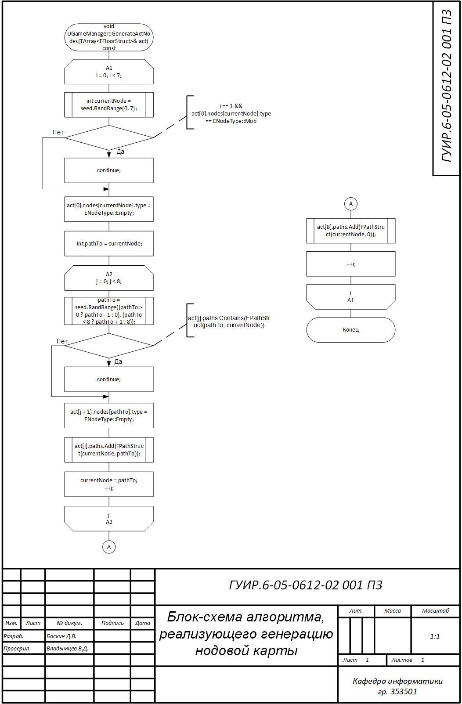
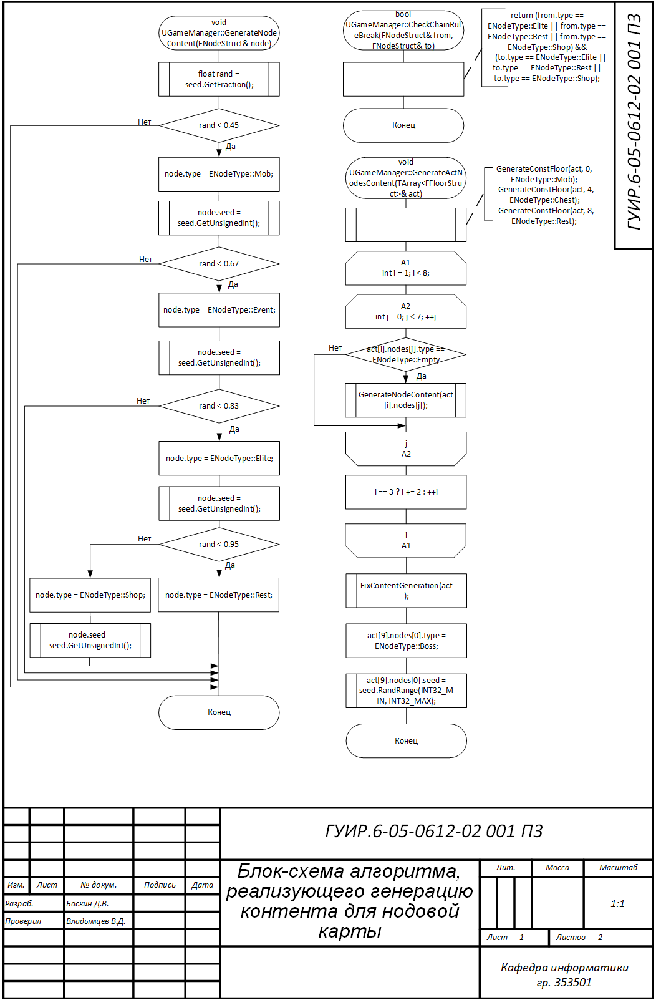
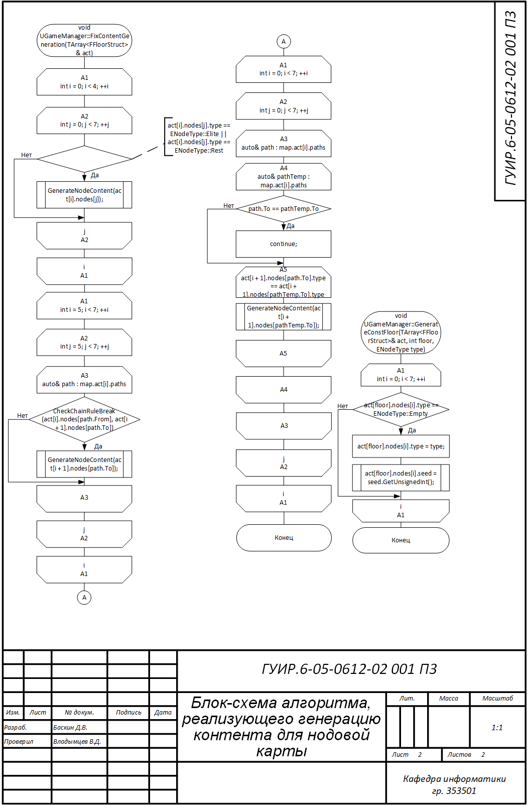
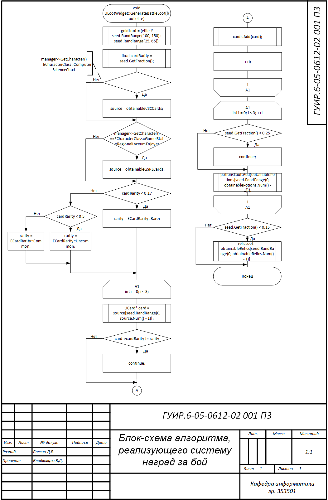
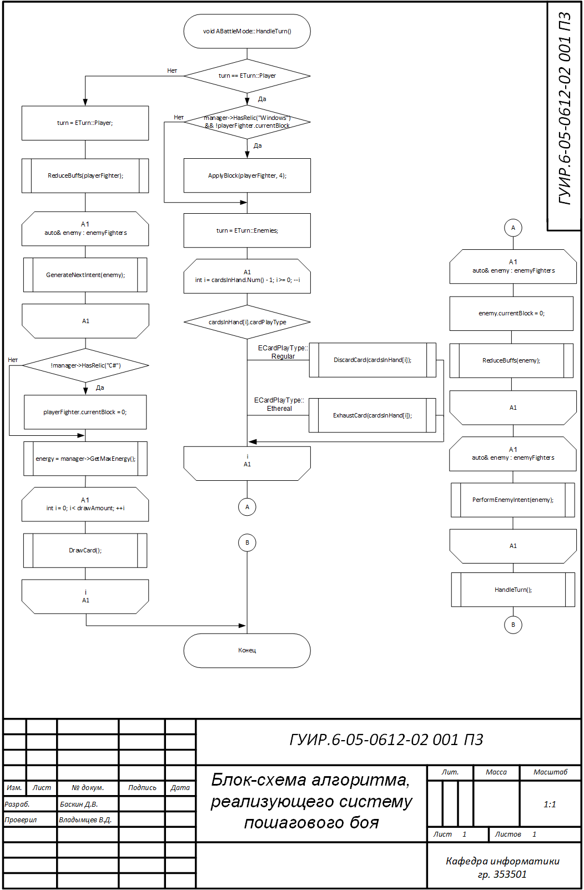
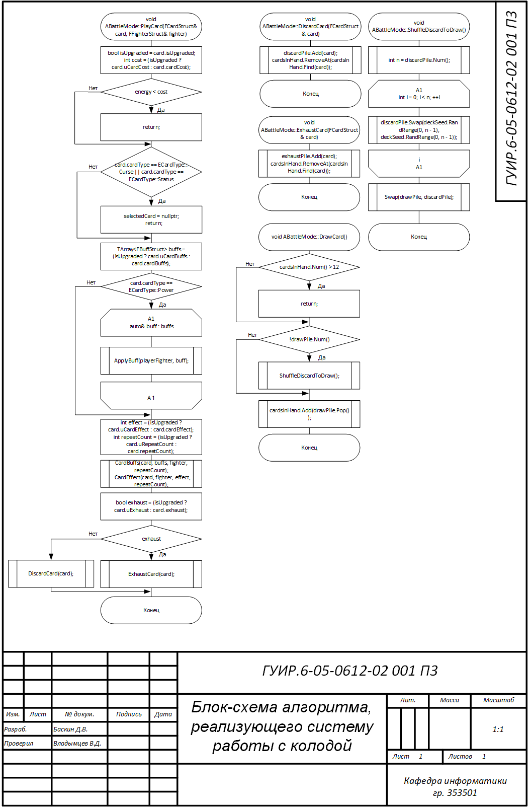
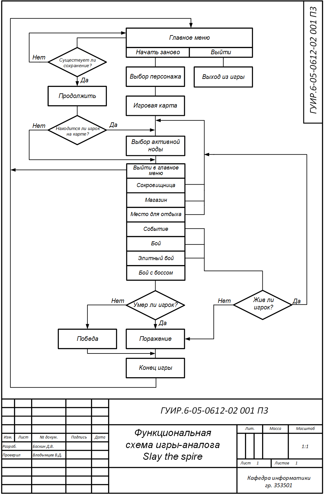

# Игра в стиле STS на С++

Примечание: загруженный проект одержит только исходные файлы кода в целях экономии веса репозитория. Полный проект находится [здесь](https://github.com/Pumpardian/CourseProject).

## Блок-схема алгоритма, реализующего генерацию нодовой карты

Применяется в: `src/GameManager.cpp`

## Блок-схема алгоритма, реализующего генерацию контента для нодовой карты

Применяется в: `src/GameManager.cpp`

## Блок-схема алгоритма, реализующего систему наград за бой

Применяется в: `src/LootWidget.cpp`

## Блок-схема алгоритма, реализующего систему пошагового боя

Применяется в: `src/BattleMode.cpp`

## Блок-схема алгоритма, реализующего систему работы с колодой

Применяется в: `src/BattleMode.cpp`

## Функциональная схема игры-аналога Slay the Spire

