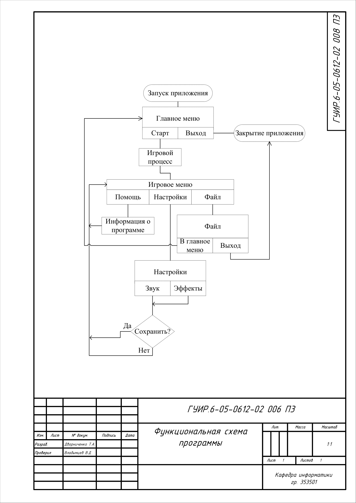
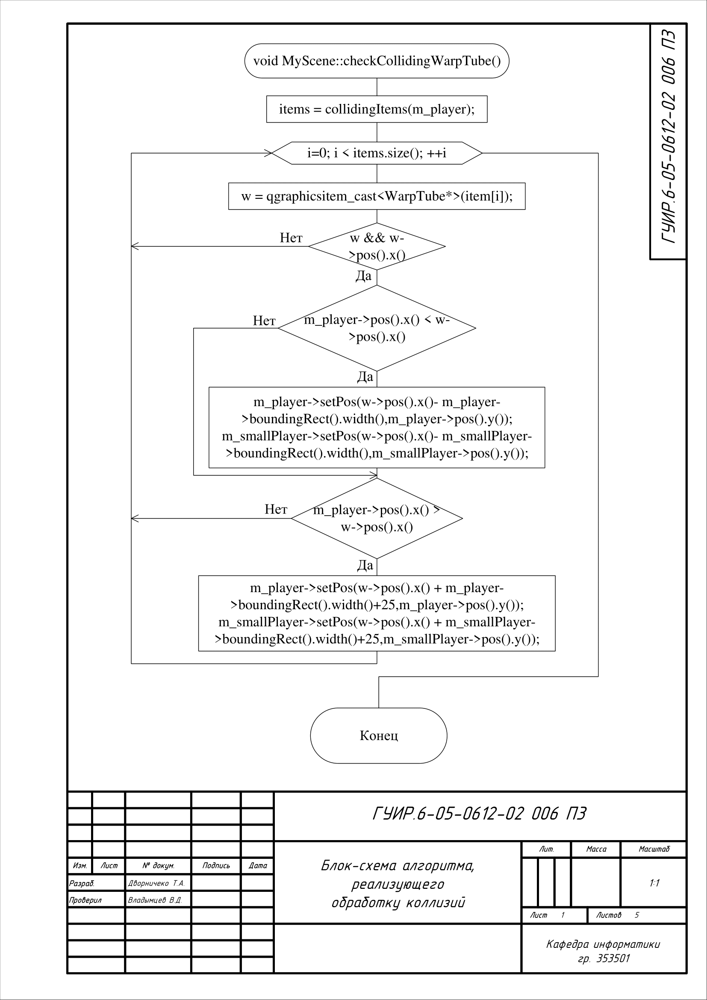
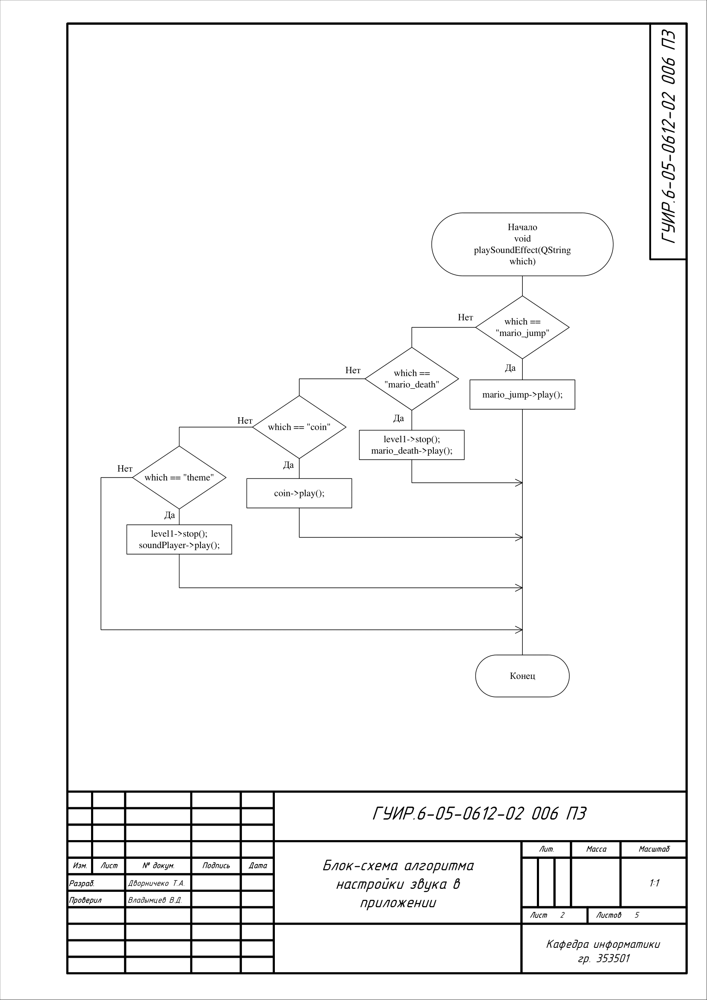
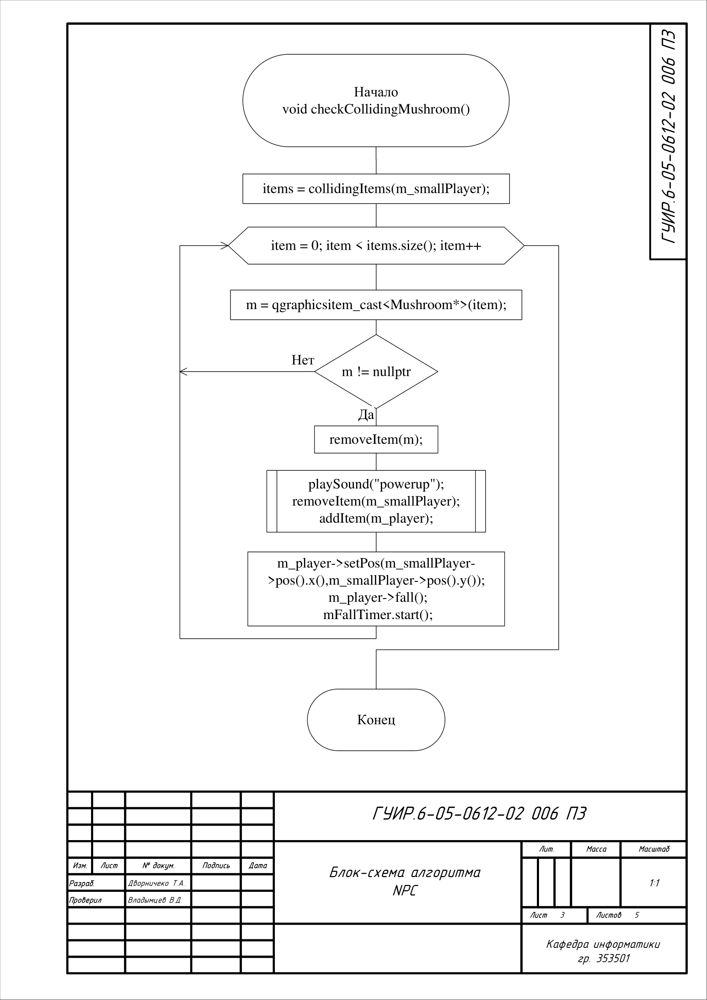
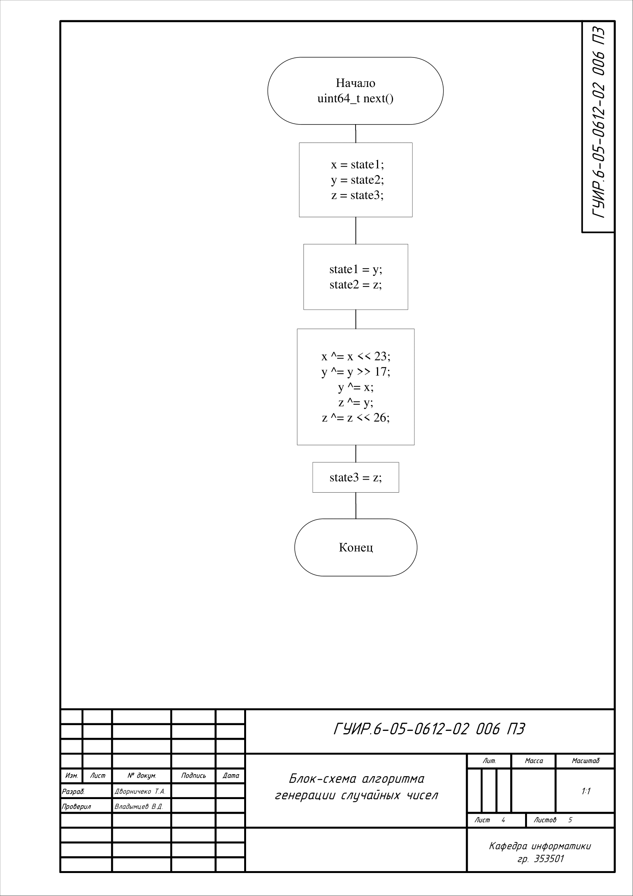
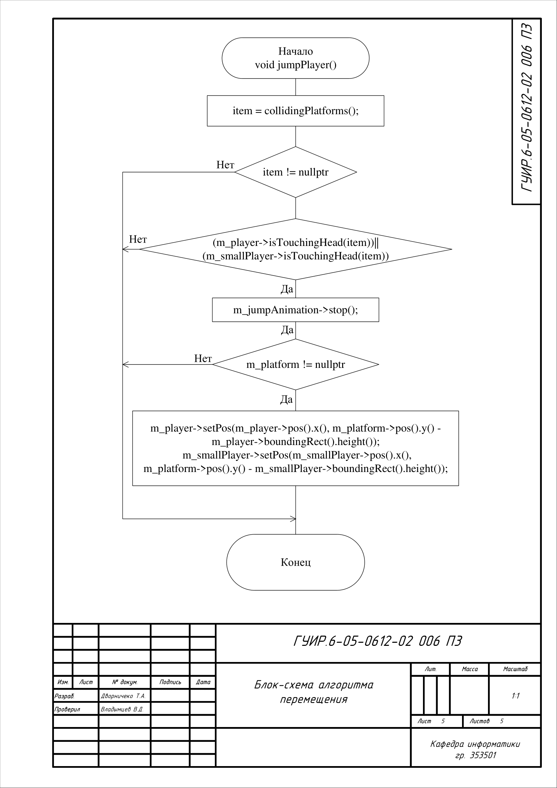

# Mario

Краткое описание 

## Функциональная блок-схема программы

## Блок-схема алгоритма, реализующий обработку коллизий

Применяется в: `mainwindow.cpp`

## Блок-схема алгоритма, реализующий настройки звука

Применяется в: `ara_sound_manager.cpp`

## Блок-схема алгоритма, реализующий алгоритм NPC

Применяется в: `mainwindow.cpp`

## Блок-схема алгоритма, реализующий генерации случайных чисел

Применяется в: `randomgenerate.cpp`

## Блок-схема алгоритма, реализующий алгоритм перемещения

Применяется в: `mainwindow.cpp`

