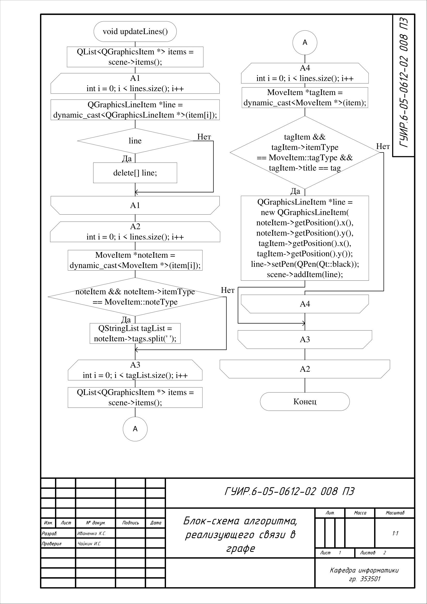
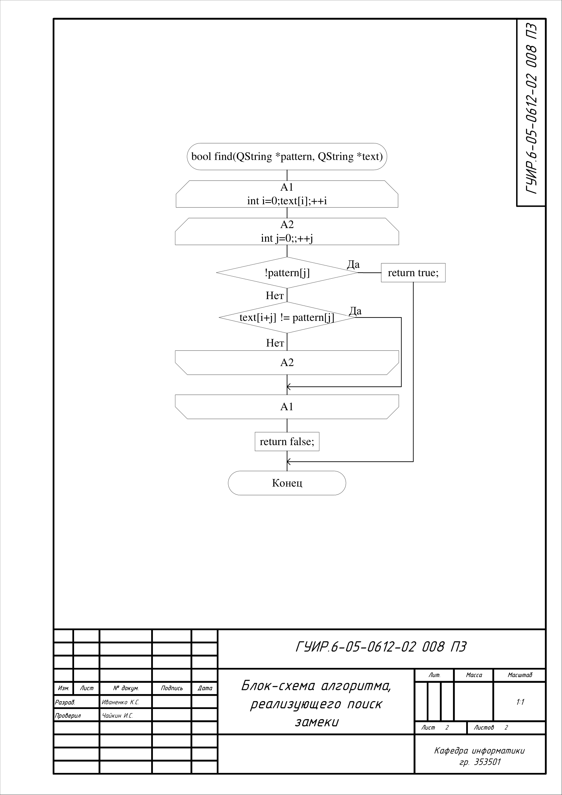
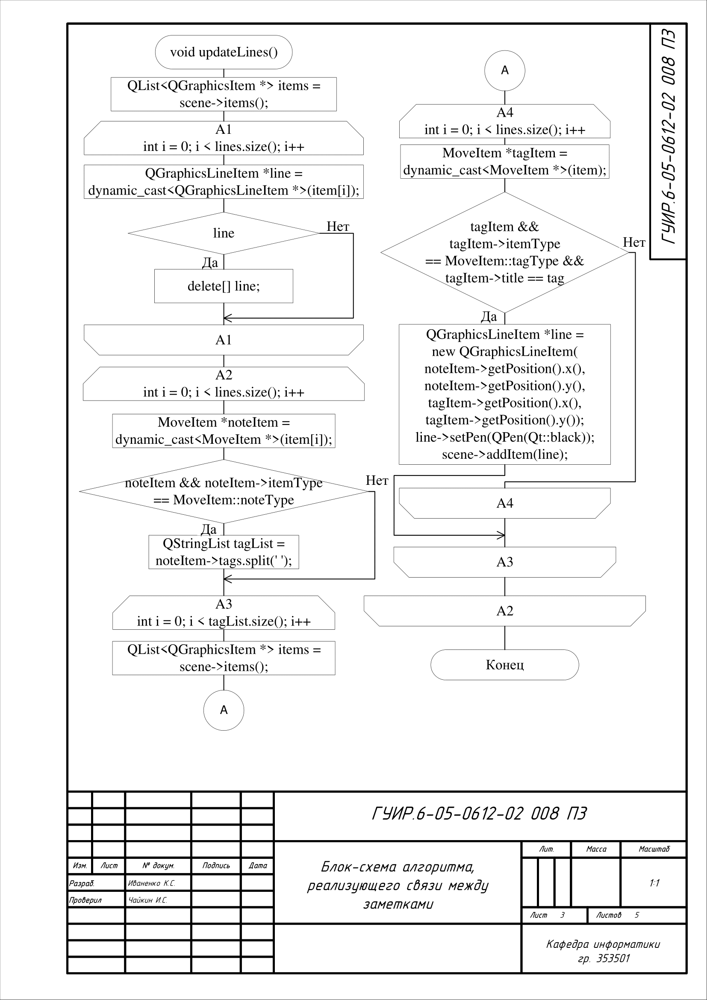
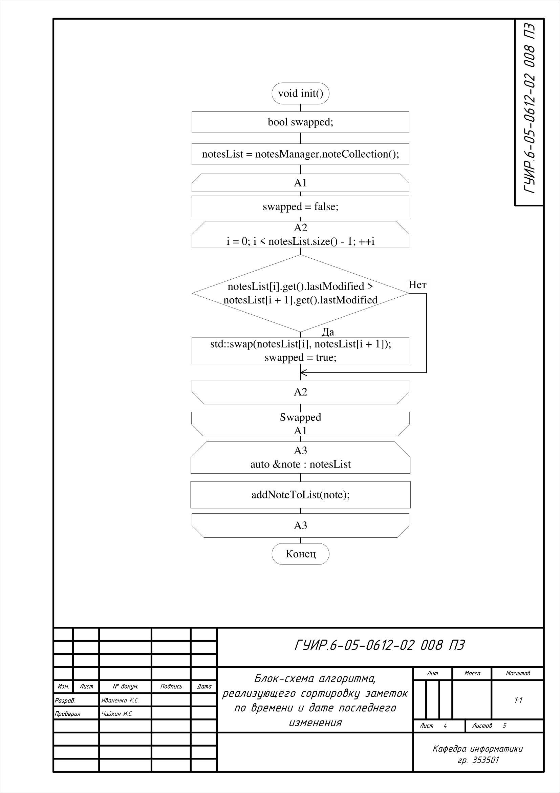
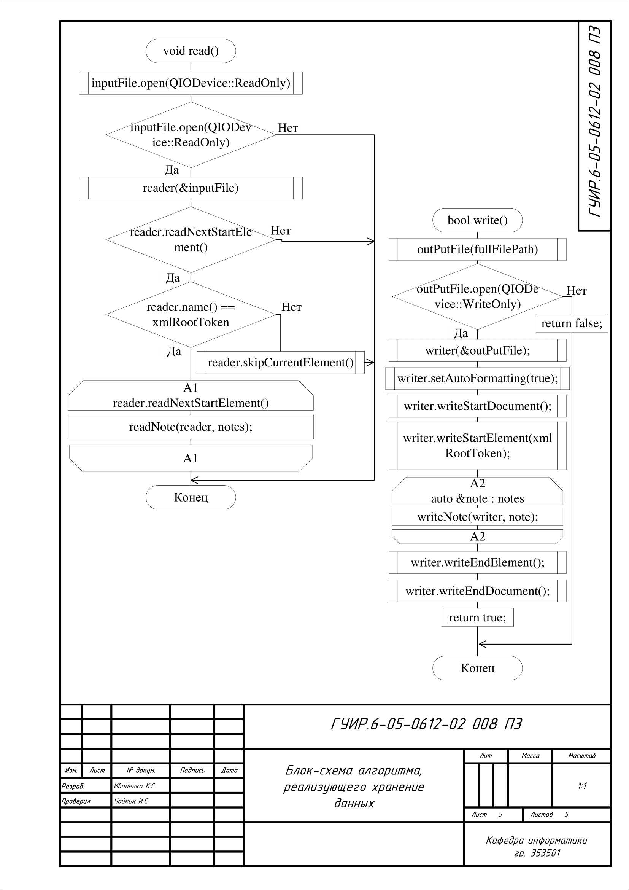
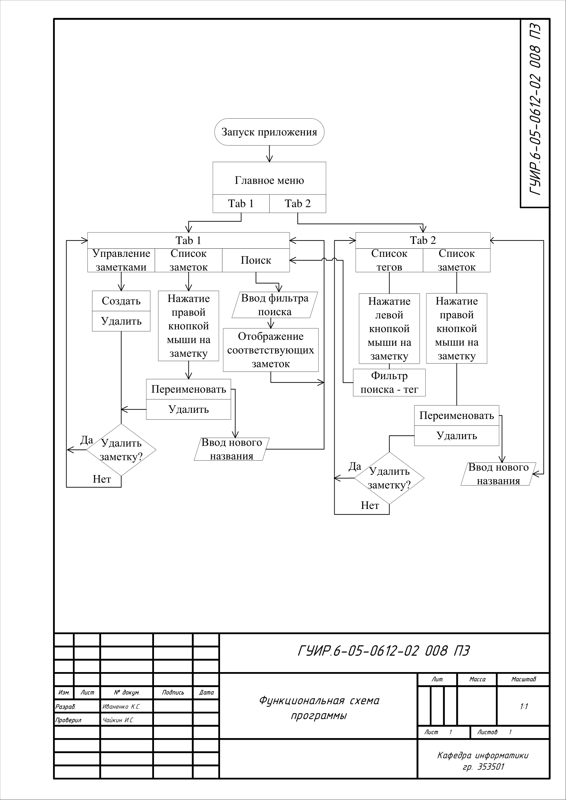

# Аналог Obsidian

### Self-written analogue of Obsidian: Your notes are under control

#### This repository is a note management app inspired by the popular Obsidian tool.

##### Main features:
- Storing notes as simple text files: Full control over your data and the ability to use any text editor.
- Linking Notes: Create links between different notes to organize information and easily navigate between them.
- Visualize connections: Graphically represent connections between notes to better understand the structure of information.
- Flexibility and customizability: Ability to adapt the application to your needs.

##### Advantages:
- Open source: Transparency and changeability.
- Privacy: Your notes are stored locally, without the need for cloud services.
- Lightweight: The application does not require large resources and works quickly.

##### Technologies:
- C++: A programming language for creating an application.
- Qt: Framework for graphical interface development.

##### For whom:
- Users who value privacy and control over their data.
- People who want a flexible and customizable note management system.
- Those who prefer open source.

## Блок-схема алгоритма, реализующего размещение заметок в индексированной последовательности

Применяется в: `notesmanager.cpp`

## Блок-схема алгоритма, реализующего поиск заметки

Применяется в: `noteslistwidget.cpp`

## Блок-схема алгоритма, реализующего связи между заметками

Применяется в: `graphwidget.cpp`

## Блок-схема алгоритма, реализующего сортировку заметок по времени и дате последнего изменения

Применяется в: `mainwindow.cpp`

## Блок-схема алгоритма, реализующего хранение данных

Применяется в: `xlmstorage.cpp`

## Функциональная схема программы

