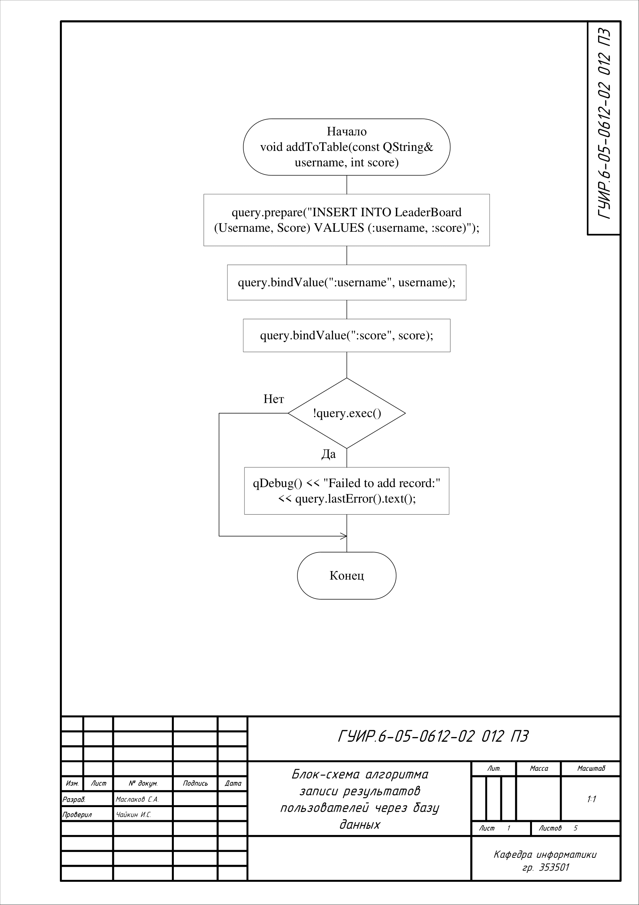
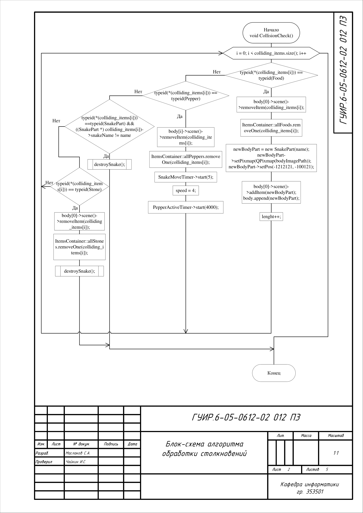
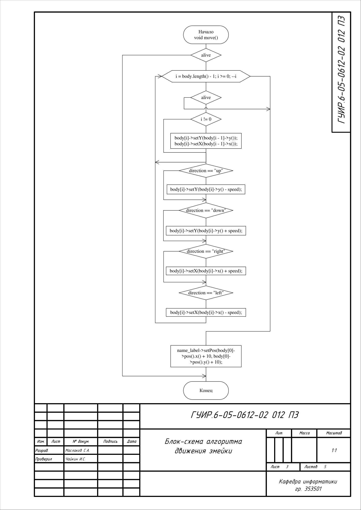
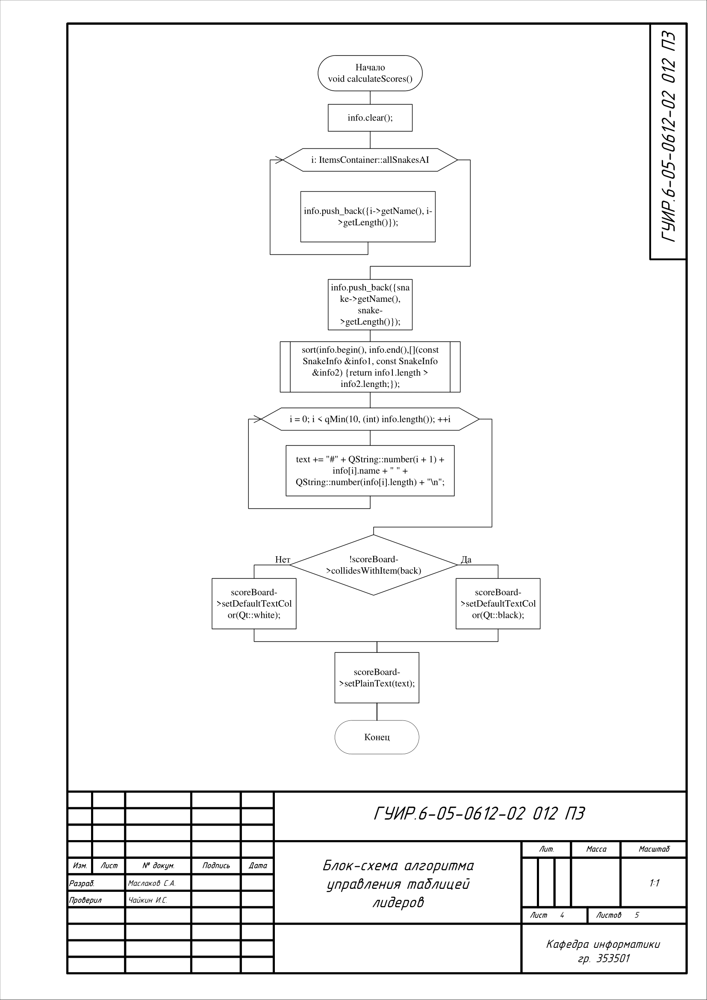
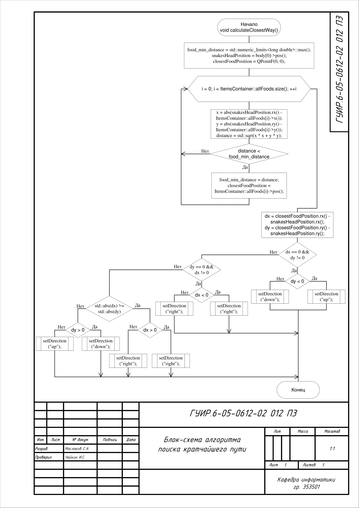

# Разработка видеоигры «Змейка»

## Алгоритм записи результатов пользователей через базу данных

Применяется в: `database.cpp`

## Алгоритм обработки столкновений

Применяется в: `snake.cpp`

## Алгоритм движения змейки

Применяется в: `snake.cpp`

## Алгоритм управления таблицей лидеров

Применяется в: `mainwindow.cpp`

## Алгоритм поиска кратчайшего пути

Применяется в: `snakeAI.cpp`

