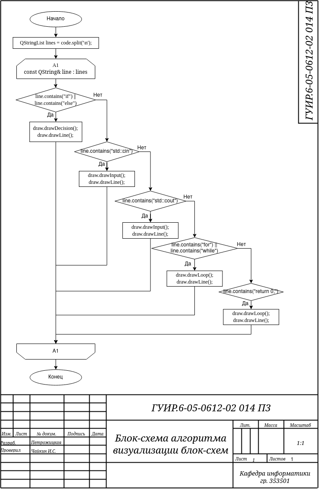
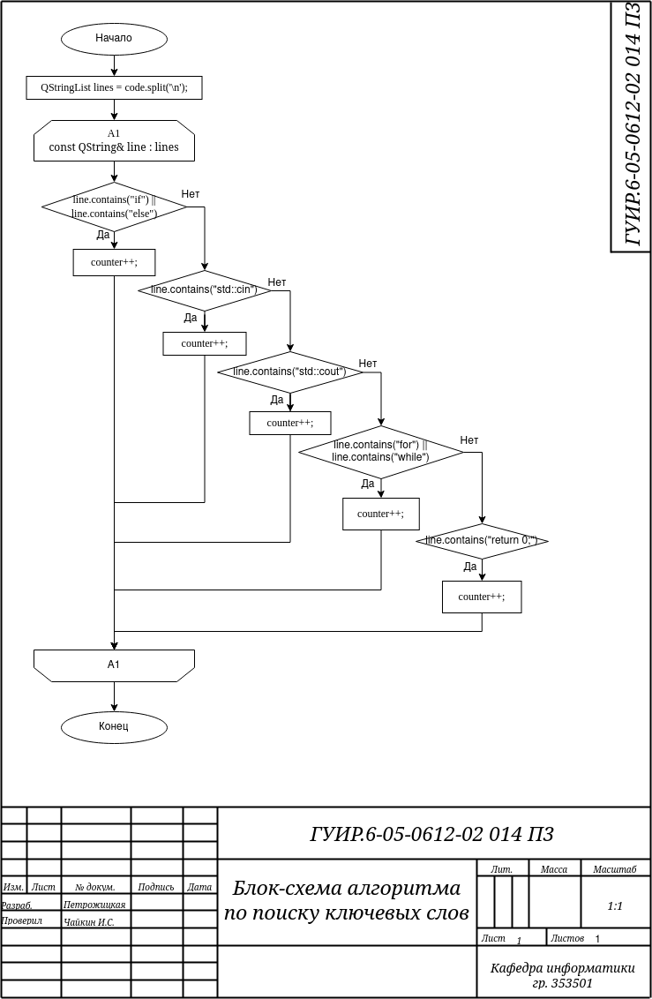
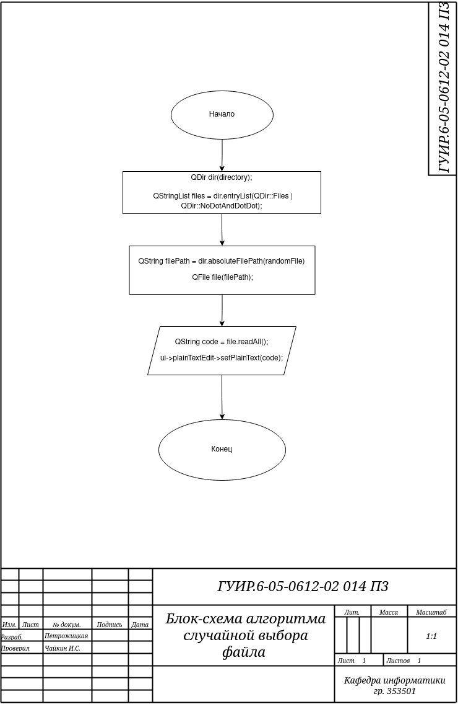
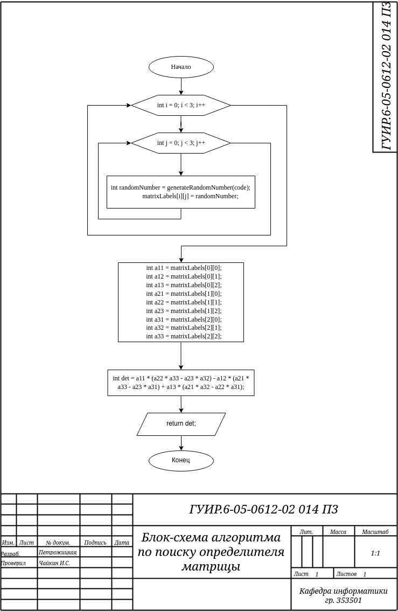

# Блок-схема из введенного кода

## Алгоритм визуализации блок-схем

Применяется в: `/code/mainwindow.cpp`

## Алгоритм поиска ключевых слов

Применяется в: `/code/mainwindow.cpp`

## Алгоритм случайного выбора файла

Применяется в: `/code/mainwindow.cpp`

## Алгоритм случайной генерации чисел

Применяется в: `/code/mainwindow.cpp`

## Алгоритм по поиску определителя матрицы

Применяется в: `/code/mainwindow.cpp`

