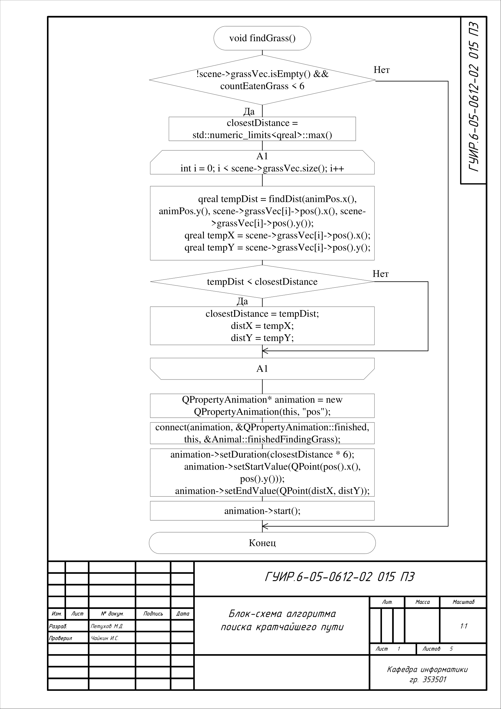
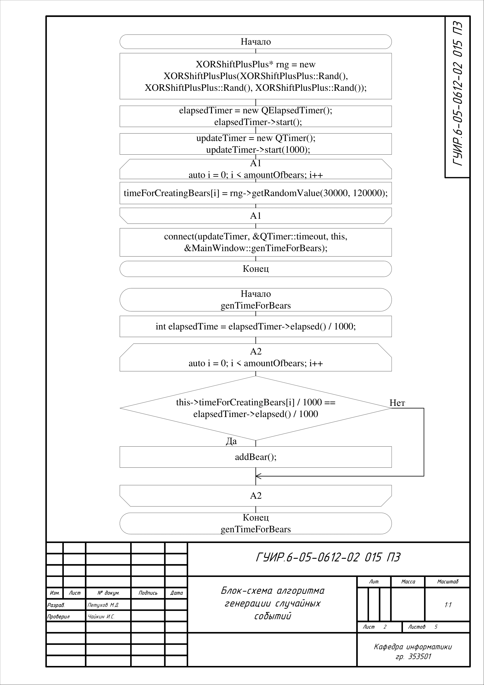
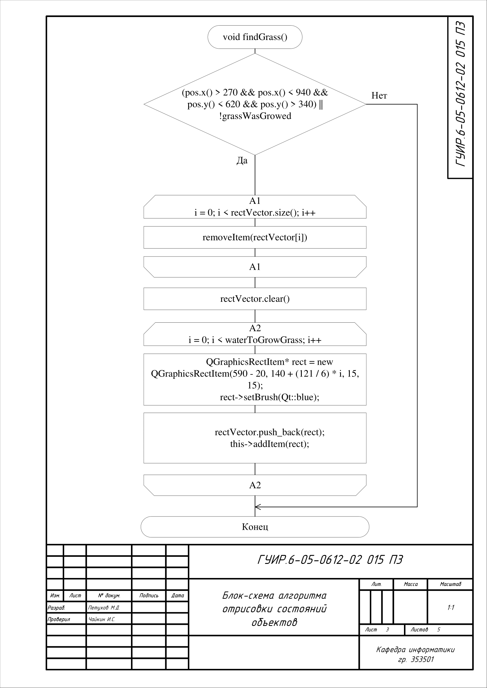
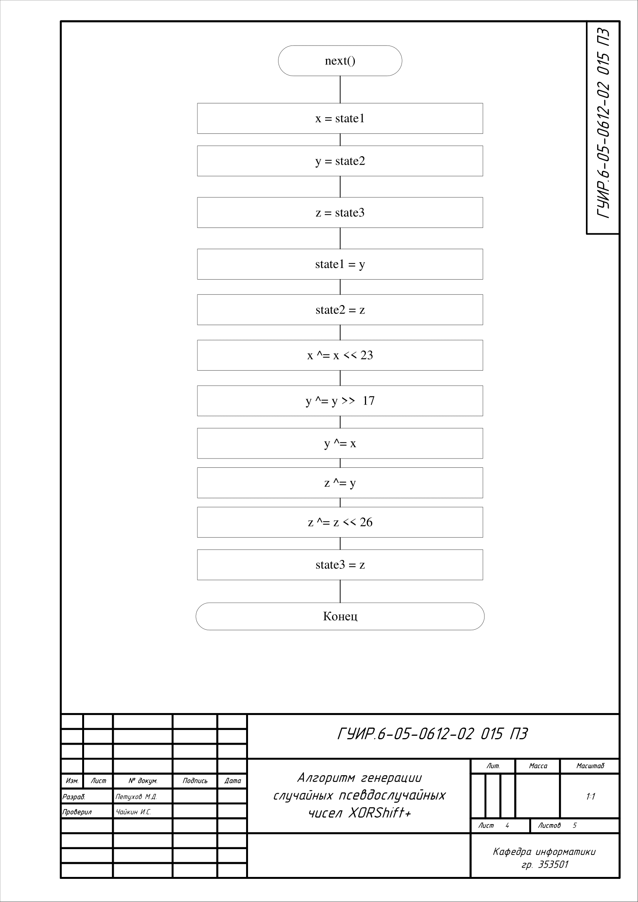
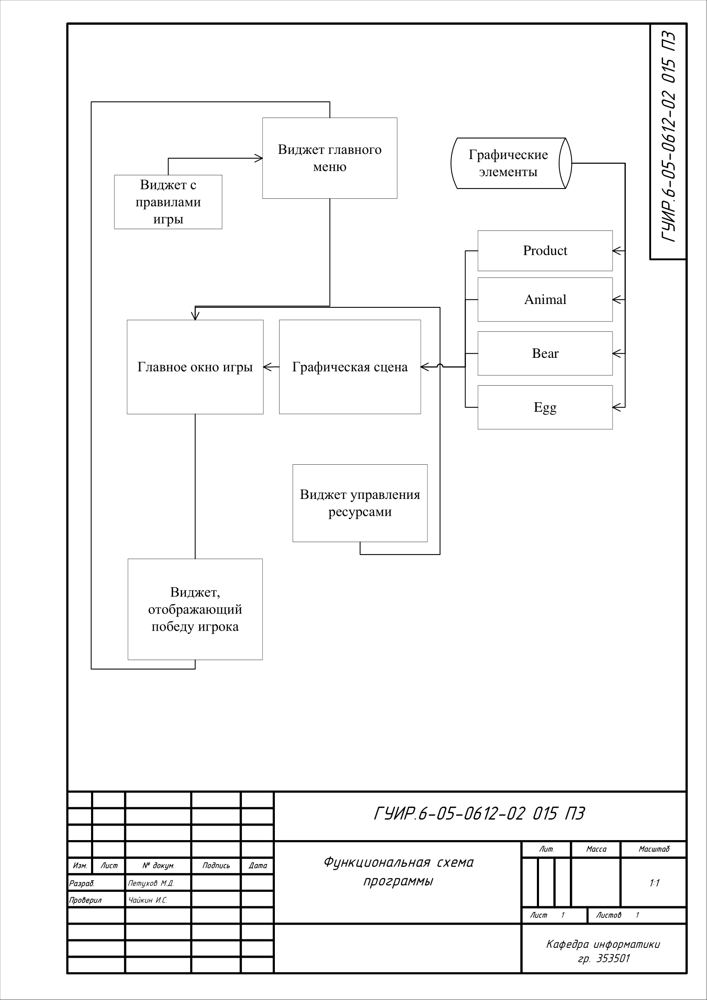

# Игра в стиле "Веселой фермы"

игра в стиле Time Management

## Блок схема алгоритма поиска кратчайшего пути

Применяется в: `Animal.cpp`

## Блок схема алгоритма генерации случайных событий

Применяется в: `mainwindow.cpp` и `Bear.cpp`

## Блок схема алгоритма отрисовки состояний объектов

Применяется в: `CustomGraphicsScene.cpp`

## Блок схема алгоритма генерации псевдослучайных чисел XorShift+

Применяется в: `xorshiftplus.cpp` и `mainwindow.cpp`

## Блок схема алгоритма случайного перемещения

Применяется в: `Animal.cpp` и `xorshiftplus.cpp`

## Функциональная схема программы

