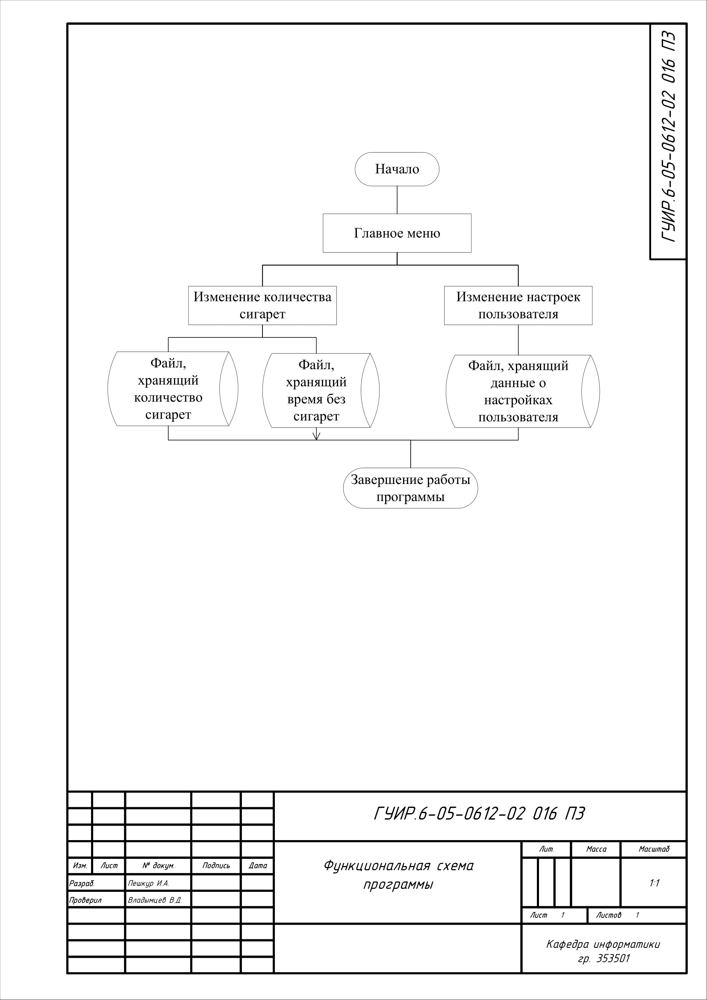
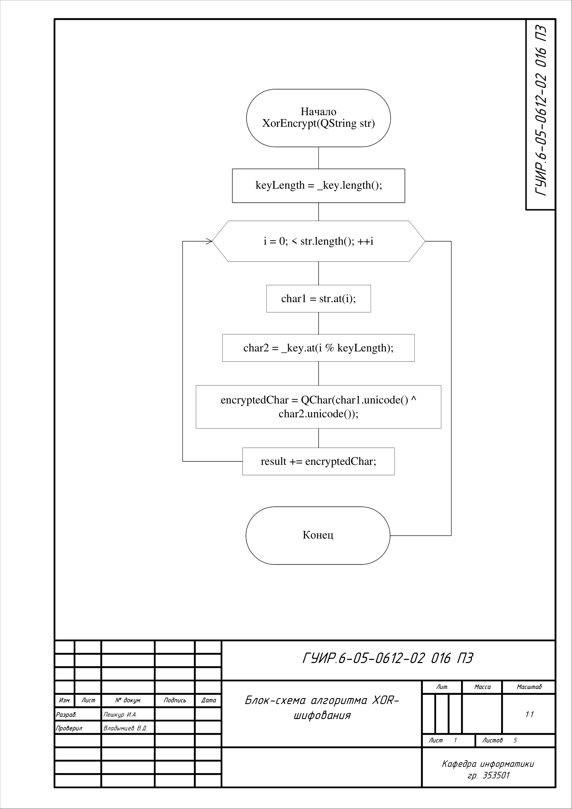
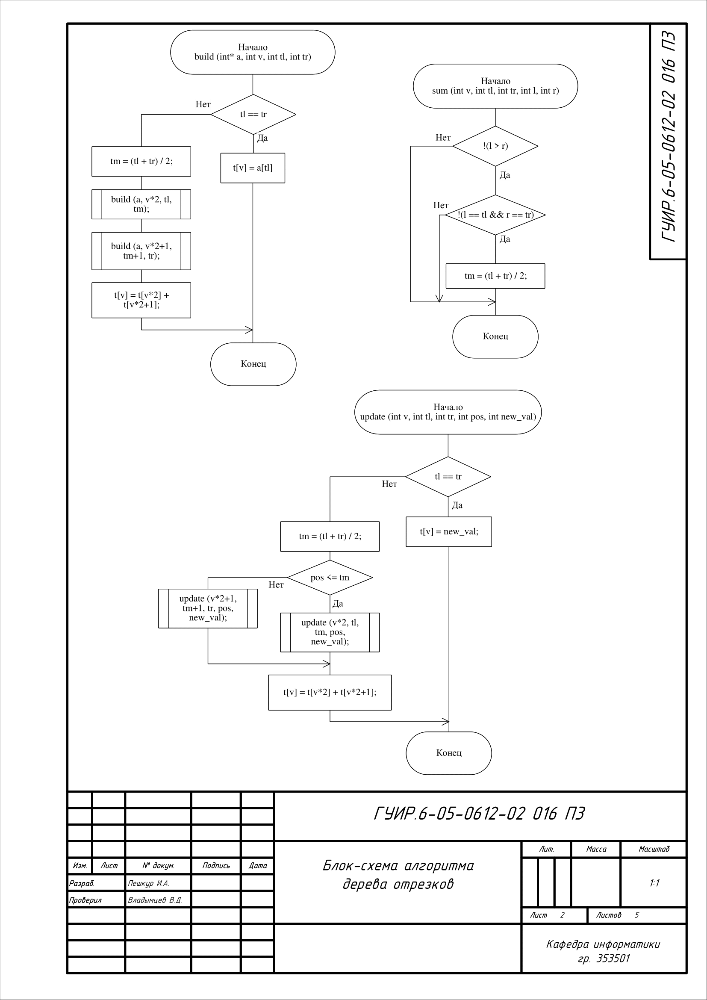
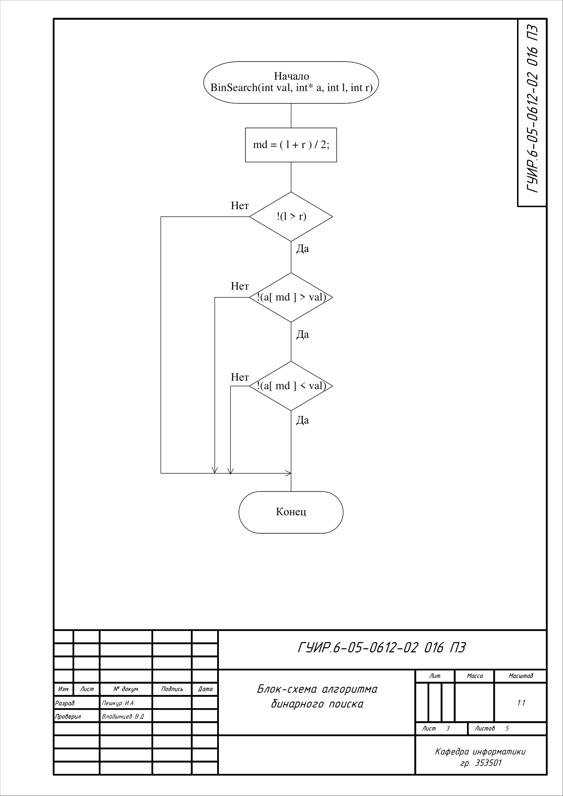
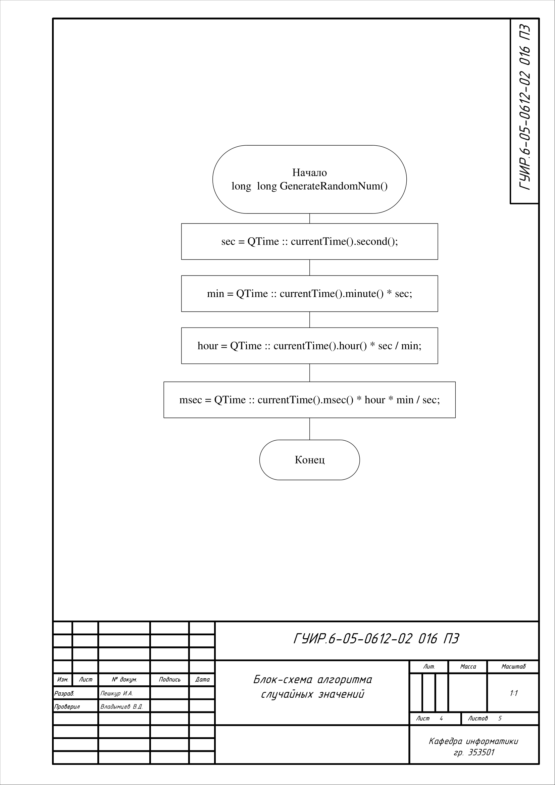
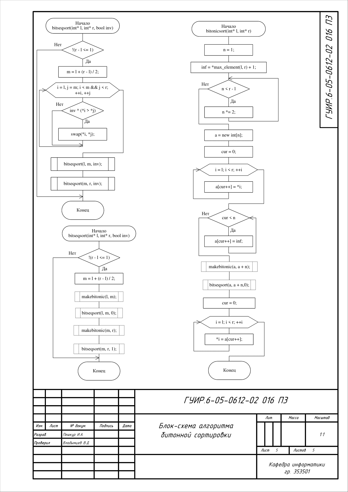

# Приложение, помогающее бросить курить

## Функциональная схема программы

Схема общей структуры программы

## Блок-схема алгоритма XOR-шифрования

Применяется в: `mainwindow.cpp`
Данный алгоритм используется для шифрования/дешифрования значения и в дальнейшем записывания/чтения его в/из файла. Его работу можно увидеть в функциях: "MakeVector", "WriteVector".

## Блок-схема алгоритма дерева отрезков

Применяется в: `mainwindow.cpp`
Данный алгоритм используется для подсчёта 5 подряд идущих элементов массива. Также для изменения определённого значения в массиве. Его работу можно увидеть в функции: "CalculateIndex".

## Блок-схема алгоритма бинарного поиска

Применяется в: `mainwindow.cpp`
Данный алгоритм используется для нахождения индекса максимального элемента в массиве. Его работу можно увидеть в функции: "CalculateIndex".

## Блок-схема алгоритма случайных значений

Применяется в: `mainwindow.cpp`
Данный алгоритм используется для отображения случайного фона и случайной цитаты на экране. Его работу можно увидеть в функциях: "SetBack", "setMotivationText".

## Блок-схема алгоритма битонной сортировки

Применяется в: `mainwindow.cpp`
Данный алгоритм используется для нахождения максимального значения элемента в массиве. Его работу можно увидеть в функции: "CalculateIndex".

