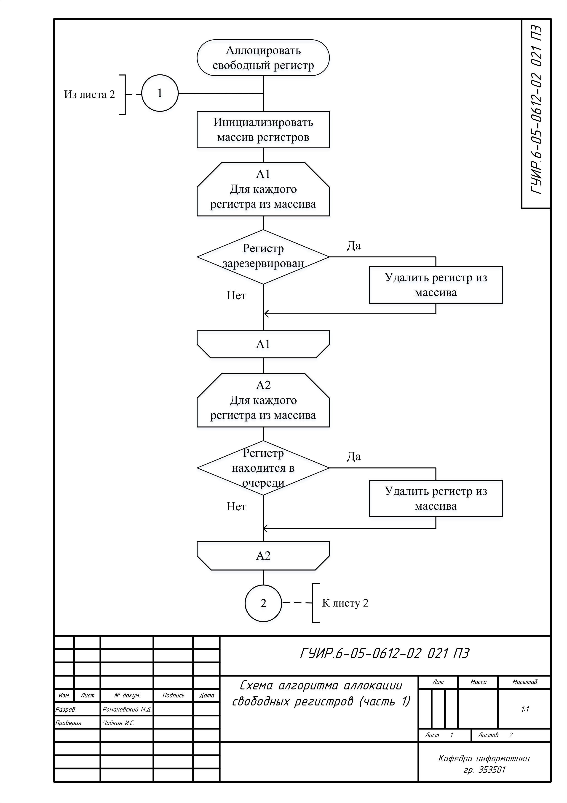
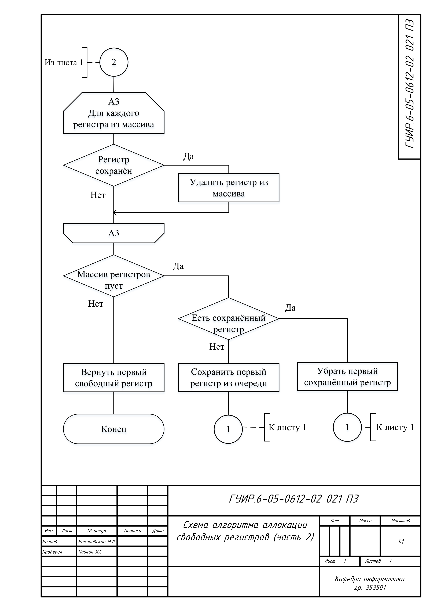
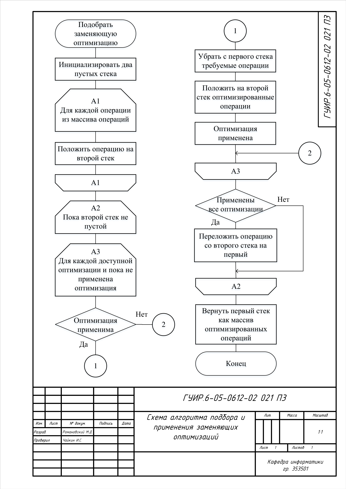
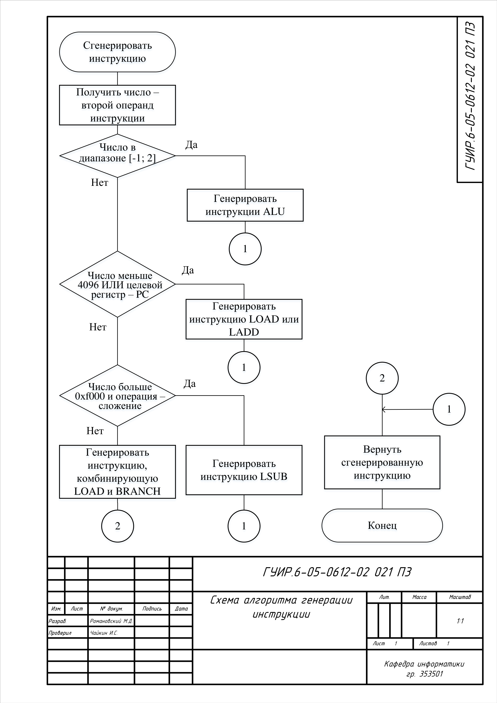
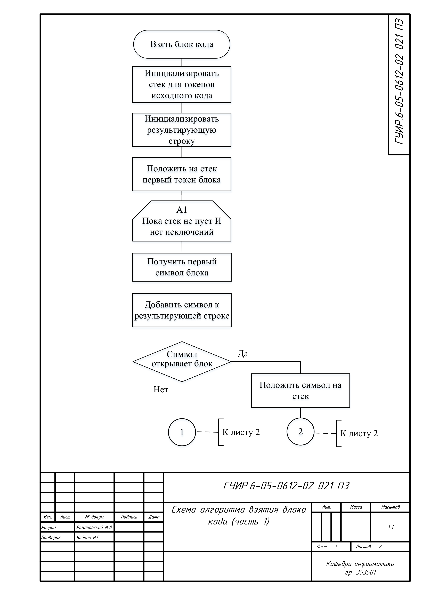
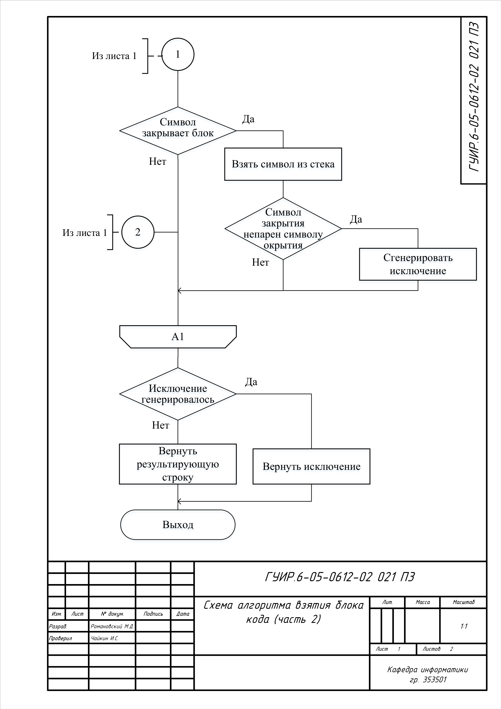
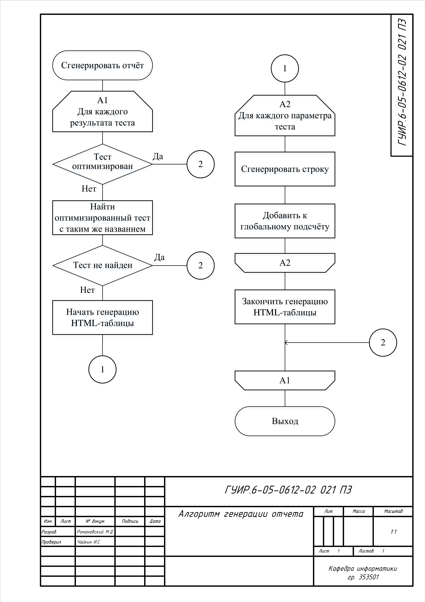

# РАЗРАБОТКА ОПТИМИЗИРУЮЩЕГО КОМПИЛЯТОРА ДЛЯ СТЕК-МАШИНЫ

Даный проект заключается в создание оптимизируещего компилятора для стек машины для микропроцессорной архитектуры EasyCPU. Такой компилятор значительно увеличивает скорость програм написанныхх с применением стек инструкций, благодаря заменяющим оптимизациям и аллокации регистров.

## Функциональная схема програмного средства

## Функциональная схема компиляции и оптимизации

## Схема алгоритма аллокации свободных регистров

Применяется в: `easycpu_lib/src/stack/opt/comp.rs`

## Схема алгоритма подбора и применения заменяющих оптимизаций

Применяется в: `easycpu_lib/src/stack/opt/optim.rs`

## Схема алгоритма генерации инструкции загрузки константы

Применяется в: `easycpu_lib/src/asm/load_const.rs`

## Схема алгоритма взятия блока кода

Применяется в: `easycpu_lib/src/parser/parse.rs`

## Схема алгоритма генерации отчёта

Применяется в: `easycpu_test/genreport.py`

