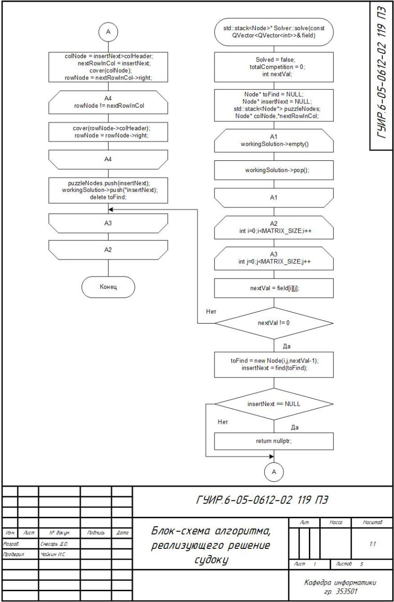
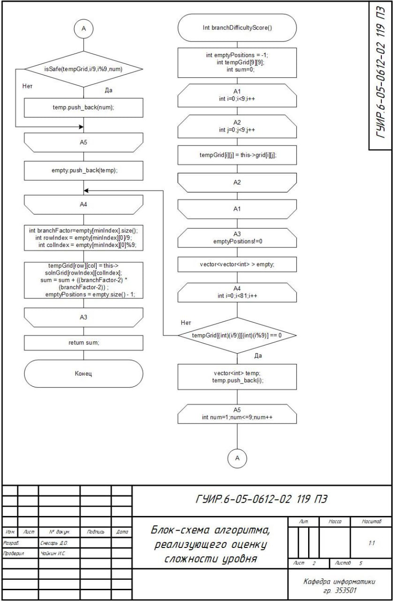
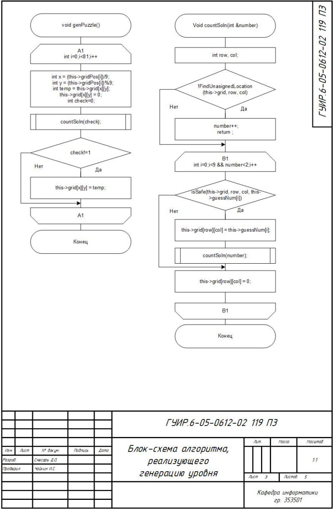
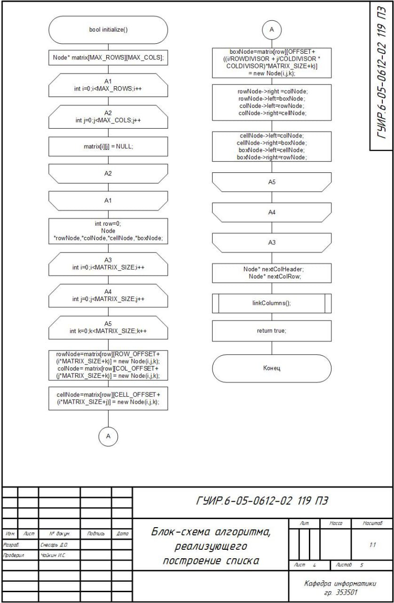
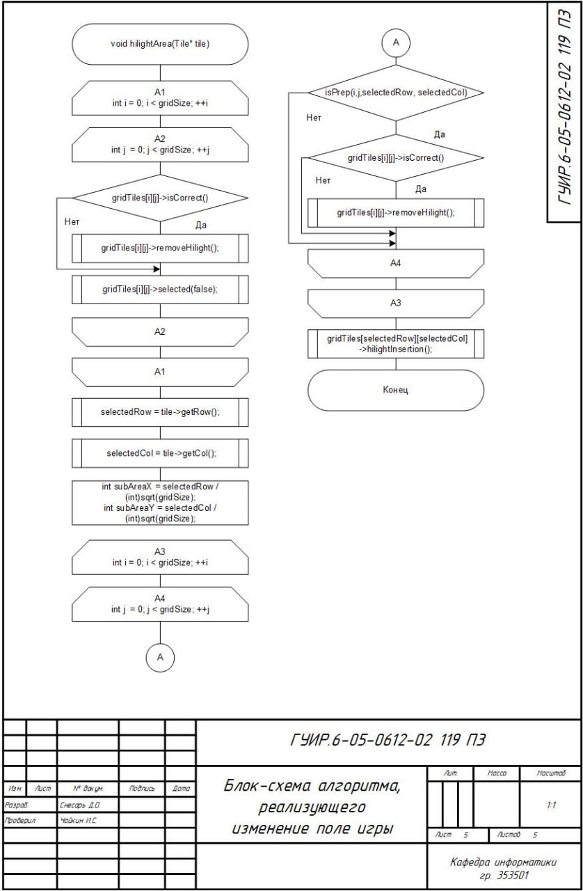
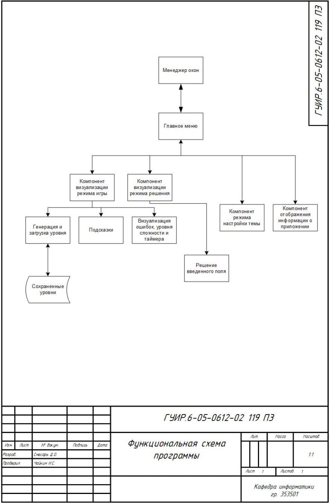

# Реализация программы для игры в судоку

Для сборки изменить пути к файлам сохраненных уровней 

## Блок-схема для функции решения судоку

Применяется в: `src/gamewidget.cpp` в функции void GameWidget::on_solveB_clicked()

## Блок-схема для оценки сложности уровня

Применяется в: `src/generator.cpp` в функции void Generator::calculateDifficulty()

## Блок-схема для генерации уровня

Применяется в: `src/gamewidget.cpp` в функции void GameWidget::generateB_Clicked()

## Блок-схема для создания двусвязного двумерного списка

Применяется в: `src/gamewidget.cpp` в функции void GameWidget::on_solveB_clicked()

## Блок-схема изменения поля игры

Применяется в: `src/gamewidget.cpp` в функциях класса gamewidget

## Функциональная схема

