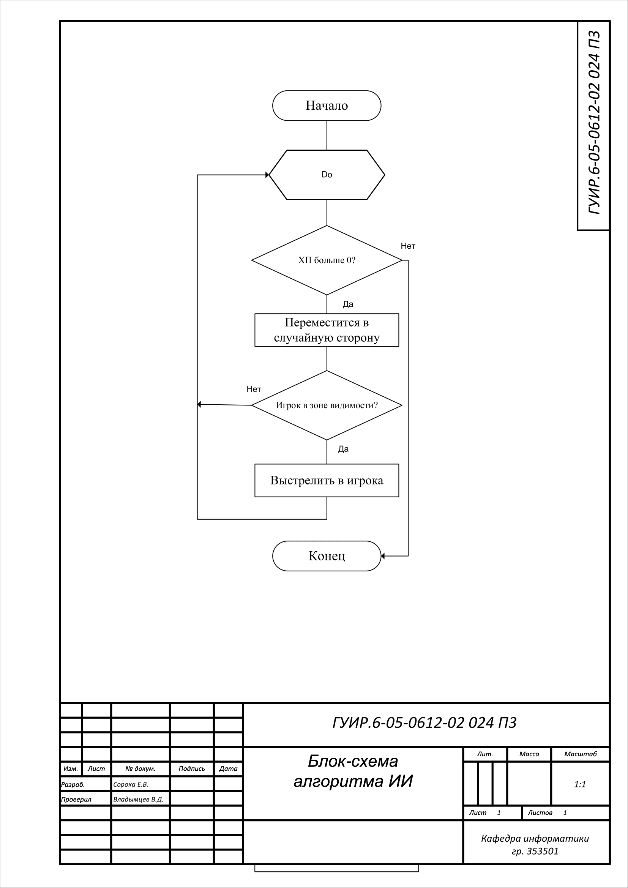
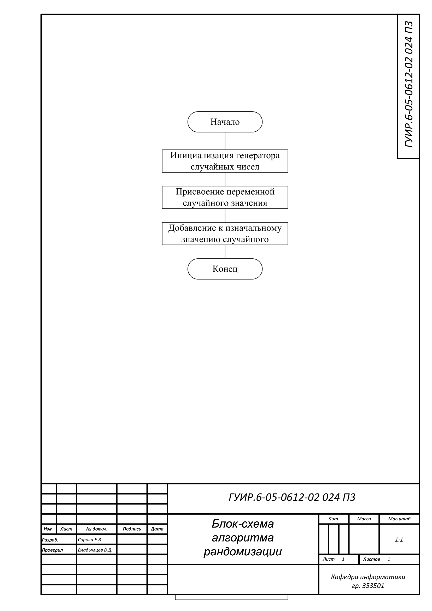
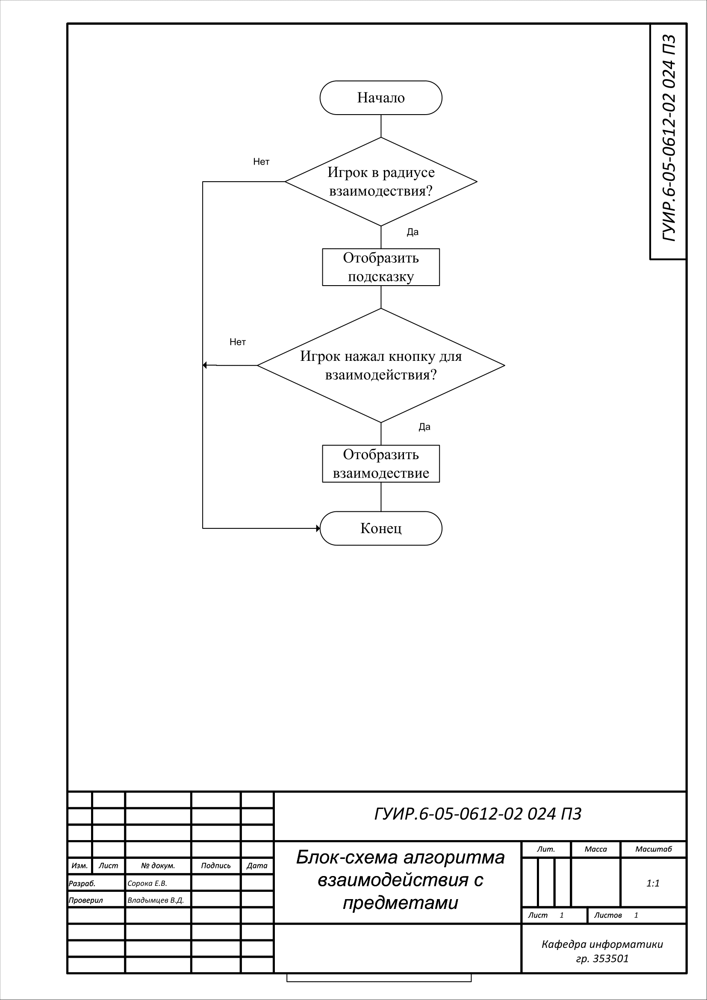
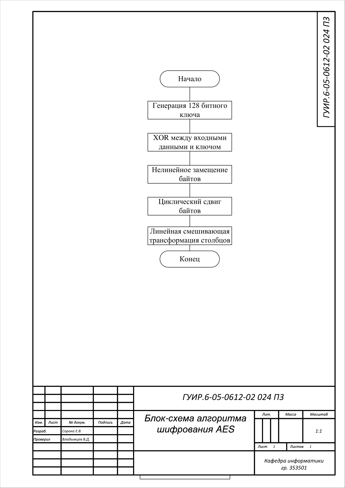

# Игра в стиле STS

Простая игра-уровень в жанре roguelike.

## Блок-схема алгоритма ИИ

Применяется в: `Source/ActionRoguelike/Private/AI/SAIControll.cpp`

## Блок-схема алгоритма пополнения HP

Применяется в: `Source/ActionRoguelike/Private/SPower_HealthPotion.cpp`

## Блок-схема алгоритма рандомизации

Применяется в: `Source/ActionRoguelike/Private/SExplosiveBarrel.cpp`

## Блок-схема алгоритма взаимодействия с предметами

Применяется в: `Source/ActionRoguelike/Private/SItemChest.cpp`

## Блок-схема алгоритма шифрования AES

Применяется в: `Source/ActionRoguelike/Private/SSaveGame.cpp`

