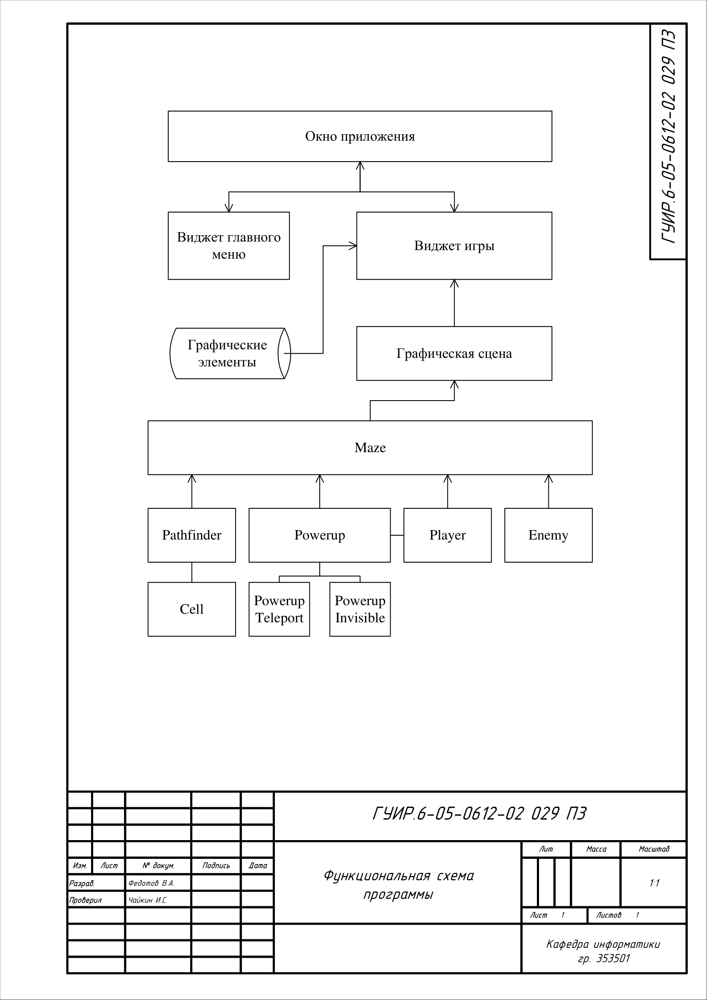
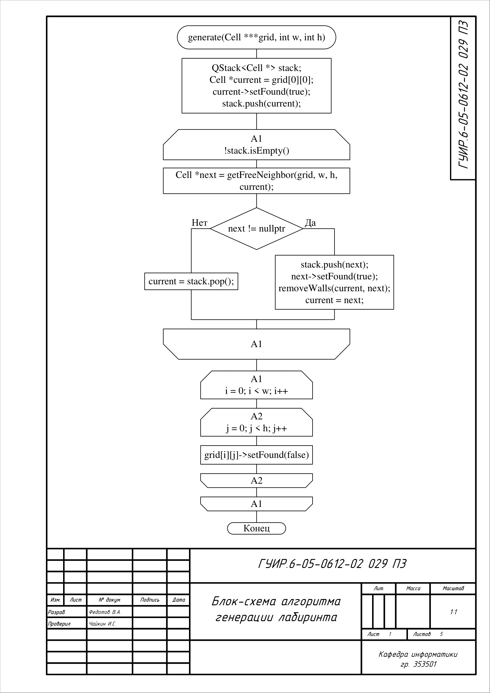
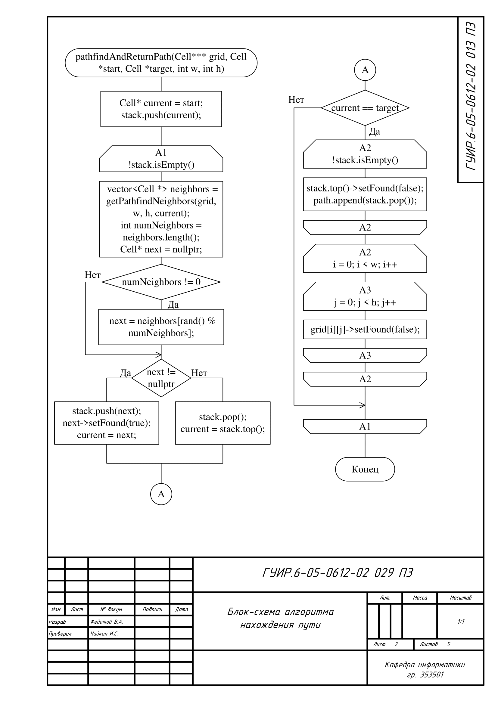
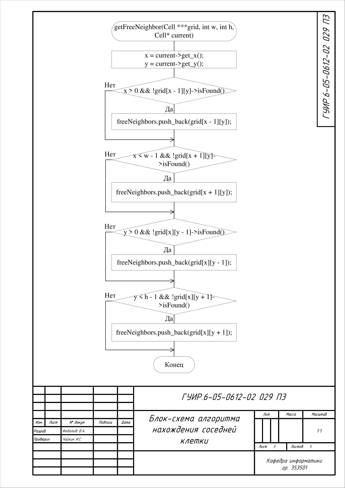
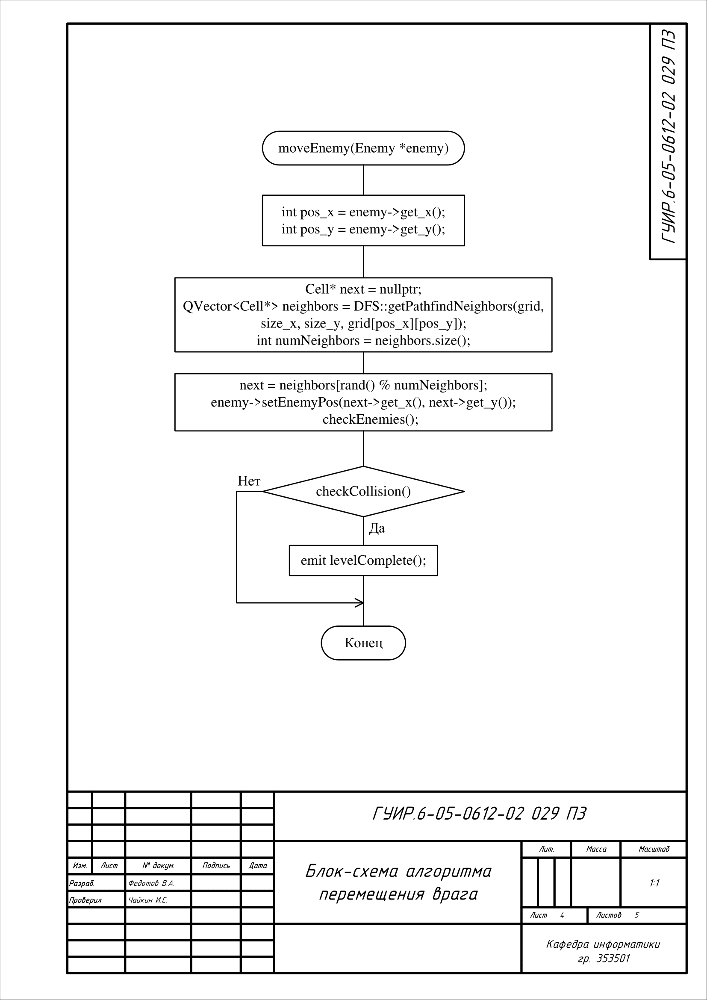
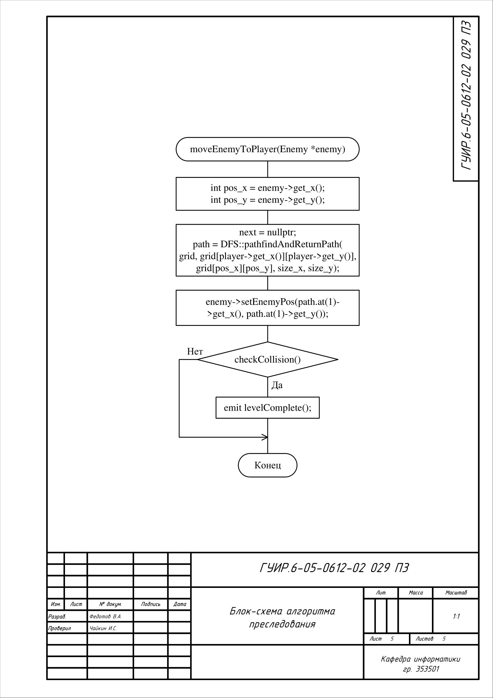

# Игра лабиринт

## Функциональная схема программы

Схема общей структуры программы

## Блок-схема алгоритма генерации

Алгоритм используется в [Pathfinder/pathfinder.cpp](Pathfinder/pathfinder.cpp) в методе generate. Он изменяет сетку из клеток так, чтобы получился лабиринт

## Блок-схема алгоритма нахождения пути

Алгоритм используется в [Pathfinder/pathfinder.cpp](Pathfinder/pathfinder.cpp). Он используется в методе pathfindAndReturnPath чтобы вернуть массив указателей на клетки, которые содержатся в пути от клетки start до клетки target.

## Блок-схема алгоритма нахождения соседней клетки

Алгоритм используется в [Pathfinder/pathfinder.cpp](Pathfinder/pathfinder.cpp). Он используется в методе getFreeNeighbor для получения списка указателей на непосещённые клетки, в которые можно перейти при генерации лабиринта.

## Блок-схема алгоритма перемещенния врага

Алгоритм используется в [Maze/maze.cpp](Maze/maze.cpp). Он используется в методе moveEnemy, чтобы передвинуть врага в случайную соседнюю клетку.

## Блок-схема алгоритма преследования

Алгоритм используется в [Maze/maze.cpp](Maze/maze.cpp). Он используется в методе moveEnemyToPlayer чтобы переместить врага на одну клетку ближе к врагу.

