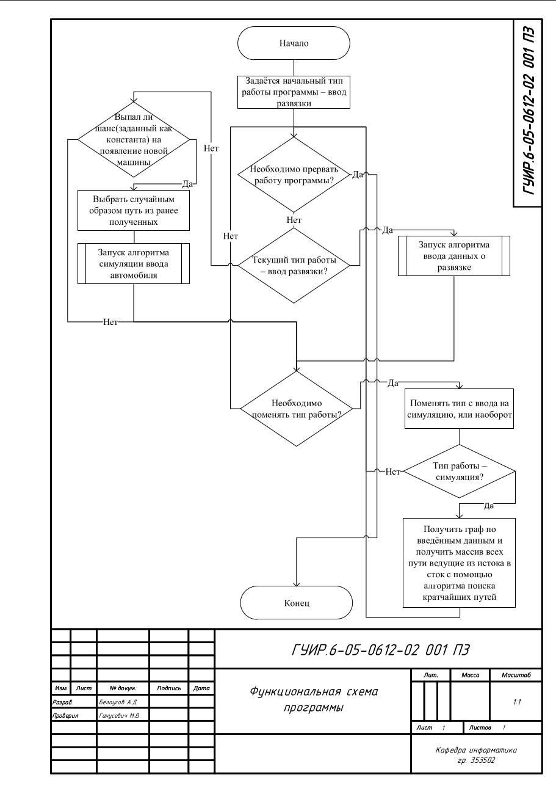
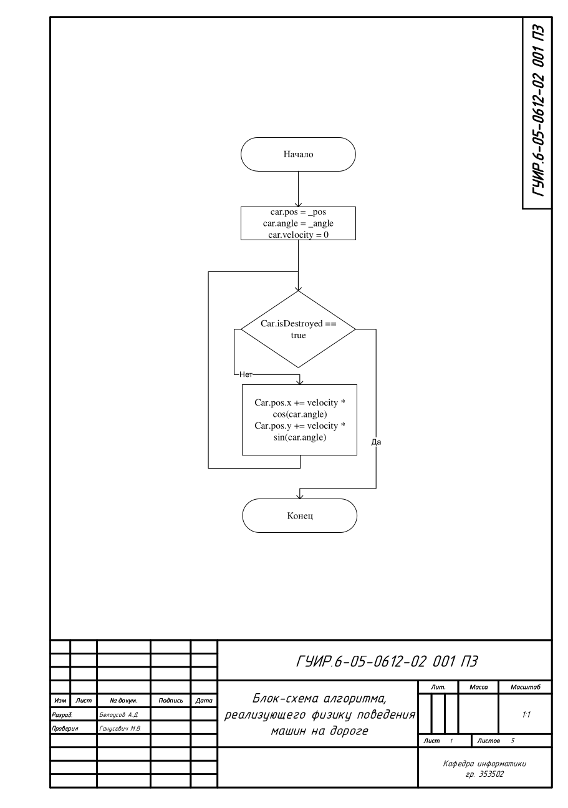
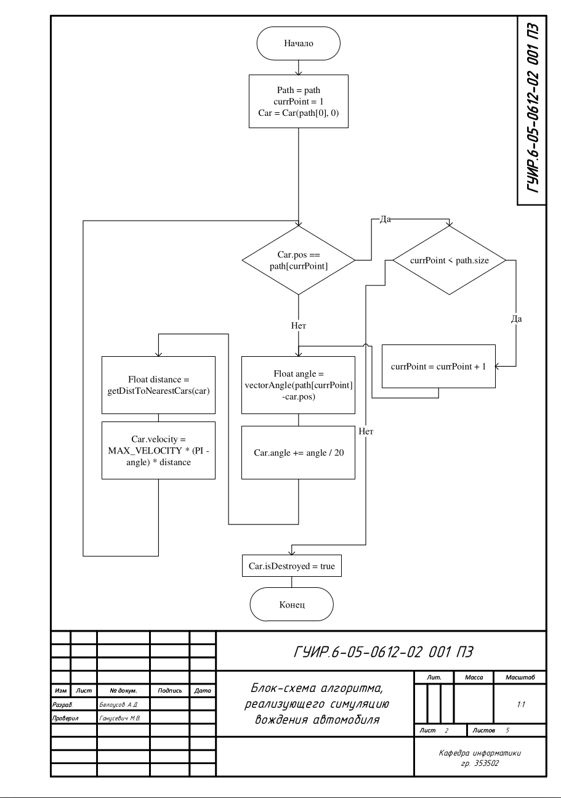
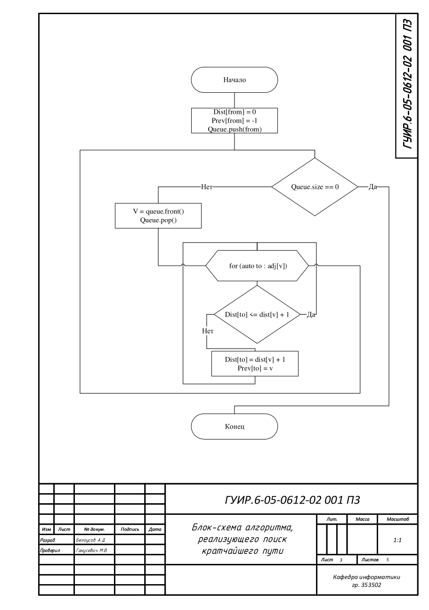
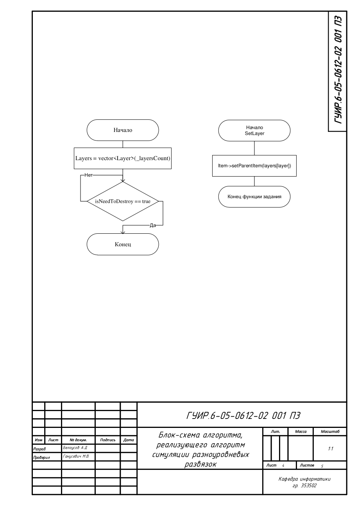
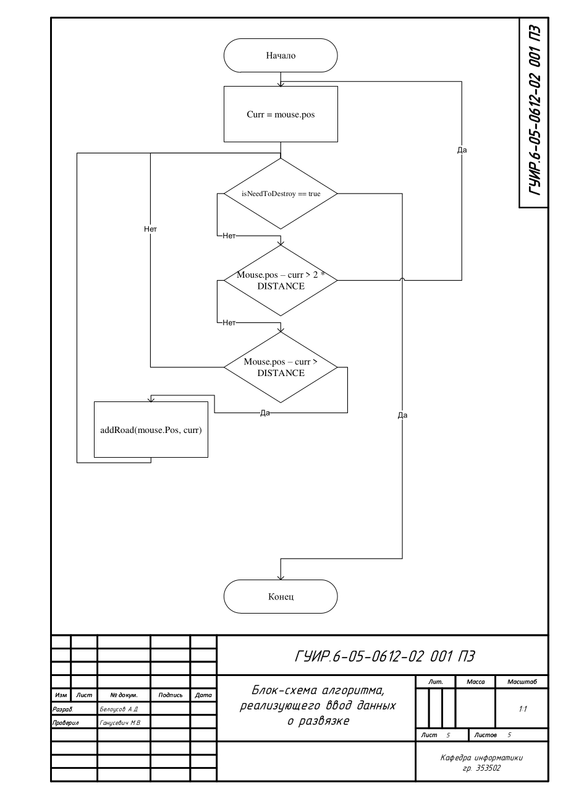

# Название Курсовой Работы

Program to simulate carflow on upshots

## Функциональная схема

## Блок-схема алгоритма, реализующего физику поведения машин на дороге

Применяется в: `upshot/car.cpp`

## Блок-схема алгоритма, реализующего симуляцию вождения автомобиля

Применяется в: `upshot/carai.cpp`

## Блок-схема алгоритма, реализующего поиск кратчайшего пути

Применяется в: `upshot/pathservice.cpp`

## Блок-схема алгоритма, реализующего алгоритм симуляции разноуровневых развязок

Применяется в: `upshot/graphicslayer.cpp`

## Блок-схема алгоритма, реализующего ввод данных о развязке

Применяется в: `upshot/inputprocesser.cpp`

