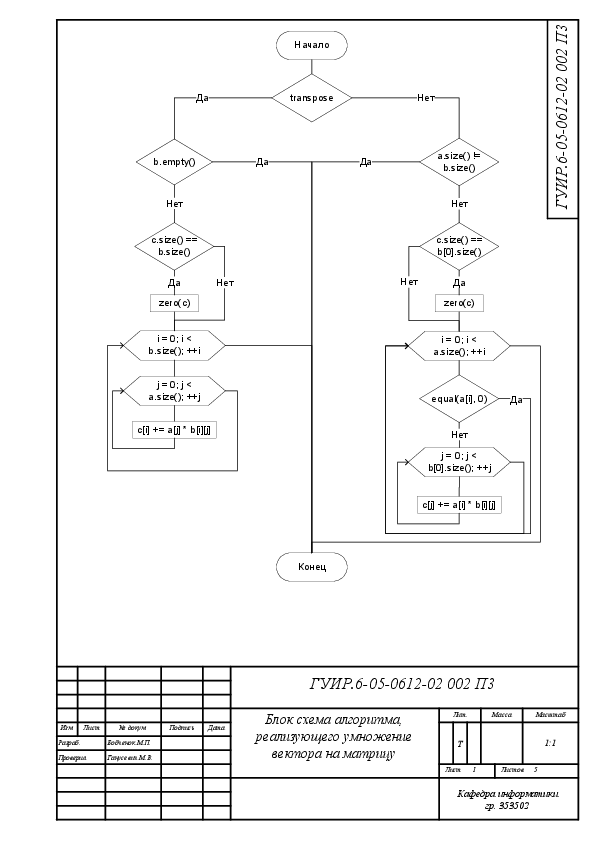
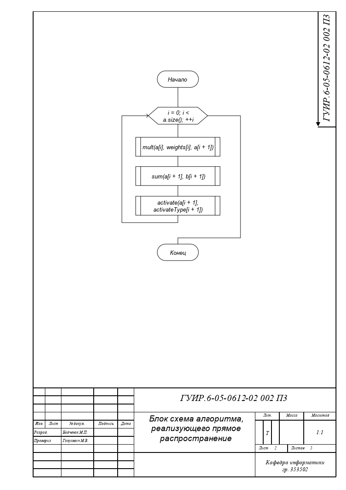
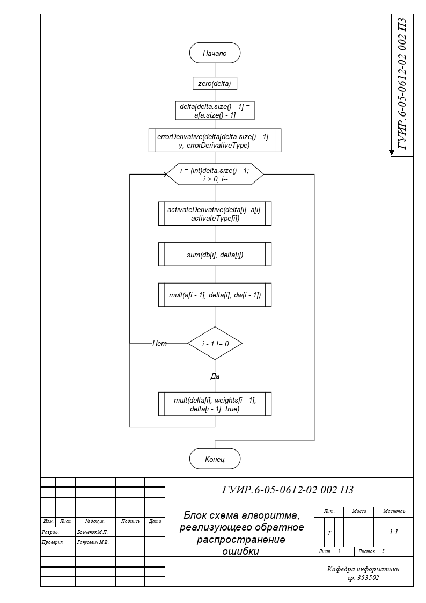
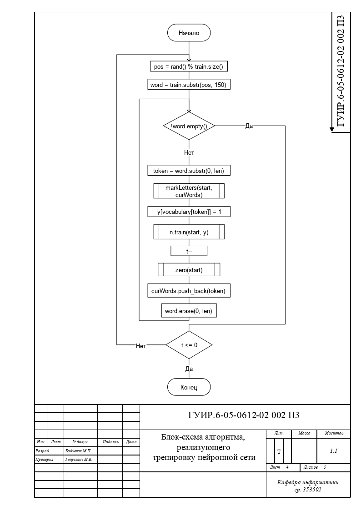
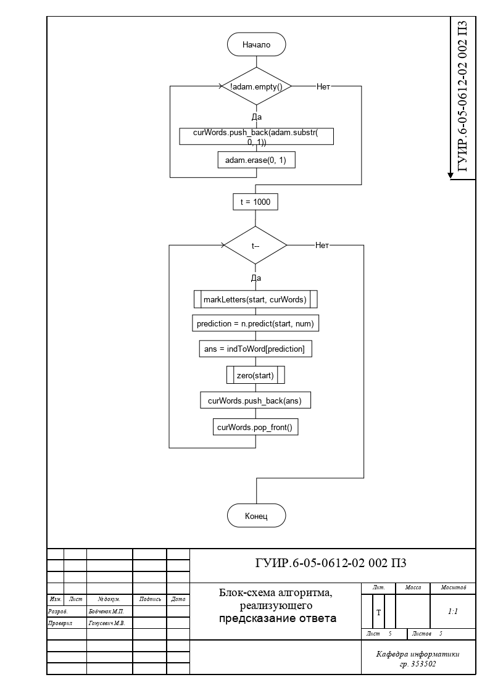

#Разработка приложения для генерации текстового бреда

Данный курсовой проект представляет из себя приложение, позволяющее генерировать текстовый бред.

##Блок-схема алгоритма, реализующего умножение вектора на матрицу

Применяется в: `Network/Network.cpp`, в методе `propagate`, реализованна в методе `mult` в `Network/matrixMath/matrixMath.cpp` 

##Блок-схема алгоритма, реализующего прямое распространение

Применяется в: `Network/Network.cpp`, в методе `predict`, реализованна в методе `propogate` в `Network/Network.cpp` 

##Блок-схема алгоритма, реализующего обратное распространение ошибки

Применяется в: `Network/Network.cpp`, в методе `train`, реализованна в методе `backPropagation` в `Network/Network.cpp` 

##Блок-схема алгоритма, реализующего тренировку нейронной сети

Применяется в: `developersMenu/Menu.cpp`, в методе `train`, реализованна в методе `train` в `developersMenu/Menu.cpp` 

##Блок-схема алгоритма, реализующего предсказание ответа

Применяется в: `userInterface/main_window.cpp`, в методе `generate`, реализованна в методе `train` в `developersMenu/Menu.cpp` 

