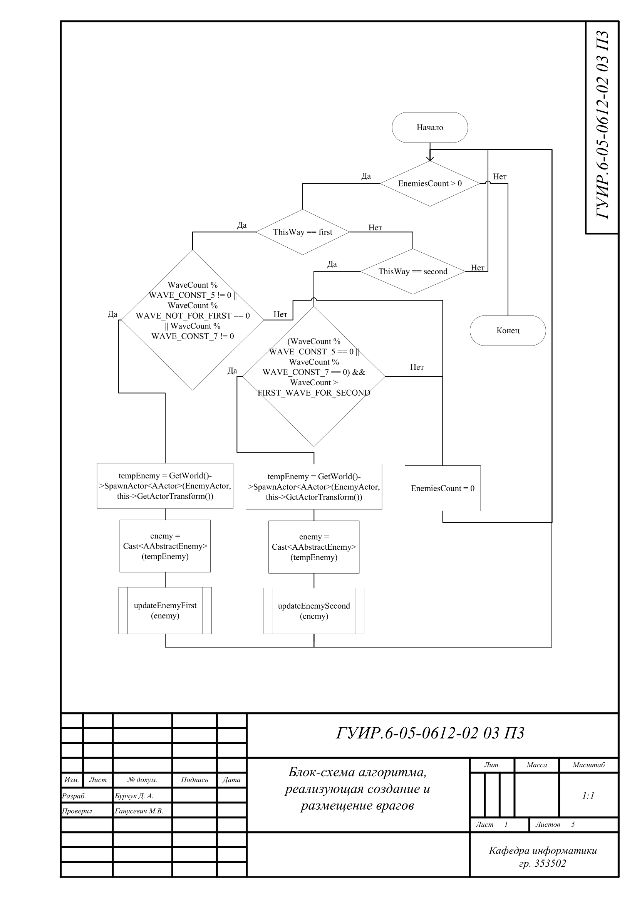
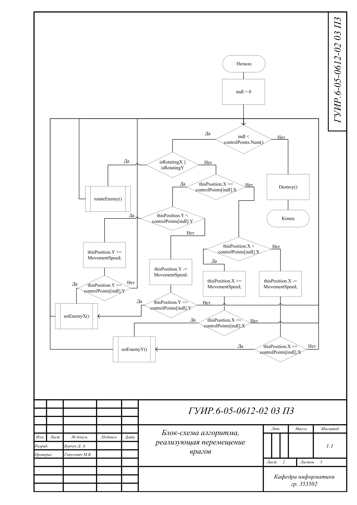
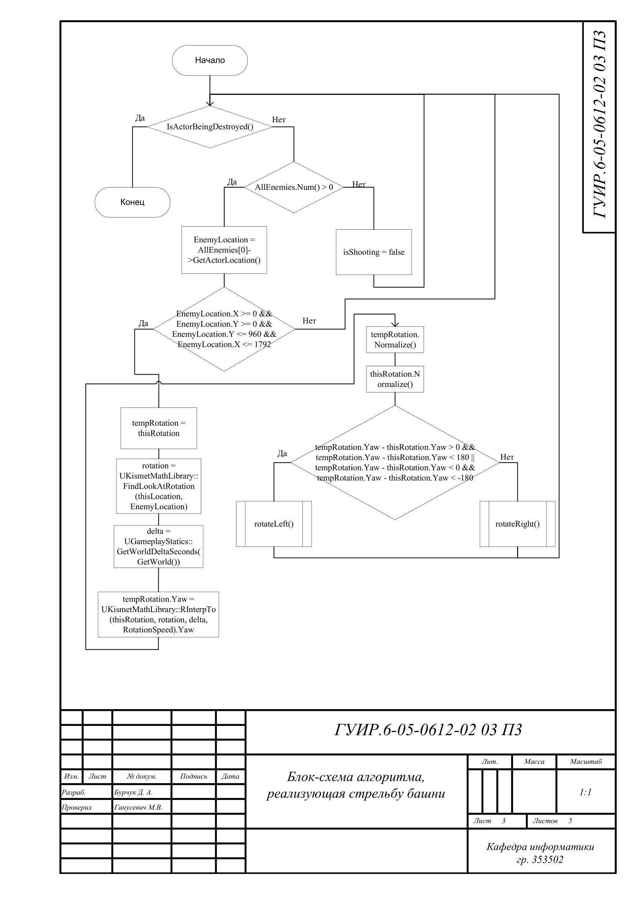
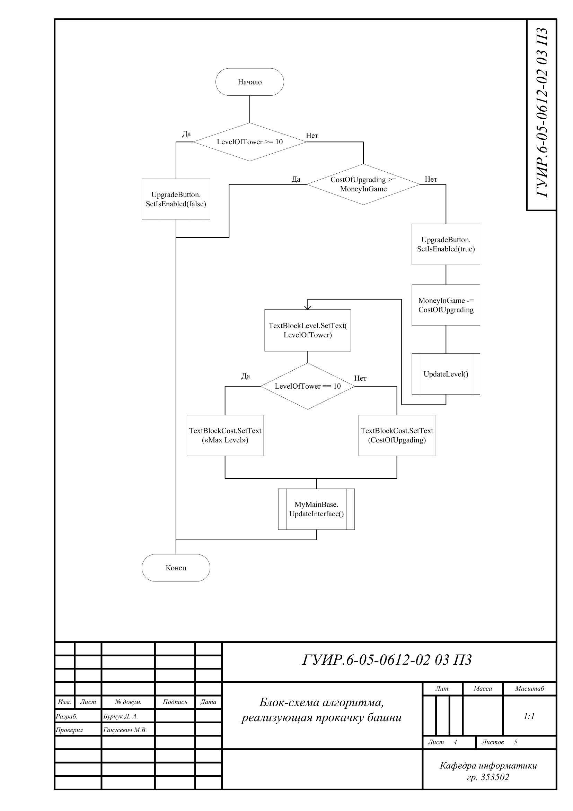
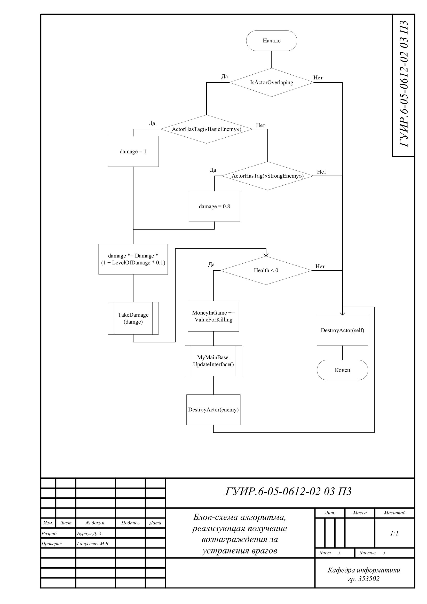

# Написание игры жанра Tower Defense

# Главной целью данной курсовой работы является воссоздание классического представителя жанра Tower Defense. Она включает в себя реализацию следующих алгоритмов: алгоритм создания и размещения врагов, алгоритм перемещения врагов, алгоритм стрельбы башен, алгоритм прокачки башен, алгоритм начисления вознаграждения за убийство врагов. В конечном результате будет получена полноценная игра с реализацией данных алгоритмов.

## Блок-схема алгоритма, реализующего создание и размещение врагов

Применяется в: `/TowerDefense/Source/TowerDefence/Private/Spawner.cpp`

## Блок-схема алгоритма, реализующего перемещение врагов

Применяется в: `/TowerDefense/Source/TowerDefence/Private/AbstractEnemy.cpp`

## Блок-схема алгоритма, реализующего стрельбу башни

Применяется в: `/TowerDefense/Source/TowerDefence/Private/AbstractTower.cpp`

## Блок-схема алгоритма, реализующего прокачку башни

Применяется в: `/TowerDefense/Content/Blueprints/UI/MenuForUpgrading.uasset`

## Блок-схема алгоритма, реализующего получение вознаграждения за устранение врагов

Применяется в: `/TowerDefense/Content/Blueprints/UI/MyBasicBullet.uasset`

