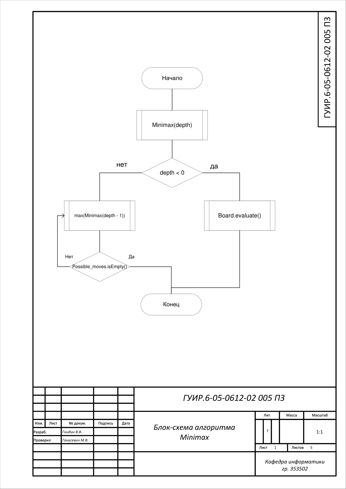
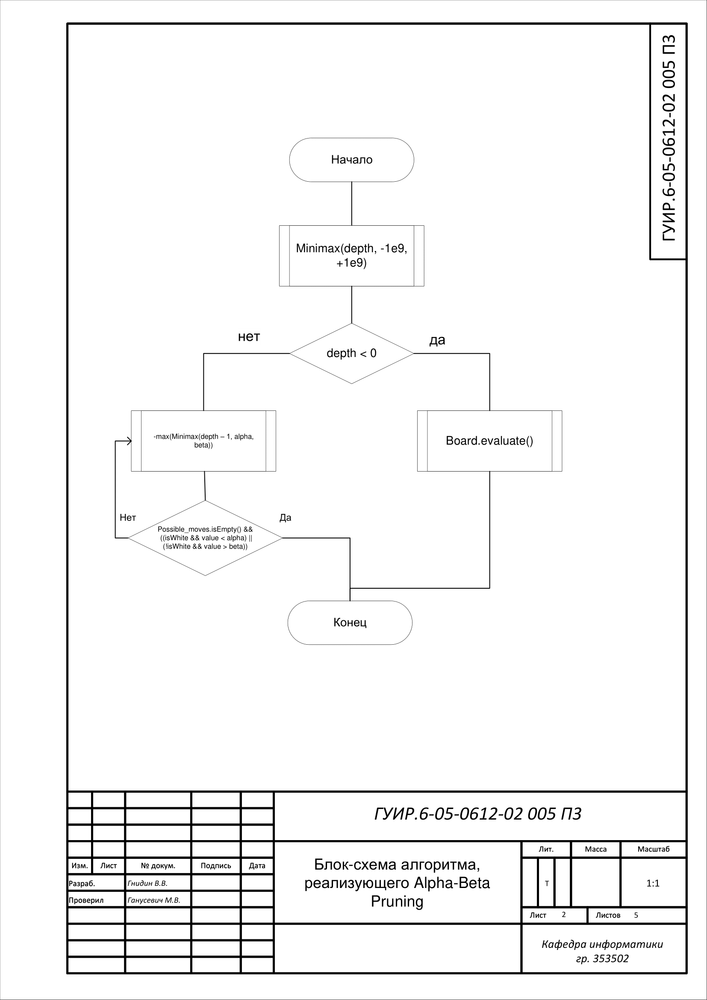
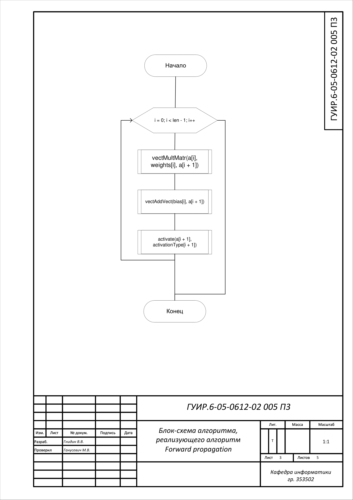
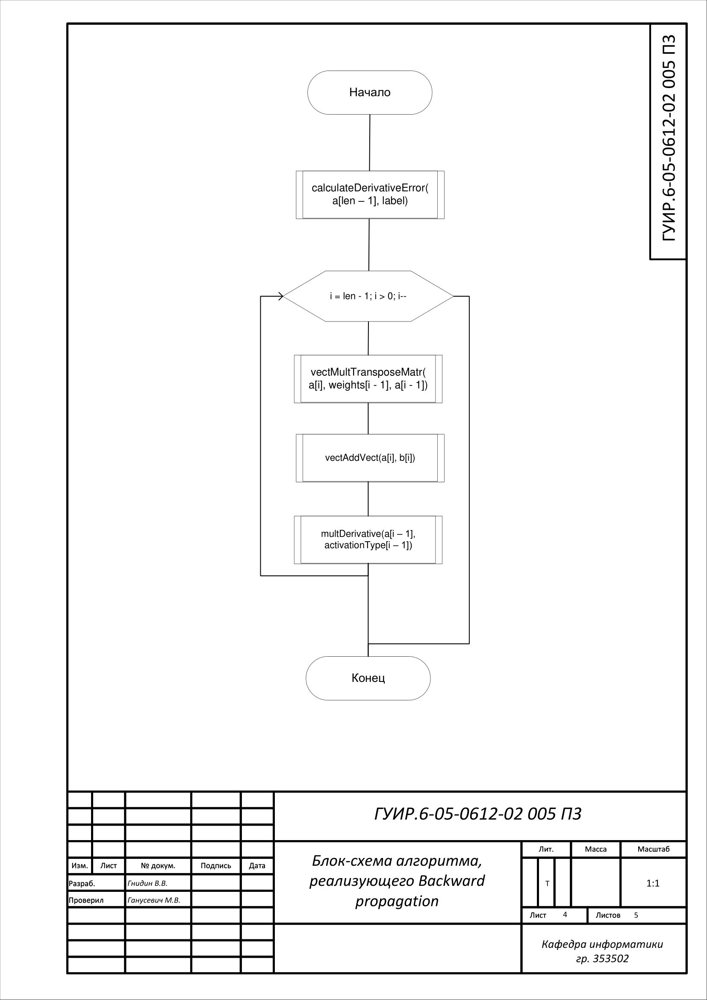
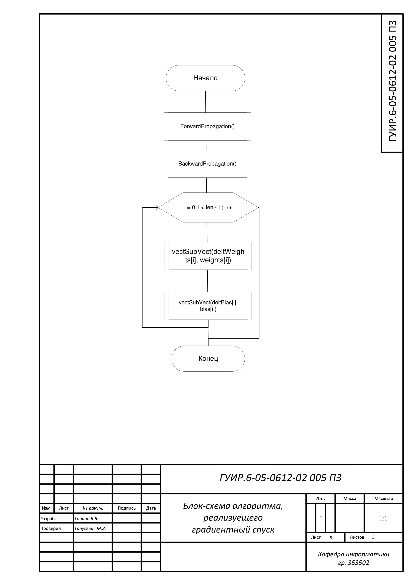

#Разработка приложения для для игры в шахматы

Данный курсовой проект представляет из себя приложение, позволяющее играть в шахматы с компьютером.

##Блок-схема алгоритма Minimax

Применяется в: `src/chess/MinimaxMovePredictor.cpp`, в методе `predictMove`, реализованна в методах `mini` и `maxi` в `src/chess/MinimaxMovePredictor.cpp` 

##Блок-схема алгоритма, реализующего Alpha-Beta Pruning

Применяется в: `src/chess/MinimaxMovePredictor.cpp`, в методе `predictMove`, реализованна в методах `mini` и `maxi` в `src/chess/MinimaxMovePredictor.cpp`

##Блок-схема алгоритма, реализующего алгоритм Forward propagation

Применяется в: `src/neural_network/GPUNeuralNetwork` и `src/neural_network/CPUNeuralNetwork`, в методе `train`, реализованна в методе `forwardPropagation` в `src/neural_network/GPUNeuralNetwork` и `src/neural_network/CPUNeuralNetwork` 

##Блок-схема алгоритма, реализующего алгоритм Backward propagation

Применяется в: `src/neural_network/GPUNeuralNetwork` и `src/neural_network/CPUNeuralNetwork`, в методе `train`, реализованна в методе `backwardPropagation` в `src/neural_network/GPUNeuralNetwork` и `src/neural_network/CPUNeuralNetwork`

##Блок-схема алгоритма, реализующего градиентный спуск

Применяется в: `main.cpp`, в методе `main`, реализованна в методе `train` в `src/neural_network/GPUNeuralNetwork` и `src/neural_network/CPUNeuralNetwork`

