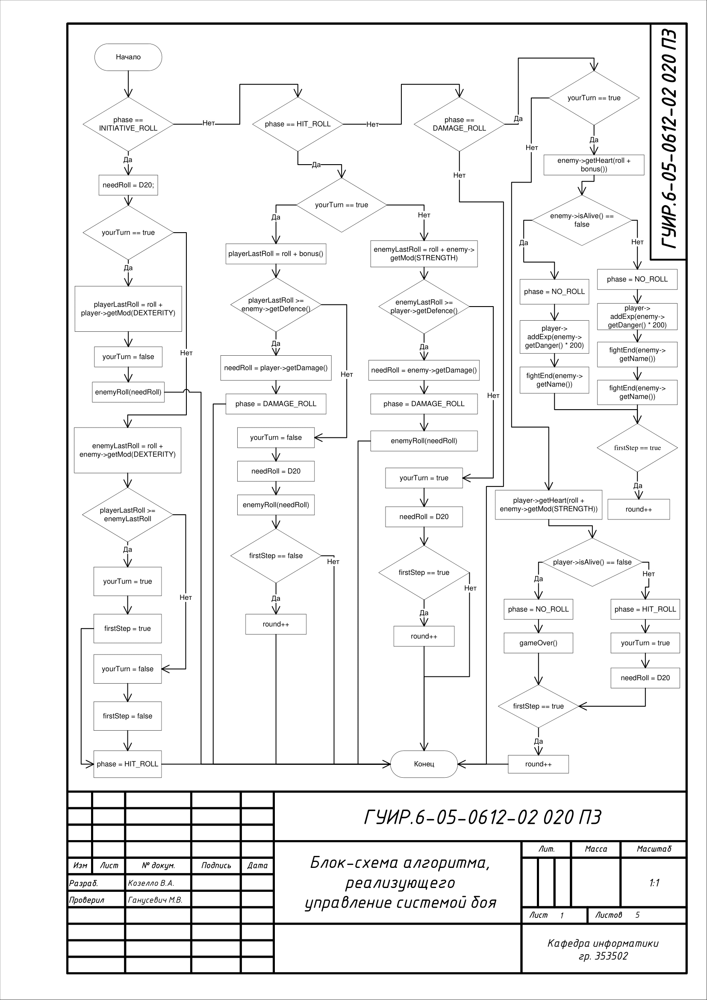
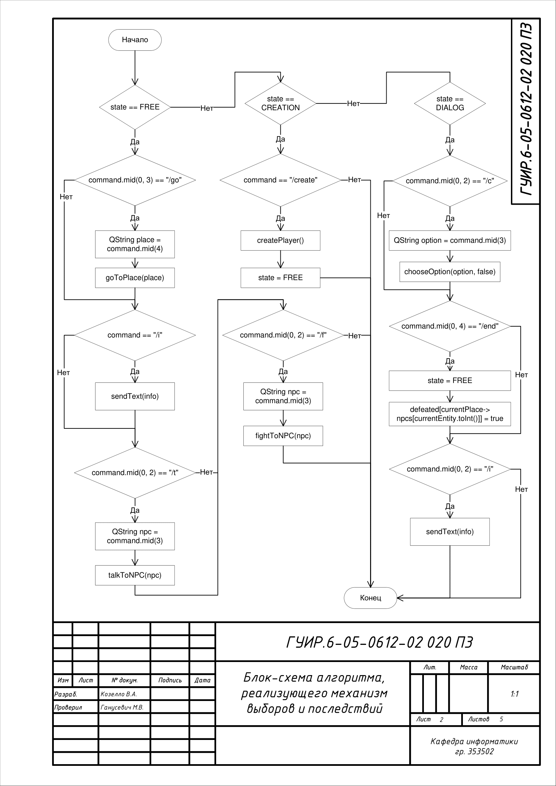
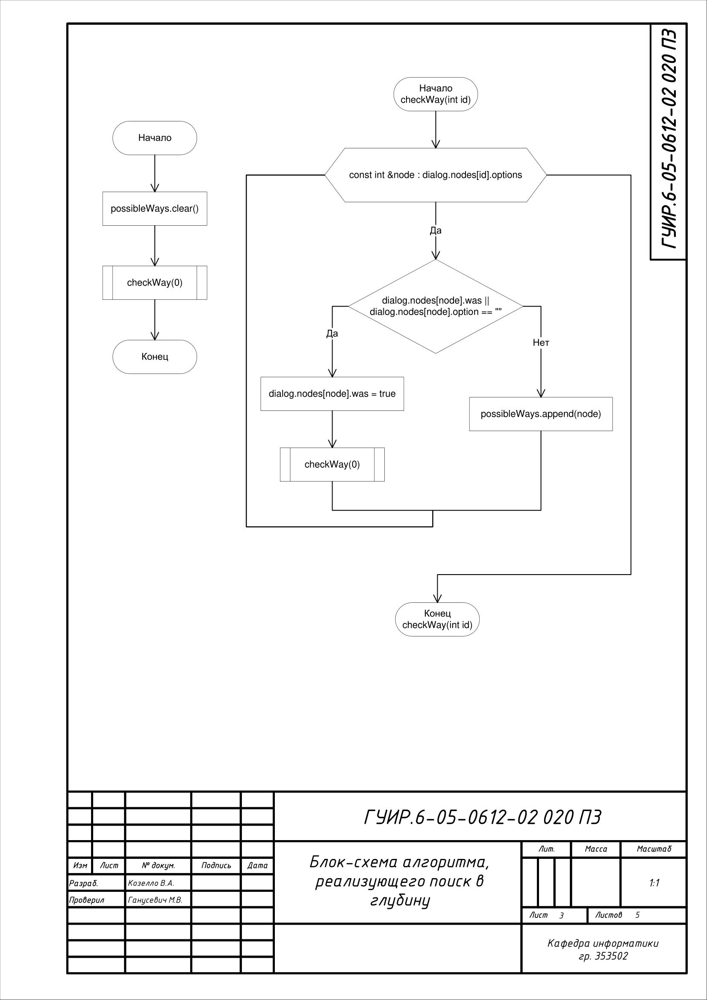
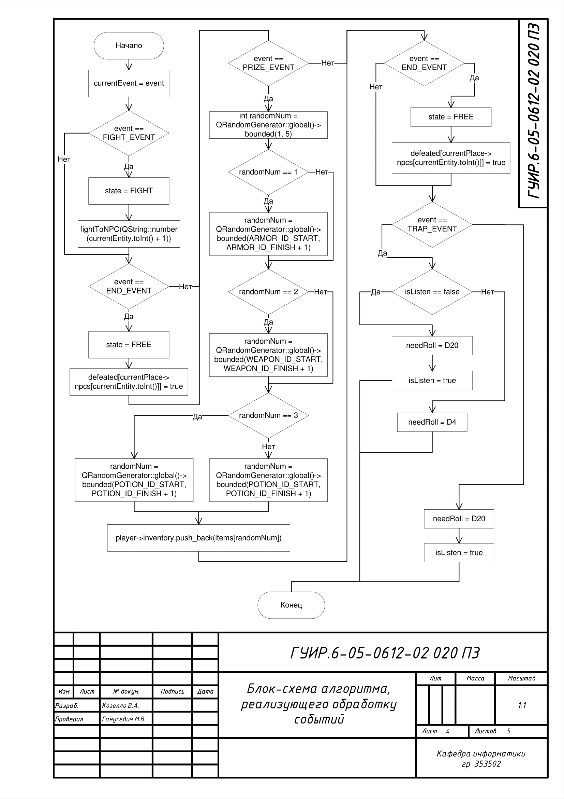
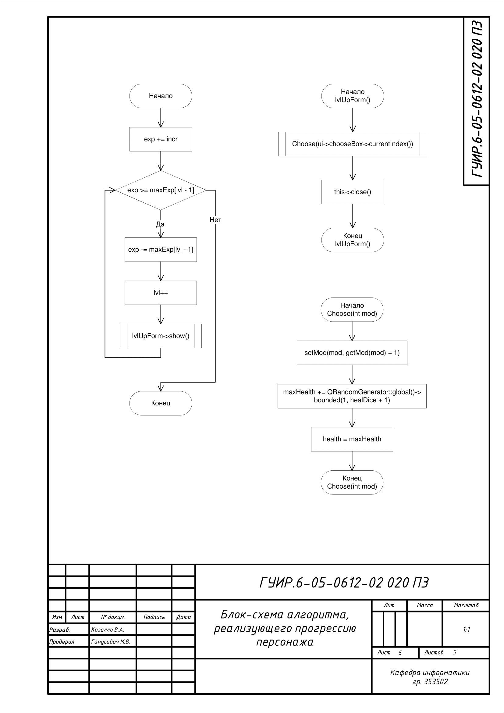

<h2>Создание текстовой RPG (аналог Dungeons & Dragons)</h2>

Целью данного курсового проекта является разработка текстовой RPG,
основой которой является настольная ролевая игра "Dungeons & Dragons",
предоставляющая игрокам возможность исследовать фантастический мир,
вступать в бои с монстрами, развивать своего персонажа и выполнять
разнообразные задания. 

<h3>Блок-схема алгоритма,реализующего управление системой боя</h3>

Применяется в: DungeonsData/compat.cpp. Алгоритм вызывается методом handleRoll и результатом является обновление полей в объекте класса Combat

<h3>Блок-схема алгоритма, реализующего механизм выборов и последствий</h3>

Применяется в: DungeonsData/world.cpp. Алгоритм вызывается методом handleCommand и результатом является обновление полей в объекте класса World

<h3>Блок-схема алгоритма, реализующего поиск в глубину</h3>

Применяется в: DungeonsData/world.cpp. Алгоритм вызывается методом findPossibleWays и реализуется методом checkWay, результат применяется для отображеня возможных вариантов выбора ответа в диалогах

<h3>Блок-схема алгоритма, реализующего обработку событий</h3>

Применяется в: DungeonsData/world.cpp. Алгоритм вызывается методом startEvent и результат применяется для вызова нужного игрового события

<h3>Блок-схема алгоритма, реализующего прогрессию персонажа</h3>

Применяется в: DungeonsData/player.cpp. Алгоритм реализован с помощью методов addExp и handleMod результат обновляет поля объекта класса Player

