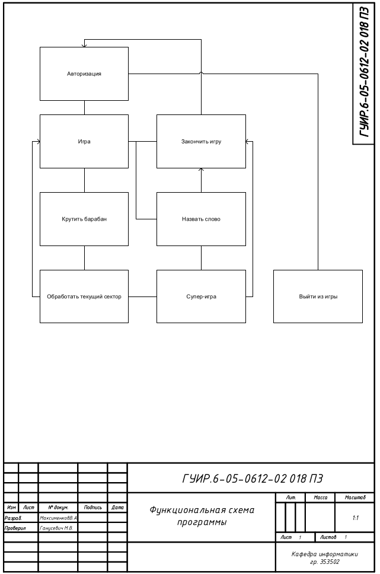
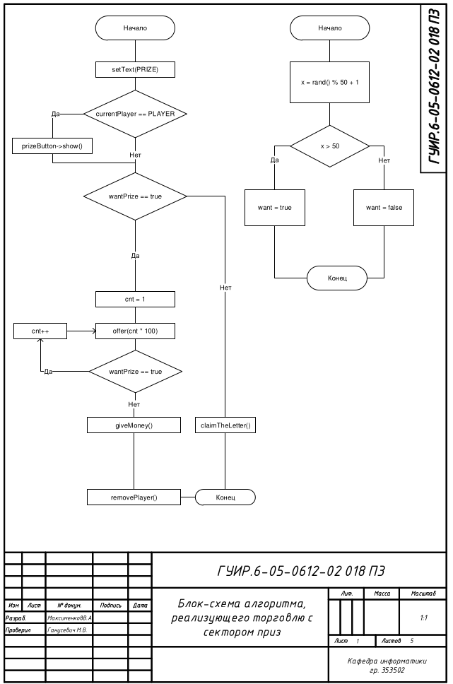
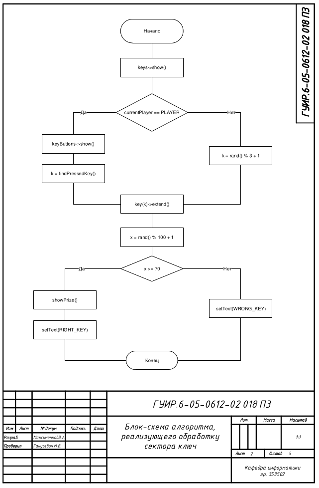
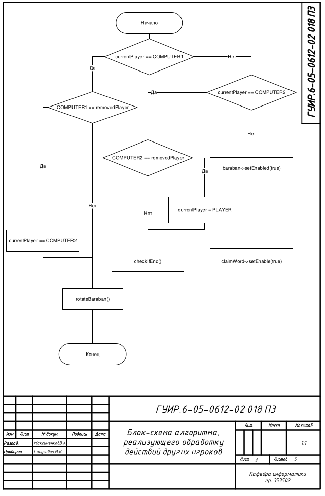
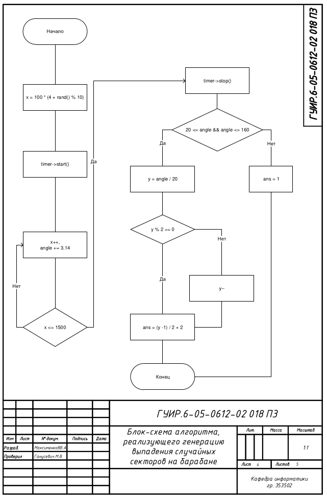
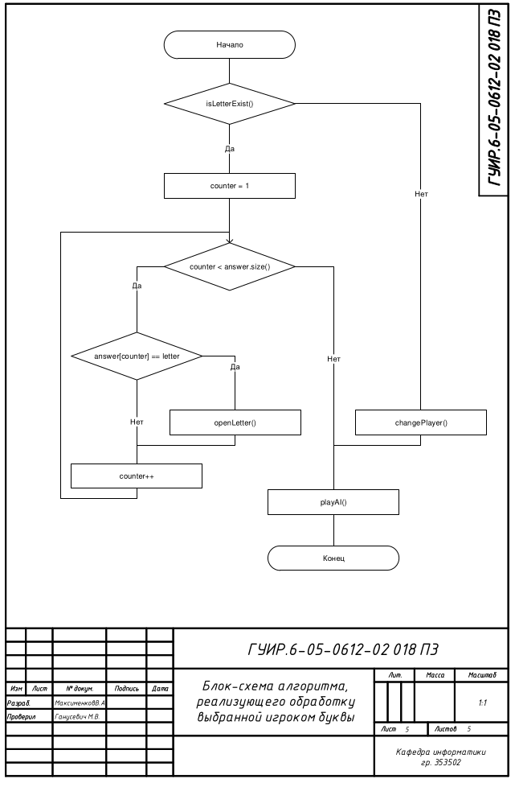

# Поле чудес

В данной курсовой работе присутствуют 6 блок-схем: 1 функциональная схема программы и 5 блок-схем алгоритмов, реализующих работу программы

## Функциональная схема программы

## Блок-схема алгоритма, реализующего торговлю с сектором приз

Применяется в: `CourseWork/game.cpp` в функции `void Game::traidingWithPrize`.

## Блок-схема алгоритма, реализующего обработку сектора ключ

Применяется в: `CourseWork/game.cpp` в функциях `void Game::processSectorKey`, `void Game::selectKey` и `void Game::processSelectedKey`.

## Блок-схема алгоритма, реализующего обработку действий других игроков

Применяется в: `CourseWork/game.cpp` в функциях `void Game::playAI`, `void Game::removeThePlayer`.

## Блок-схема алгоритма, реализующего генерацию выпадения случайных секторов на барабане

Применяется в: `CourseWork/game.cpp` и в `CourseWork/baraban.cpp` в функциях `void Game::rotateBaraban`, `void Baraban::rotationFunction` и `int Baraban::evaluateCurrentSector`.

## Блок-схема алгоритма, реализующего обработку выбранной игроком буквы

Применяется в: `CourseWork/game.cpp` в функциях `bool Game::isExists`, `void Game::openingLettersFunction`, `void Game::openLetter`.

