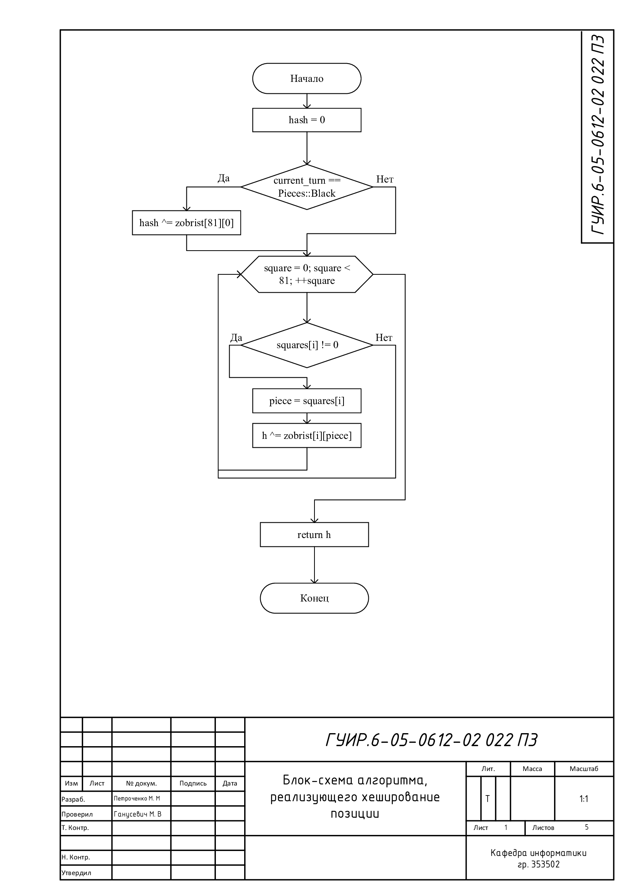
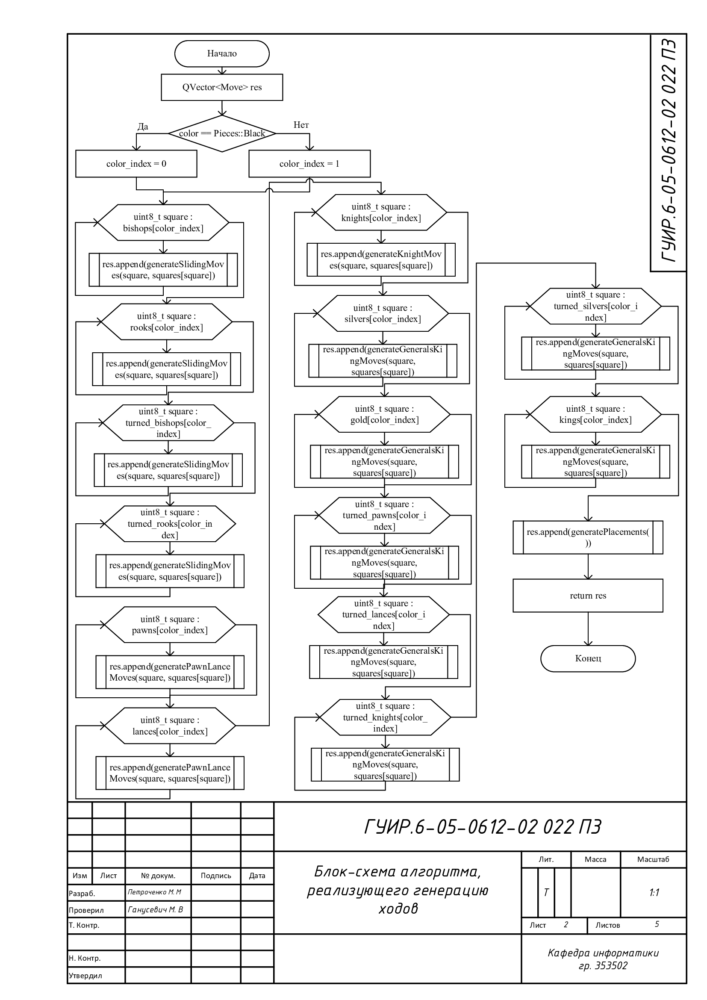
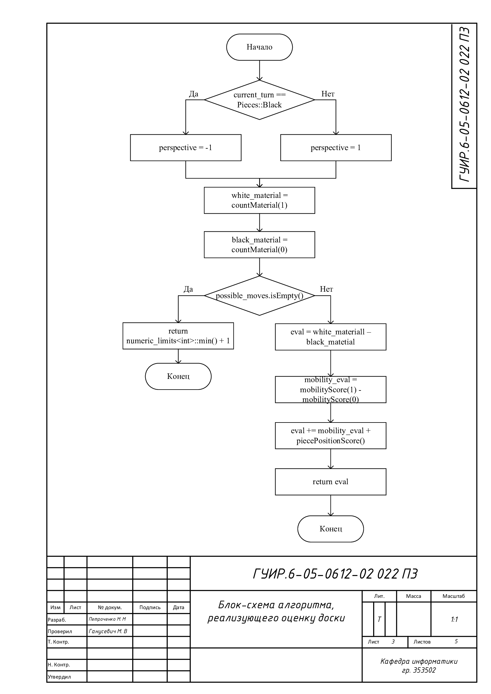
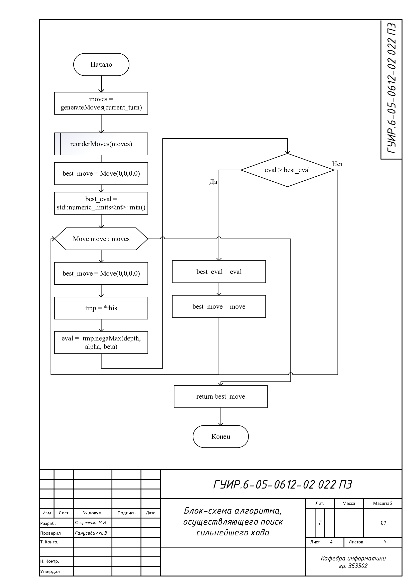
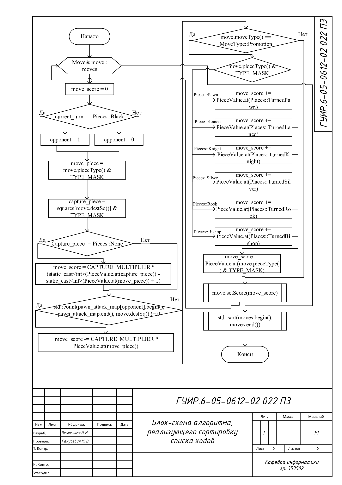

#Разработка приложения для игры в сёги

Данный курсовой проект представляет из себя приложение, позволяющее играть в сёги с реальным соперником на одном экране или же с компьютером.

##Блок-схема алгоритма, реализующего хеширование позиции

Применяется в: `lib/search.cpp`, в методе `negaMax`, реализованна в методе `hash` в `lib/Board.cpp` 

##Блок-схема алгоритма, реализующего генерацию ходов

Применяется в: `lib/Board.cpp`, в методе `makeMove`, реализованна в методе `generateMoves` в `lib/move_generation.cpp` 

##Блок-схема алгоритма, реализующего оценку доски

Применяется в: `lib/search.cpp`, в методе `negaMax`, реализованна в методе `evalBoard` в `lib/evaluation.cpp` 

##Блок-схема алгоритма, реализующего поиск сильнейшего хода

Применяется в: `src/mainwindow.cpp`, в методе `makeMove`, реализованна в методе `search` в `lib/search.cpp` 

##Блок-схема алгоритма, реализующего сортировку списка ходов 

Применяется в: `lib/search.cpp`, в методе `negaMax`, реализованна в методе `reorderMoves` в `lib/search.cpp` 

