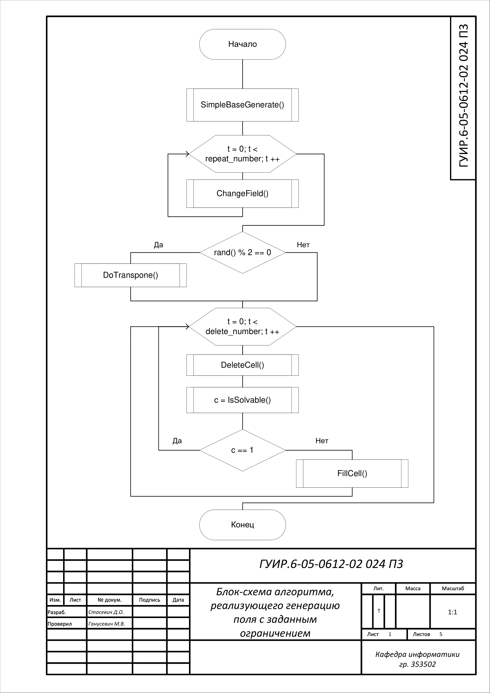
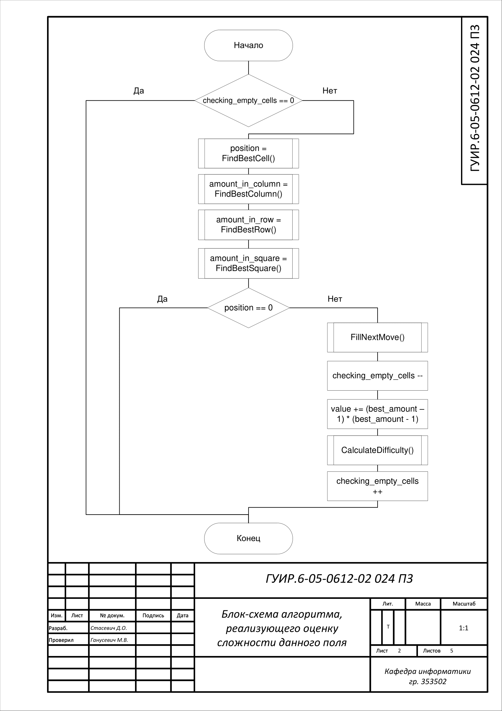
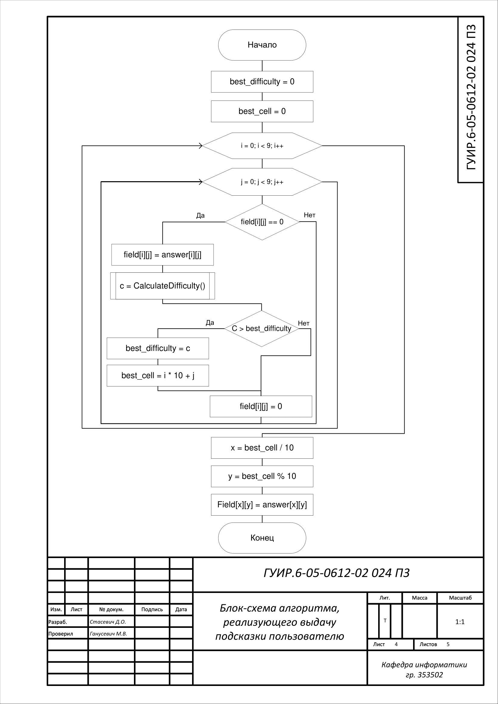
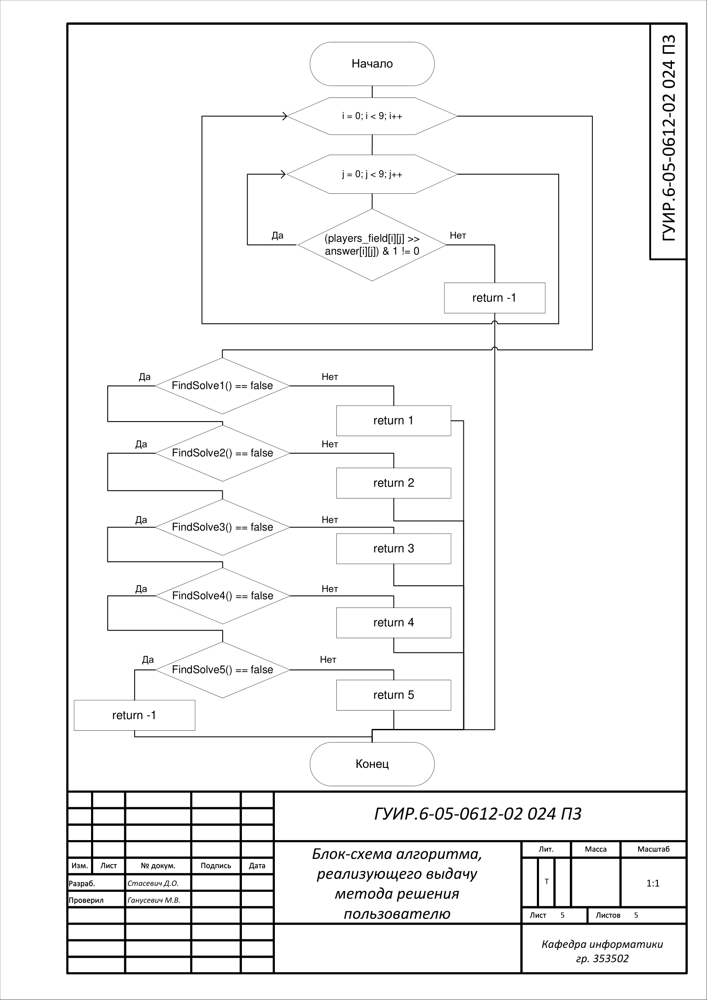

#Разработка аналога игры Судоку

Данный курсовой проект представляет приложение, позволяющее играть в Судоку и сохдавать свои головоломки.

##Блок-схема алгоритма, реализующего генерацию полю с заданным ограничением

Применяется в: `SudokuField/PlayersField.cpp`, при вызове конструктора поля, реализована в методе `SimpleLevelGenerate` в `SudokuField/SudokuField.cpp` 

##Блок-схема алгоритма, реализующего оценку сложности данного поля

Применяется в: `SudokuField/SudokuField.cpp`, в методе `CalculateDifficulty`, реализована в методе `GetDifficulty` в `SudokuField/SudokuField.cpp` 

##Блок-схема алгоритма, реализующего генерацию поля заданной сложности

Применяется в: `SudokuField/PlayersField.cpp`, при вызове конструктора поля, реализована в методе `DifficultLevelGenerate` в `SudokuField/SudokuField.cpp` 

##Блок-схема алгоритма, реализующего выдачу подсказки пользователю

Применяется в: `mainwindow/mainwindow.cpp`, в методе `simple_hint_button_clicked`, реализована в методе `GetSimpleHint` в `SudokuField/PlayersField.cpp` 

##Блок-схема алгоритма, реализующего выдачу метода решения пользователю 

Применяется в: `mainwindow/mainwindow.cpp`, в методе `clever_hint_button_clicked`, реализована в методе `GetCleverHint` в `SudokuField/Pl   ayersField.cpp`

