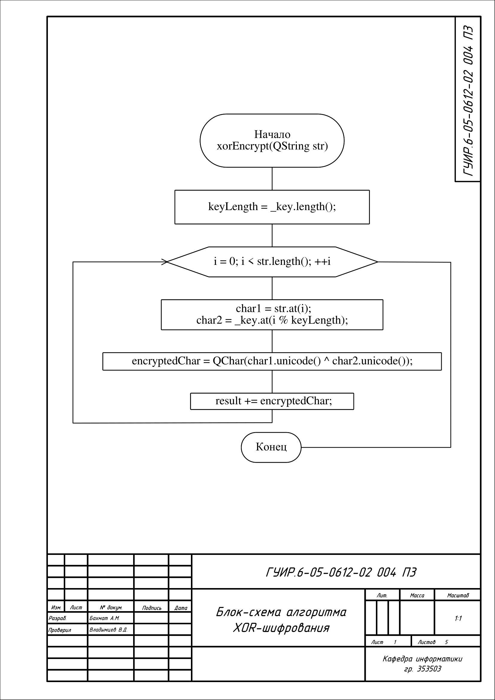
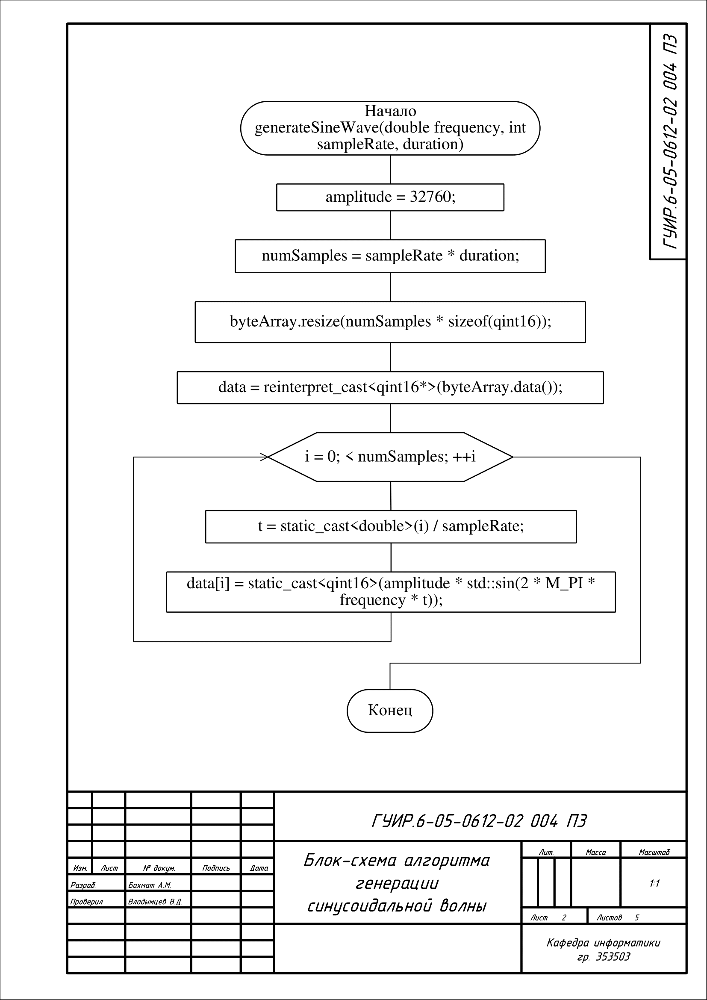
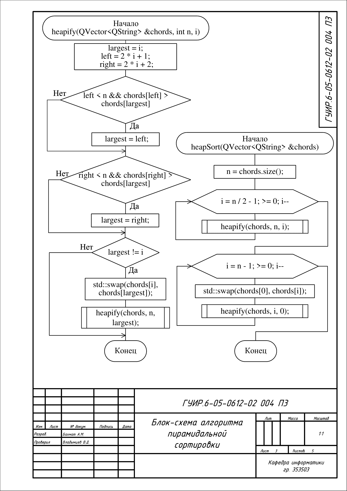
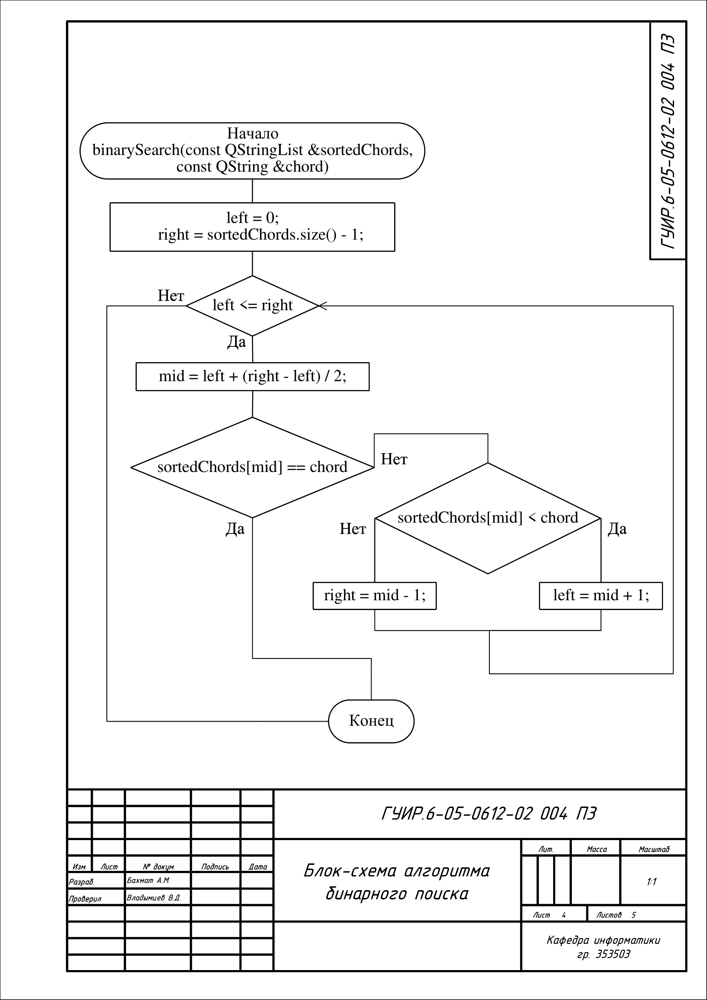
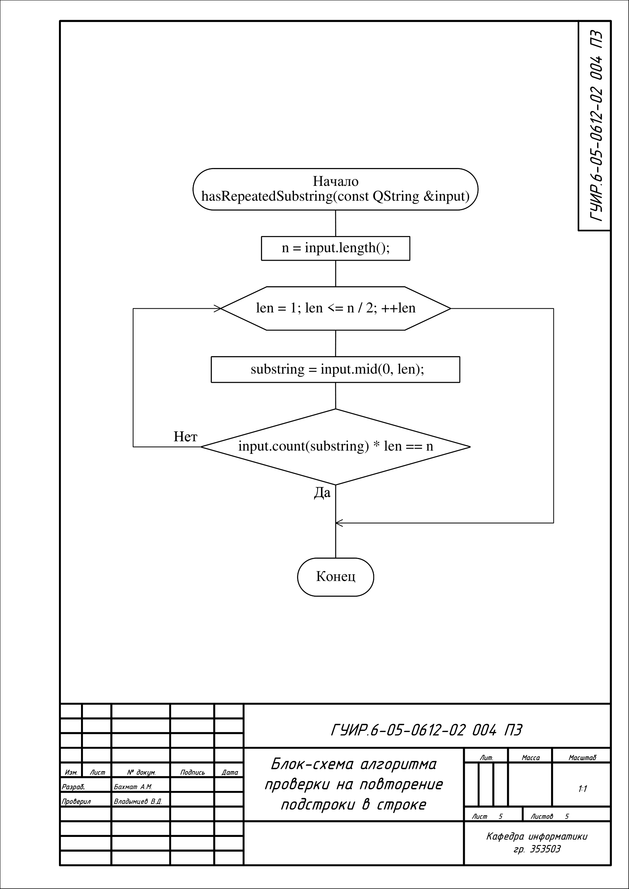

# Приложение-помощник для струнных инструментом

Данное приложение написано на С++ используя Qt5, приложение содержит хроматический тюнер, функцию транспонирования аккордов и метроном.

## Блок-схема алгоритма XOR-шифрования

Применяется в: `mainwindow.cpp` в функции `QString MainWindow::xorEncrypt(QString str)`. Далее результат используется в `void MainWindow::saveSettings()` и в `void MainWindow::getSettings()`.

## Блок-схема алгоритма генерации синусоидальной волны

Применяется в: `tuner.cpp` в функции `QByteArray Tuner::generateSineWave(double frequency, int sampleRate, int duration)`. Далее результат используется в `QString Tuner::generateSoundFile(double frequency)`.

## Блок-схема алгоритма пирамидальной сортировки

Применяется в: `chordtransposer.cpp` в функциях `void ChordTransposer::heapSort(QVector<QString> &chords)` и `void ChordTransposer::heapify(QVector<QString> &chords, int n, int i)`. Далее результат используется в `QStringList ChordTransposer::sortChords(const QStringList &chords)`.

## Блок-схема алгоритма бинарного поиска

Применяется в: `chordtransposer.cpp` в функции `bool ChordTransposer::binarySearch(const QStringList &sortedChords, const QString &chord)`. Далее результат используется в `void MainWindow::on_searchButton_clicked()`.

## Блок-схема алгоритма проверки на повторение подстроки в строке

Применяется в: `chordtransposer.cpp` в функции `bool ChordTransposer::hasRepeatedSubstring(const QString &input)`. Далее результат используется в `QStringList ChordTransposer::transposeChords(const QStringList &chords, int transposeInterval)`.

