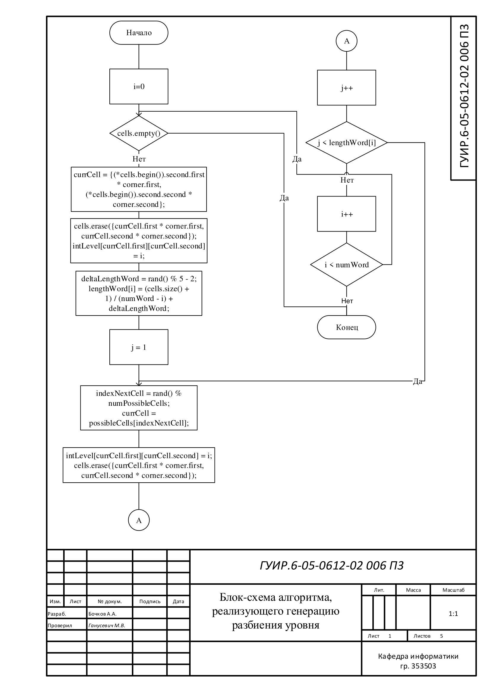
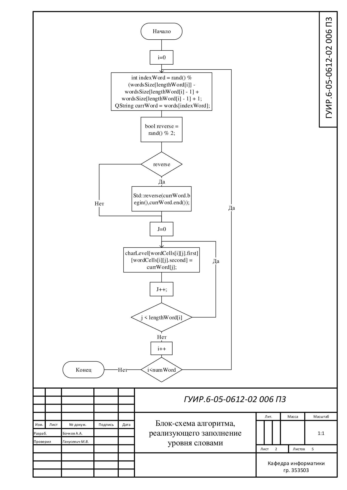
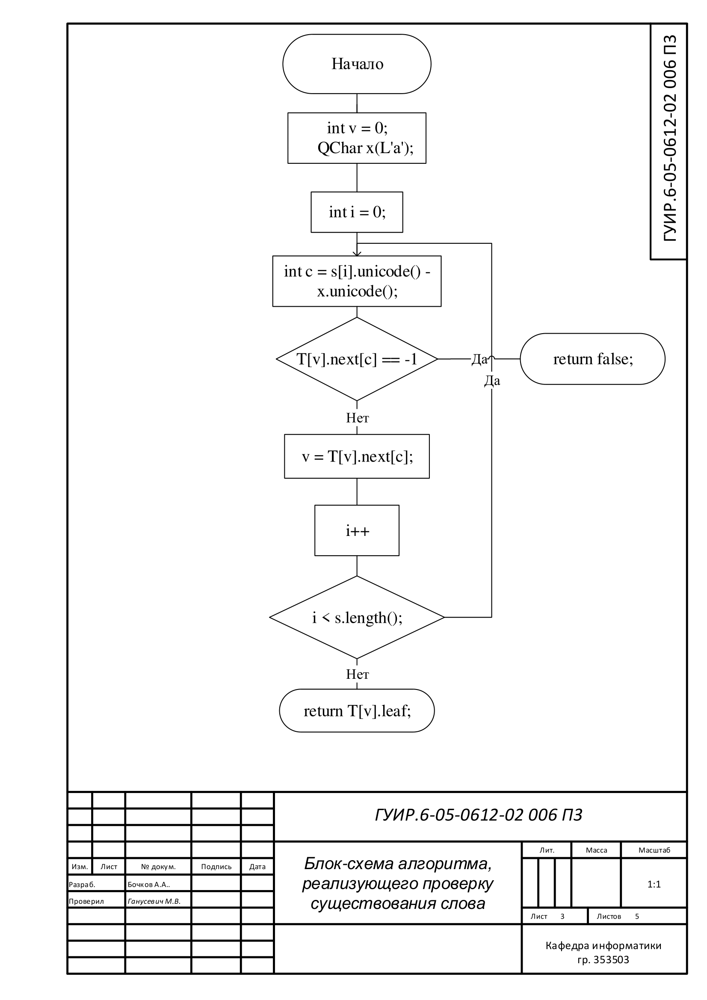
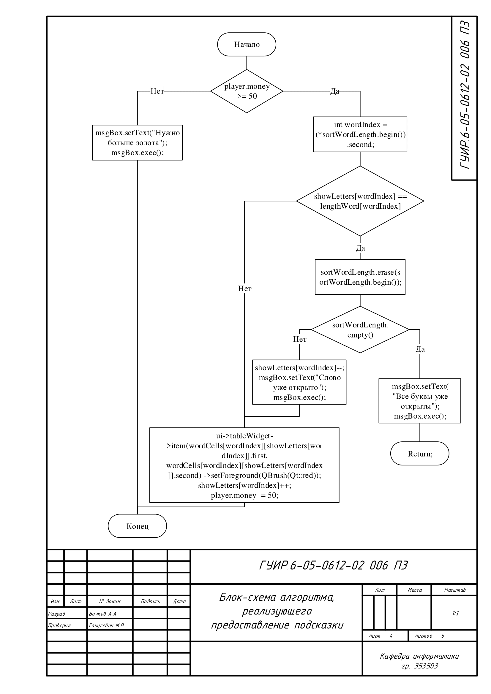
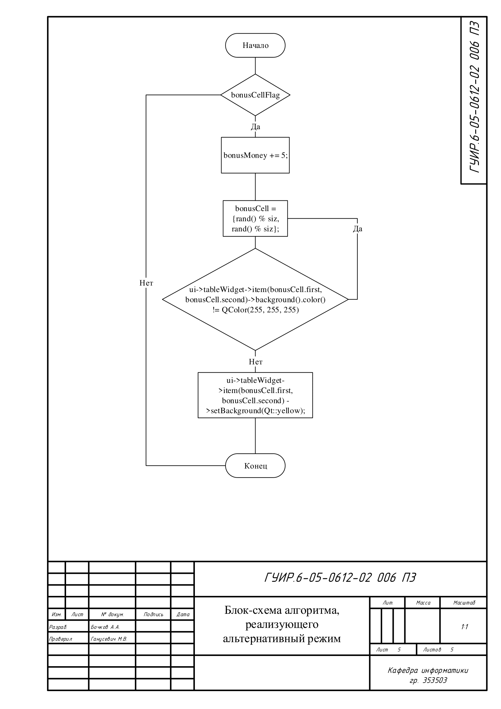

## Блок-схема алгоритма, реализующего генерацию разбиения уровня

Применяется в: `Fundamentals-of-algorithmization-and-programming/353503/Бочков А.А./Курсовая работа/Code/filword/level.cpp` в методе generateLevel(int, int)

## Блок-схема алгоритма, реализующего заполнение уровня словами

Применяется в: `Fundamentals-of-algorithmization-and-programming/353503/Бочков А.А./Курсовая работа/Code/filword/level.cpp` в методе fillLevel(int)

## Блок-схема алгоритма, реализующего проверку существования слова

Применяется в: `Fundamentals-of-algorithmization-and-programming/353503/Бочков А.А./Курсовая работа/Code/filword/bor.cpp` в методе findWord(QString)

## Блок-схема алгоритма, реализующего предоставление подсказки

Применяется в: `Fundamentals-of-algorithmization-and-programming/353503/Бочков А.А./Курсовая работа/Code/filword/level.cpp` в методе on_pushButton_3_clicked()

## Блок-схема алгоритма, реализующего альтернативный режим

Применяется в: `Fundamentals-of-algorithmization-and-programming/353503/Бочков А.А./Курсовая работа/Code/filword/level.cpp` в методе mouseReleaseEvent(QMouseEvent *event)

