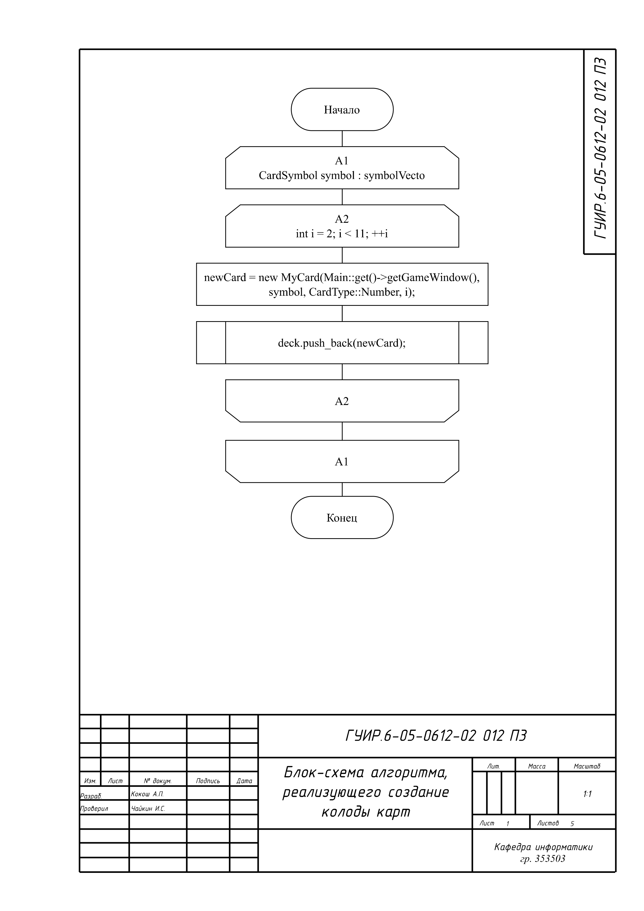
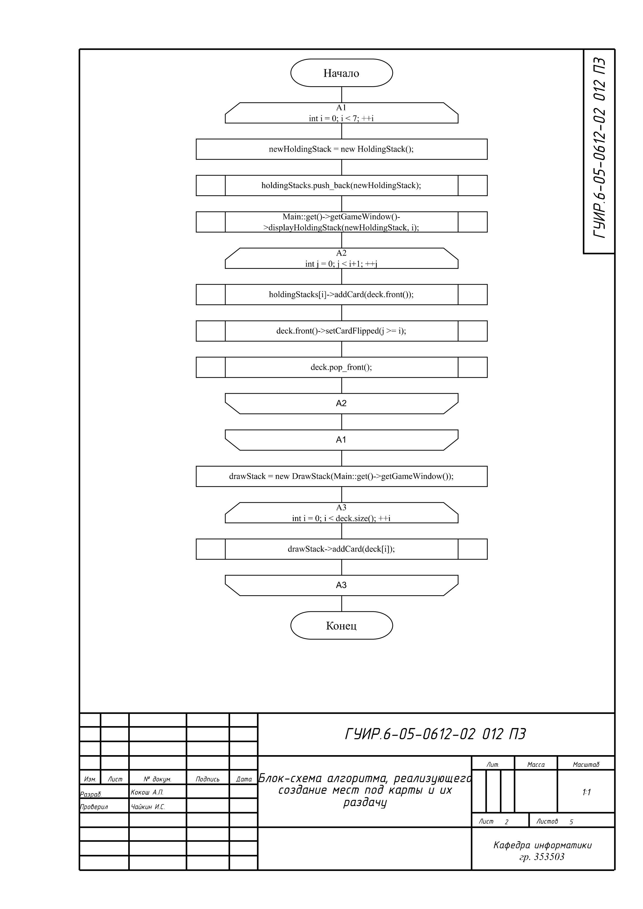
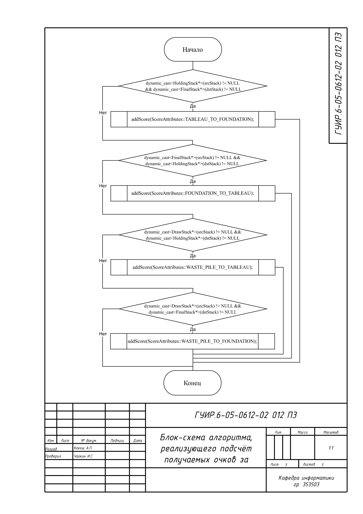
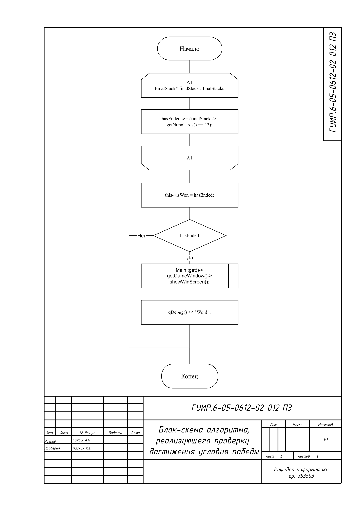
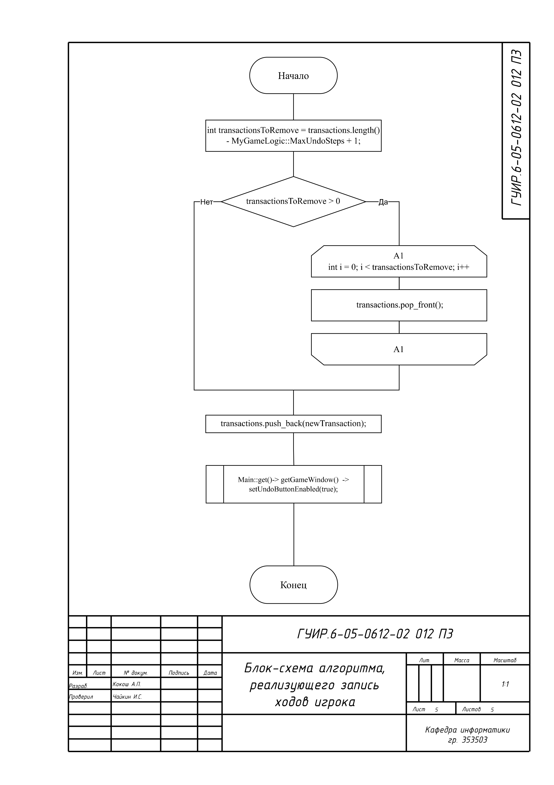

# Игра "Пасьянс"

## Блок-схема алгоритма, реализующего создание колоды карт

Реализован в: `MyGameLogic.cpp`
Данный алгоритм используется в `MyGameLogic.cpp`
Название "setUp"

)

## Блок-схема алгоритма, реализующего создание мест под карты и их раздачу

Реализован в: `MyGameLogic.cpp`
Данный алгоритм используется в `MyGameLogic.cpp`
Название "setUp"

## Блок-схема алгоритма, реализующего подсёт очков за ход

Реализован в: `MyGameLogic.cpp`
Данный алгоритм используется в `MyGameLogic.cpp`
Название "evaluateScore".

## Блок-схема алгоритма, реализующего проверку достижения условия победы 

Пример этого алгоритма показан на функциях отрисовки травы.
Реализован в: `MyGameLogic.cpp`
Данный алгоритм используется в `MyGameLogic.cpp`
Название "checkHasEnded".

## Блок-схема алгоритма, реализующего запись ходов игрока

Реализован в: `MyGameLogic.cpp`
Данный алгоритм используется в `MyGameLogic.cpp`
Название "addTransaction".

