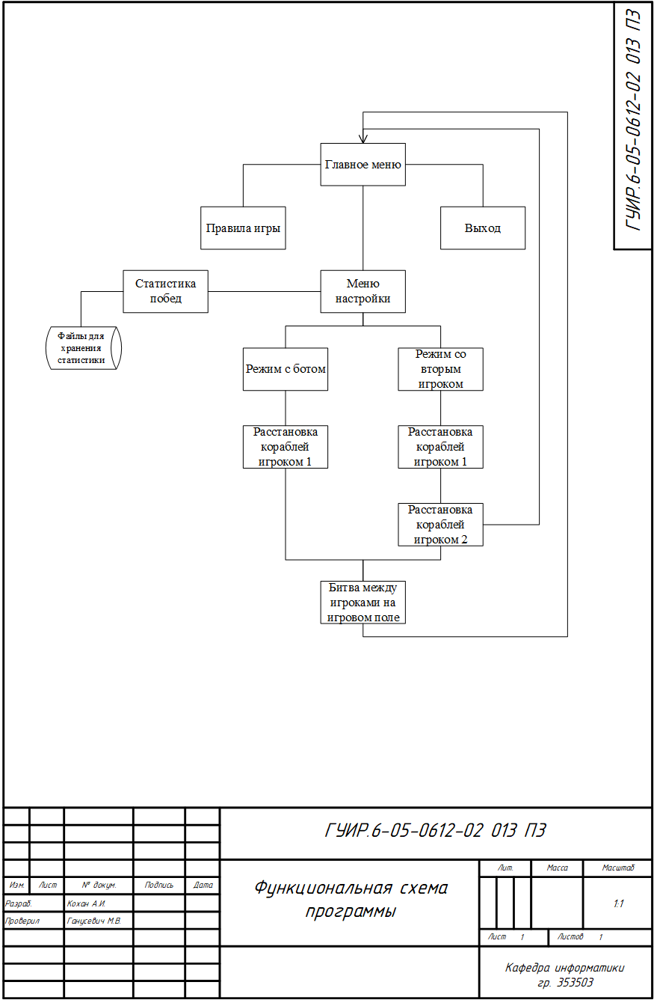
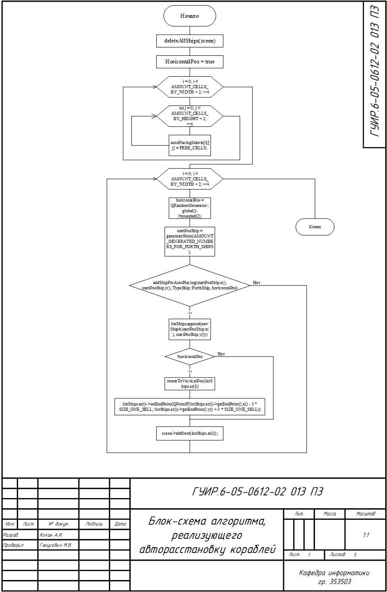
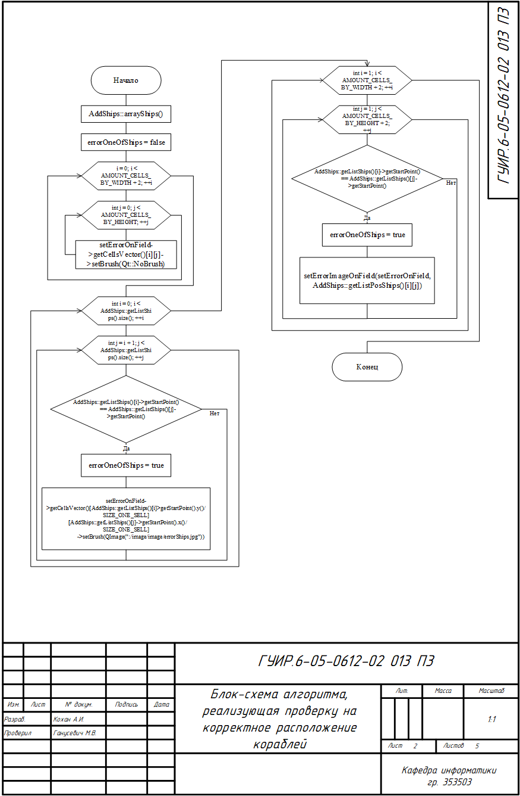
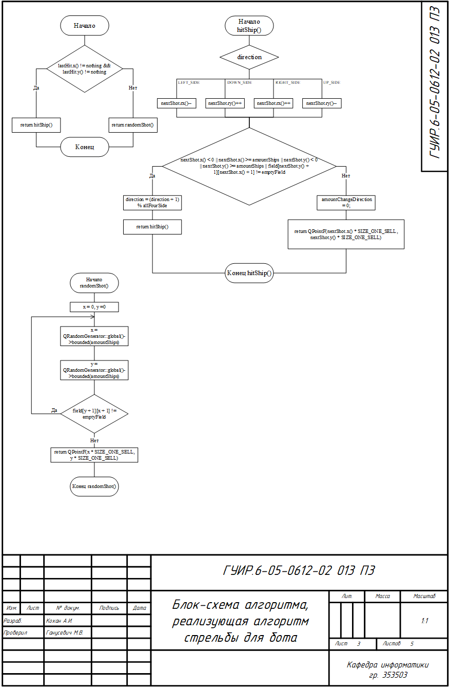
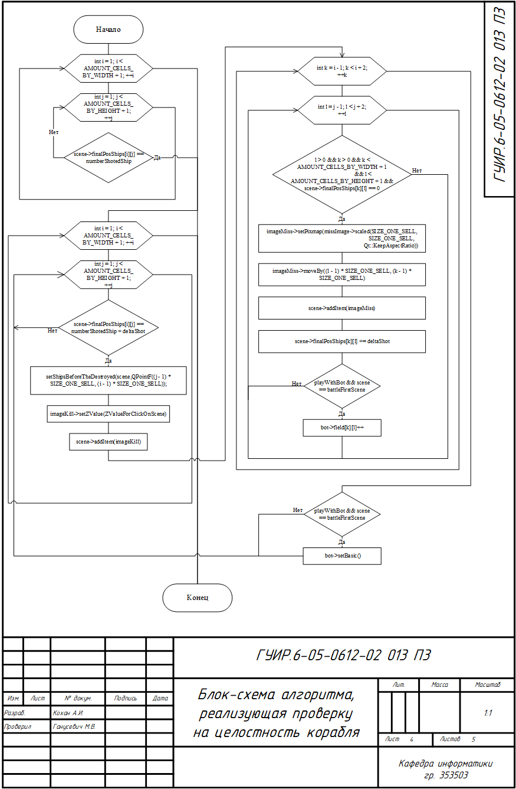
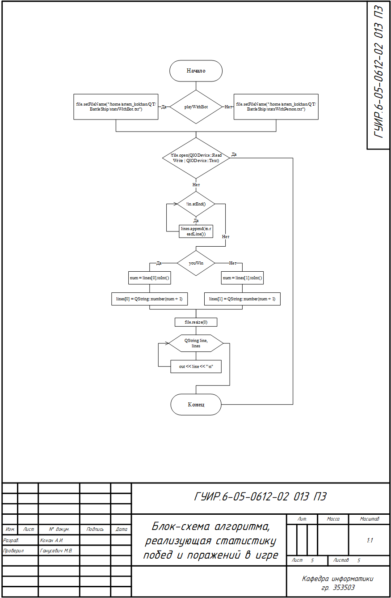

# Разработка программы на языке С++, с использованием фреймворка QT, реализующая игру морской бой

## Функциональная схема программы

## Блок-схема алгоритма, реализующая авторассановку кораблей

Применяется в `src/BattleShip/addShip.cpp` в функции `AddShips::autoPlacing`.

## Блок-схема алгоритма, реализующая проверку на корректное расположение кораблей

Применяется в `src/BattleShip/correctposship.cpp` в функции `CorrectPosShip::correctPosShip`.

## Блок-схема алгоритма, реализующая алгоритм стрельбы для бота

Применяется в `src/effects/Reverb.cpp` в функции `Reverb::_process`.

## Блок-схема алгоритма, реализующая проверку на целостность корабля

Применяется в `src/effects/TimePitch.cpp` в функции `TimePitch::_process`.

## Блок-схема алгоритма, реализующая статистику побед и поражений в игре

Применяется в `src/effects/Pitch.cpp` в функции `Pitch::processFftChunk`.

