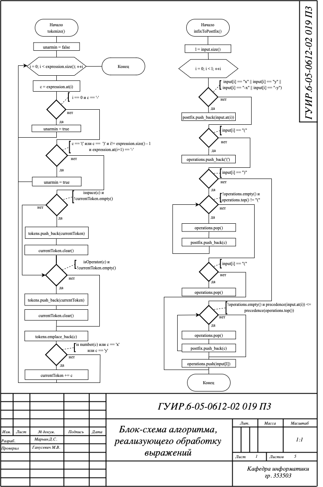
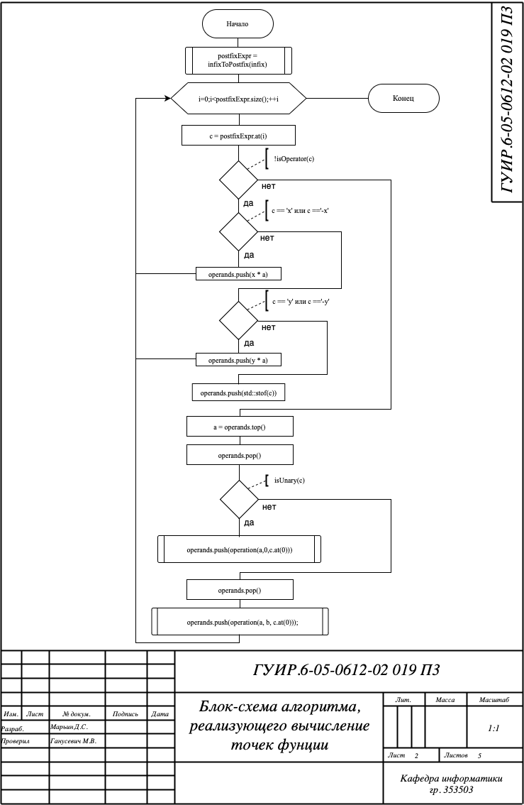
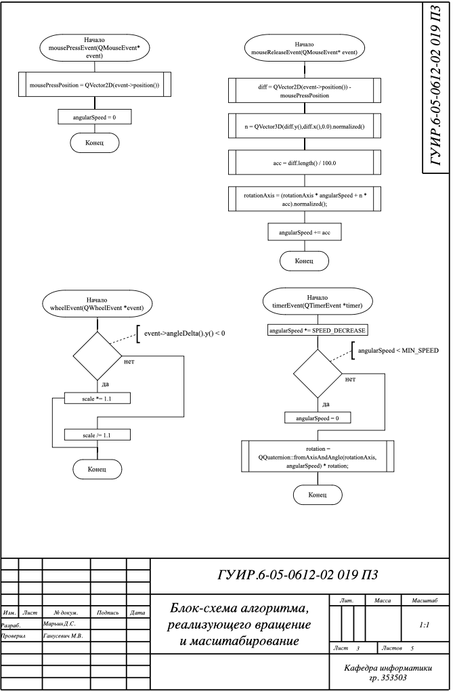
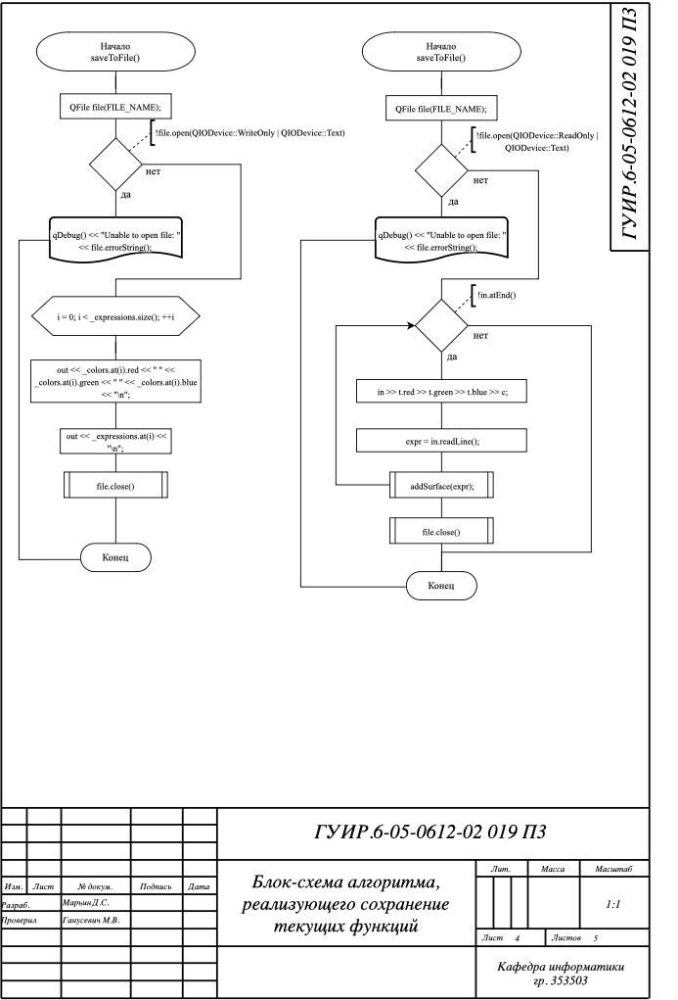

## Визуальный редактор 3D графиков

## Функциональная cхема программы

## Блок-схема алгоритма, реализующего обработку выражений

Применяется в: parser.cpp в методе infixToPostfix(std::string infix)

## Блок-схема алгоритма, реализующего вычисление точек фунции

Применяется в: parser.cpp в методе Сalc(float x, float y,std::string& infix)

## Блок-схема алгоритма, реализующего вращение и масштабирование

Применяется в: mainwidget.cpp в методах mouseReleaseEvent(QMouseEvent *e), wheelEvent(QWheelEvent *e), timerEvent
(QTimerEvent *timer)

## Блок-схема алгоритма, реализующего сохранение текущих функций

Применяется в: surface.cpp в методе saveToFile()

## Блок-схема алгоритма, реализующего нахождение пересечений

Применяется в: surface.cpp в методе drawSection(std::vector<int> sections)

