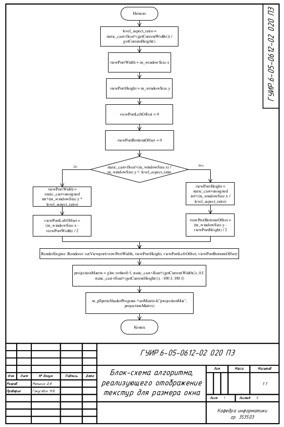
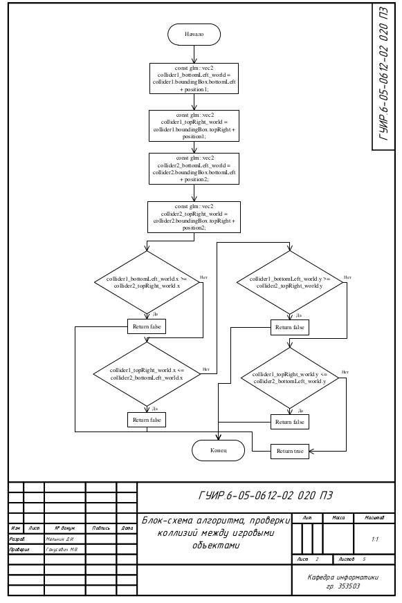
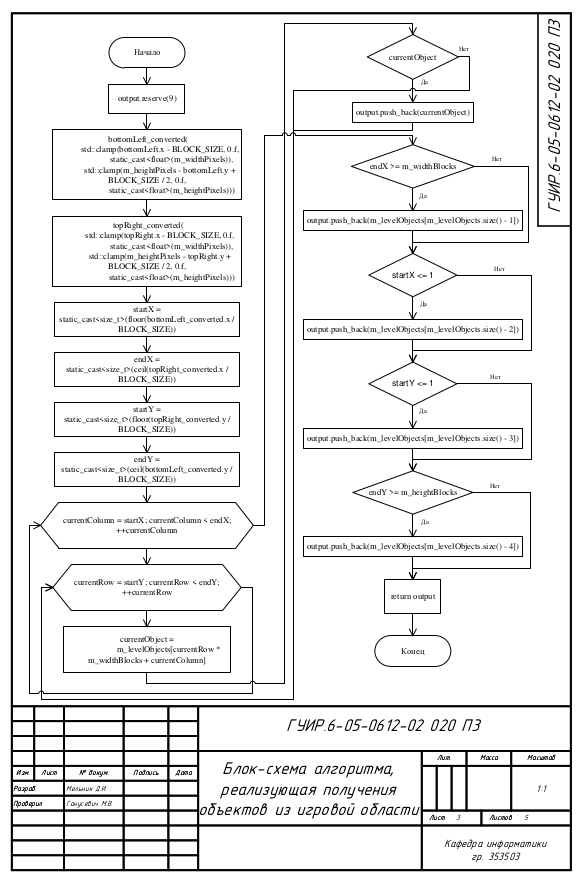
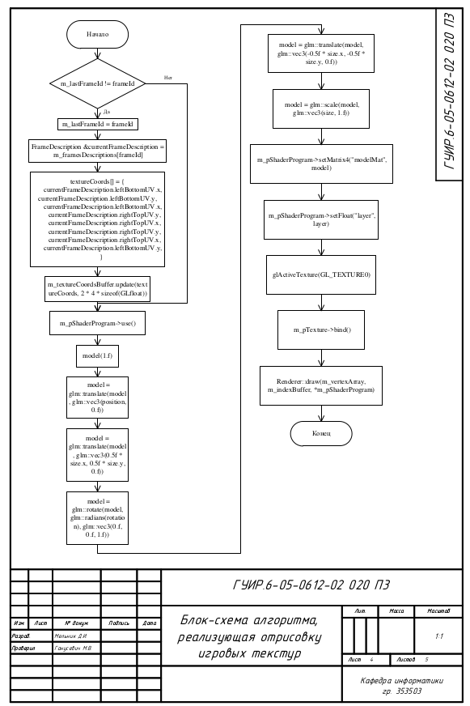
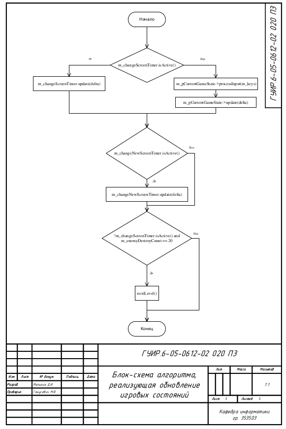

## Блок-схема алгоритма, реализующего отображение текстур для размера окна

Применяется в: `Fundamentals-of-algorithmization-and-programming/353503/Мельник Д.И./Курсовая работа/Coursework/src/Game/Game.cpp` в методе updateViewport(), результат работы применяется в методе startNewLevel(const size_t level, const EGameMode eGameMode)

## Блок-схема алгоритма, проверки коллизий между игровыми объектами

Применяется в: `Fundamentals-of-algorithmization-and-programming/353503/Мельник Д.И./Курсовая работа/Coursework/src/Physics/PhysicsEngine.cpp` в методе hasCollidersIntersection(const Collider &collider1, const glm::vec2 &position1, const Collider &collider2, const glm::vec2 &position2), результат работы применяется в методе hasPositionIntersection(const std::shared_ptr<IGameObject> &pObject1, const glm::vec2 &position1, const std::shared_ptr<IGameObject> &pObject2, const glm::vec2 &position2)

## Блок-схема алгоритма, реализующая получения объектов из игровой области

Применяется в: `Fundamentals-of-algorithmization-and-programming/353503/Мельник Д.И./Курсовая работа/Coursework/src/Game/GameStates/Level.cpp` в методе getObjectsInArea(const glm::vec2 &bottomLeft, const glm::vec2 &topRight), результат работы применяется в методе calculateTargetPositions(std::unordered_set<std::shared_ptr<IGameObject>> &dynamicObjects, const double delta)

## Блок-схема алгоритма, реализующая отрисовку игровых текстур

Применяется в: `Fundamentals-of-algorithmization-and-programming/353503/Мельник Д.И./Курсовая работа/Coursework/src/Renderer/Sprite.cpp` в методе render(const glm::vec2 &position, const glm::vec2 &size, const float rotation, const float layer, const size_t frameId), результат работы применяется в методе renderBlock(const EBlockLocation eBlockLocation)

## Блок-схема алгоритма, реализующая обновление игровых состояний  

Применяется в: `Fundamentals-of-algorithmization-and-programming/353503/Мельник Д.И./Курсовая работа/Coursework/src/Game/Game.cpp` в методе update(const double delta), результат работы применяется в методе main(int argc, char **argv)

