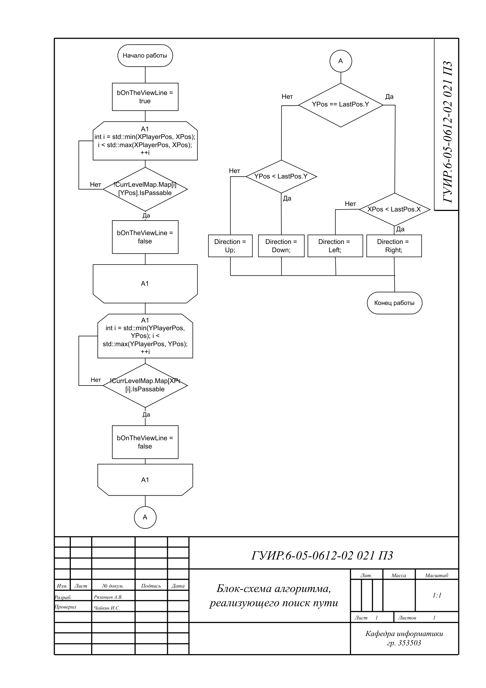
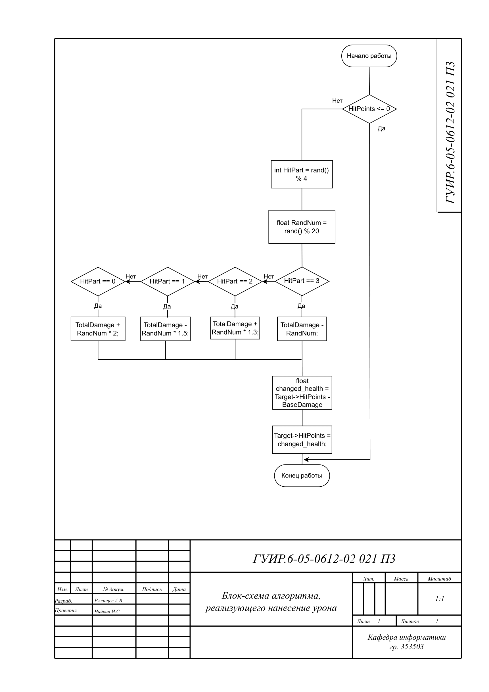
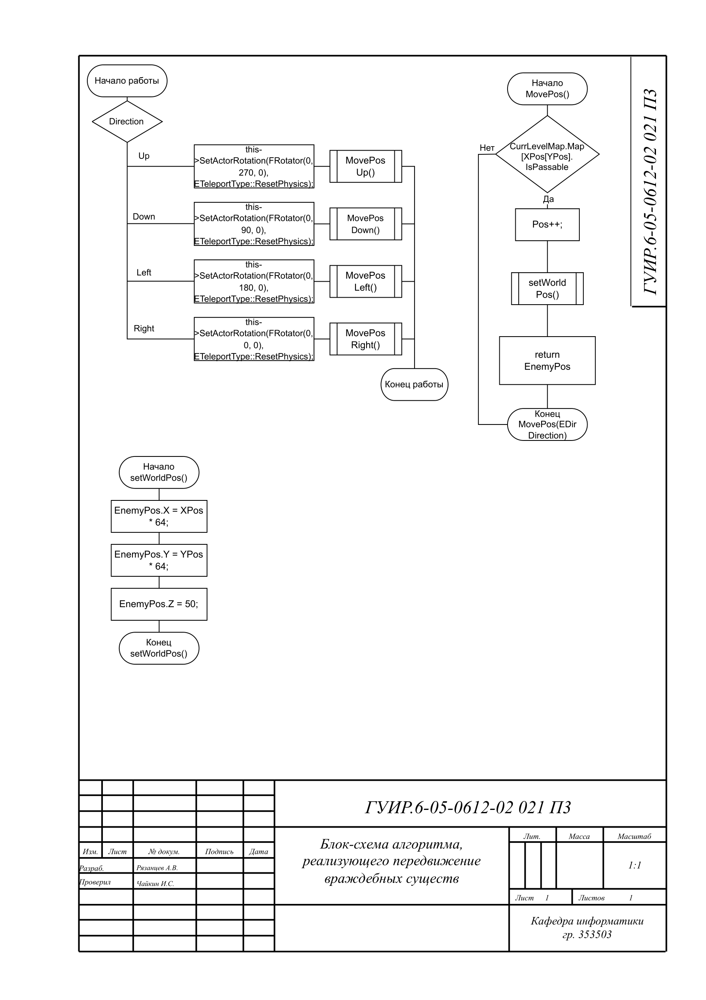
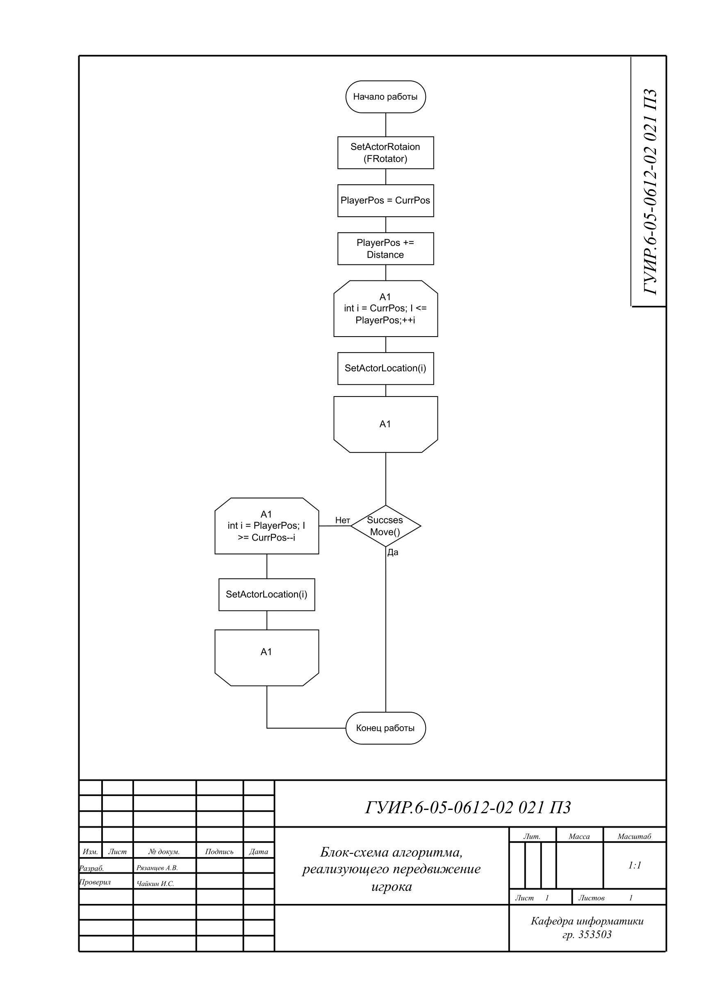
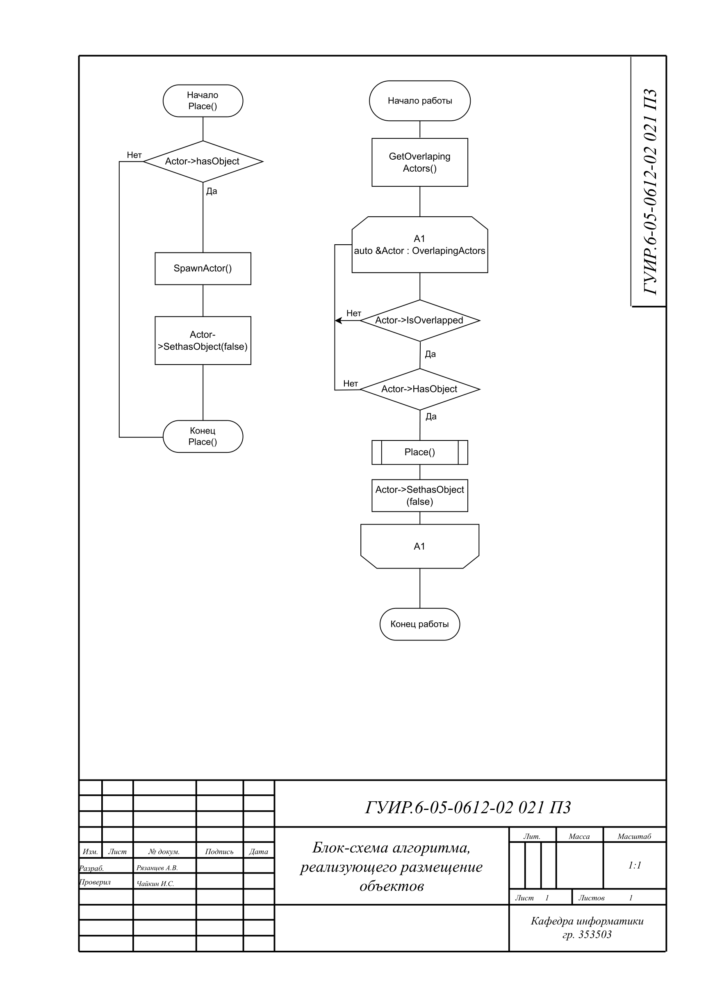

## Блок-схема алгоритма реализующего поиск пути

Применяется в: `Fundamentals-of-algorithmization-and-programming/353503/Рязанцев А.В./Курсовая работа/Project/Source/Cursach/EnemyCharacter.cpp` в методе Move(), результат работы обрабатывается в блюпринте BP_EnemyChar

## Блок-схема алгоритма реализующего нанесения урона

Применяется в: `Fundamentals-of-algorithmization-and-programming/353503/Рязанцев А.В./Курсовая работа/Project/Source/Cursach/BaseCharacter.cpp` в методе Atack(), результат работы обрабатывается в блюпринте BP_MainCharacter

## Блок-схема алгоритма реализущего передвижение враждебных существ

Применяется в: `Fundamentals-of-algorithmization-and-programming/353503/Рязанцев А.В./Курсовая работа/Project/Source/Cursach/EnemyCharacter.cpp` в методе MoveCall(), результат работы обрабатывается в блюпринте BP_EnemyChar

## Блок-схема алгоритма реализущего передвижение игрока

Применяется в: `Fundamentals-of-algorithmization-and-programming/353503/Рязанцев А.В./Курсовая работа/Project/Content/BPs/Entities/BP_MainCharater.uasset` в методах MoveUP(), MoveRight(), MoveLeft(), MoveDown(), результат работы обрабатывается в блюпринте BP_MainCharacter

## Блок-схема алгоритма реализущего размещение объектов

Применяется в: `Fundamentals-of-algorithmization-and-programming/353503/Рязанцев А.В./Курсовая работа/Project/Content/Interface/Widgets/WPB_Key.uasset` в методе onClicked(), результат работы обрабатывается в блюпринте Bp_BaseSurface

