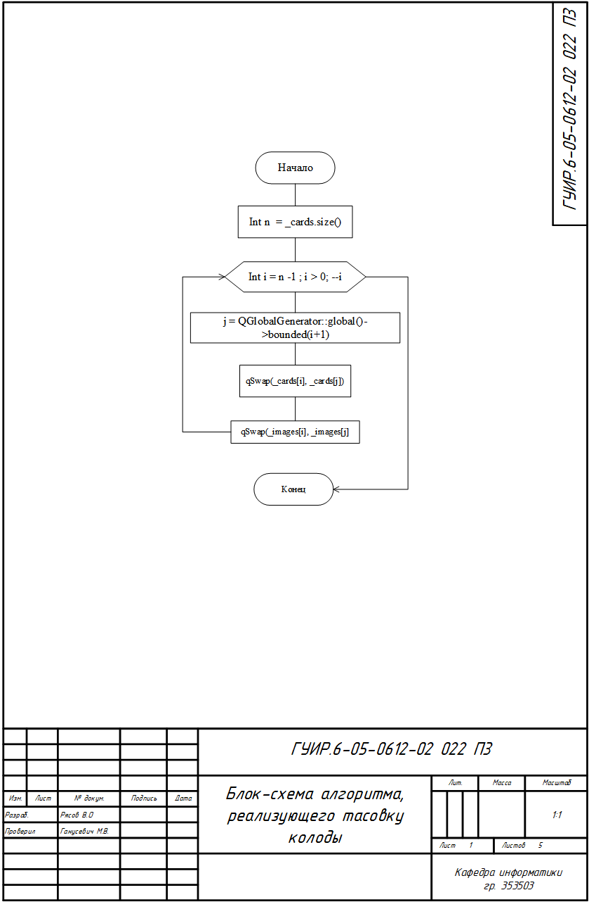
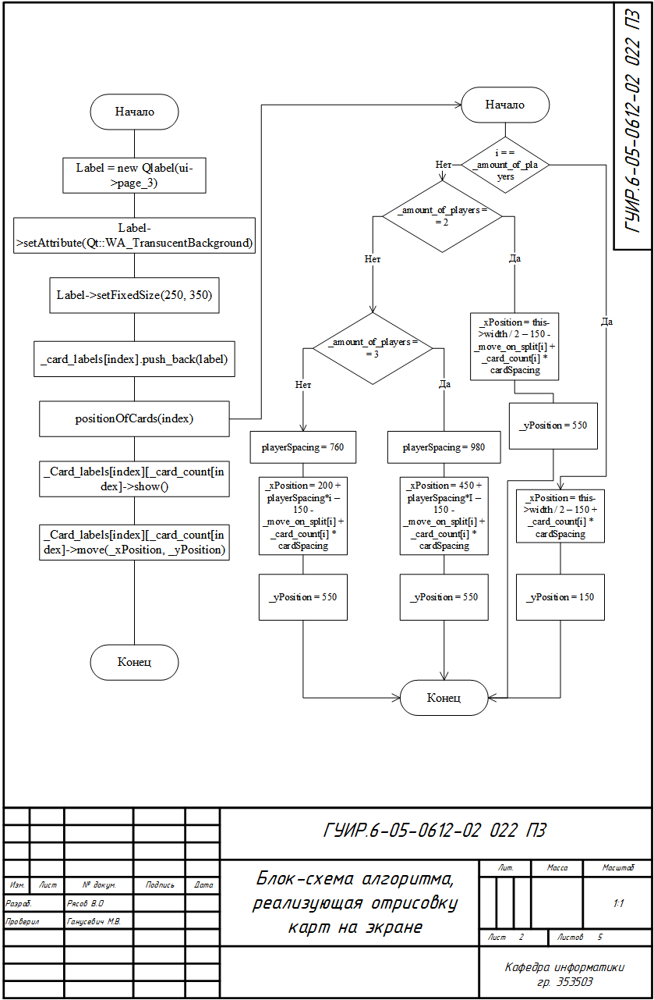
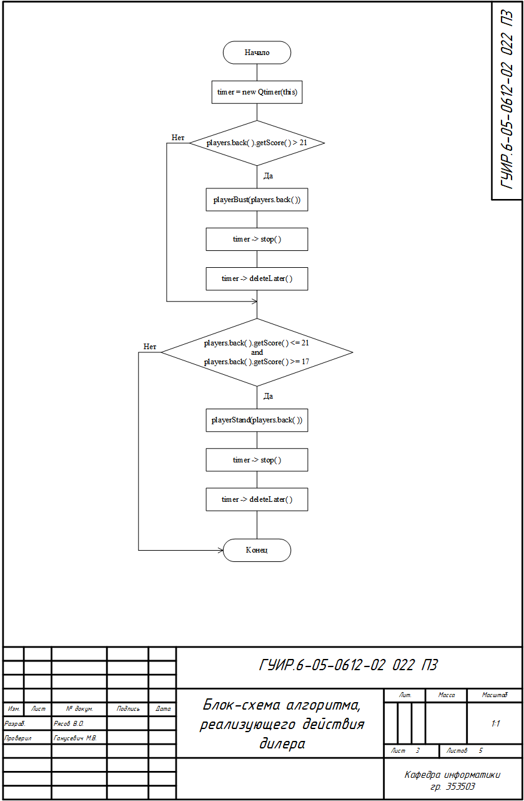
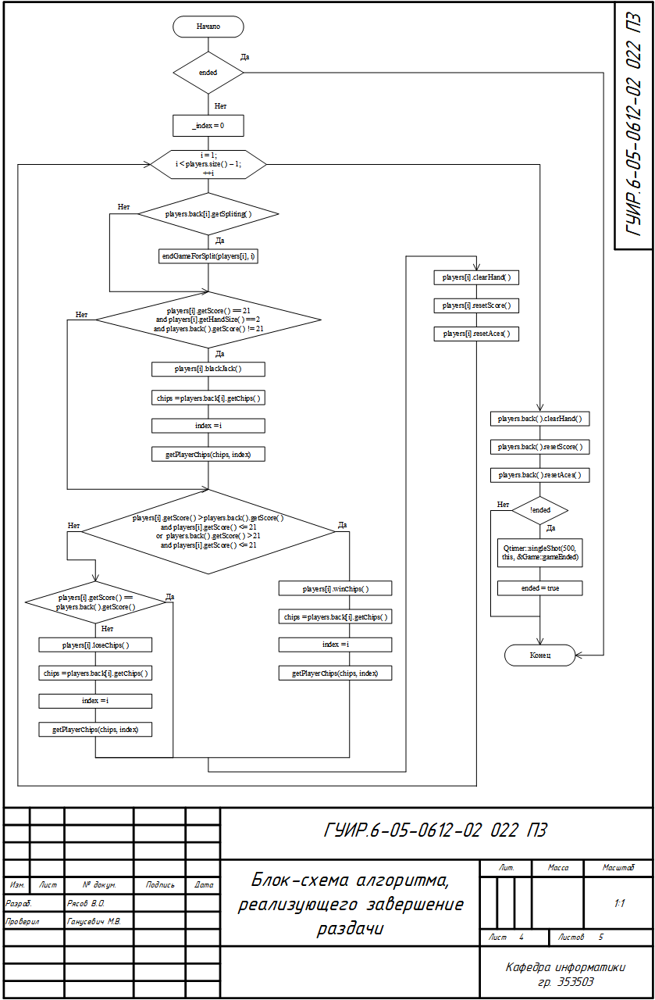
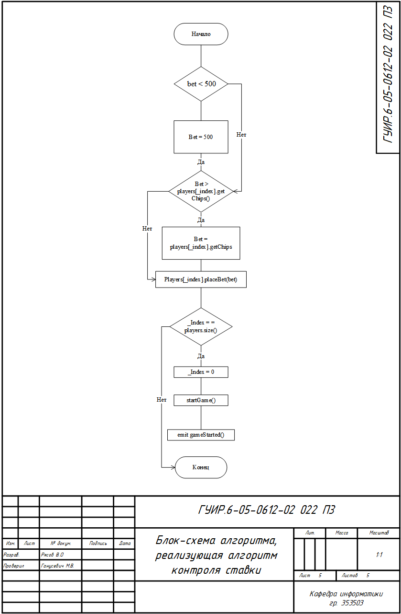

## Разработка карточной игры

## Блок-схема алгоритма, тасовку колоды

Применяется в: deck.cpp в методе shufle()

## Блок-схема алгоритма, реализующего отрисовку карт на экране

Применяется в: mainwindow.cpp в методе playerTakesCard(const QPixmap& pixmap, int index)

## Блок-схема алгоритма, реализующего действия дилера

Применяется в: game.cpp в методe dealerPlay()

## Блок-схема алгоритма, реализующего завершение раздачи

Применяется в: game.cpp в методе endGame()

## Блок-схема алгоритма, реализующего алгоритм контроля ставки

Применяется в: game.cpp в методе playerPlaceBet(int bet)

