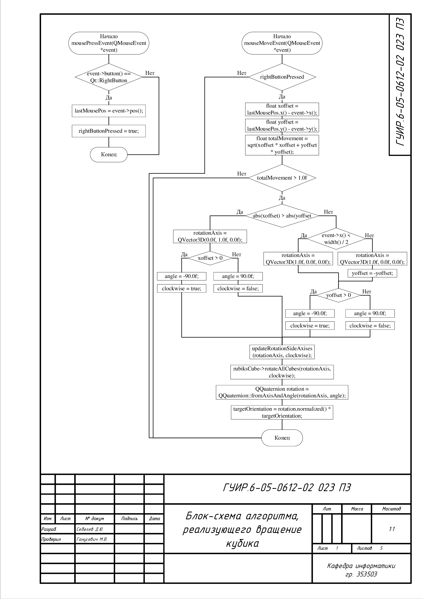
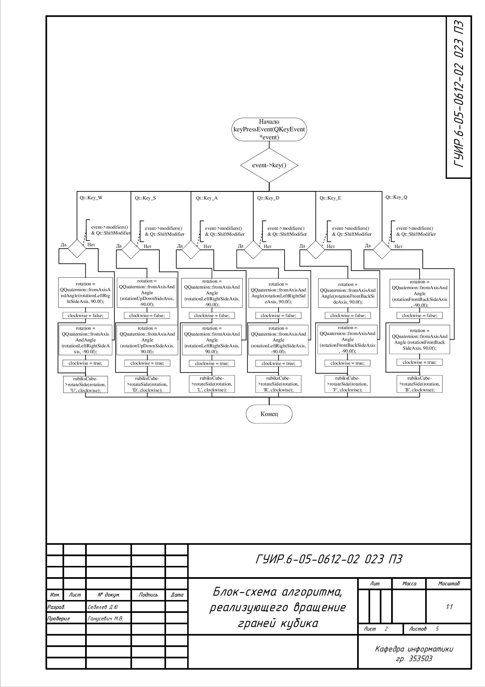
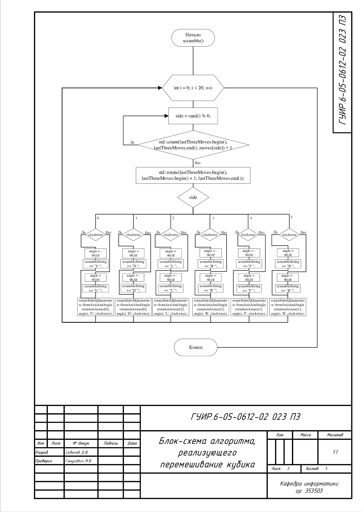
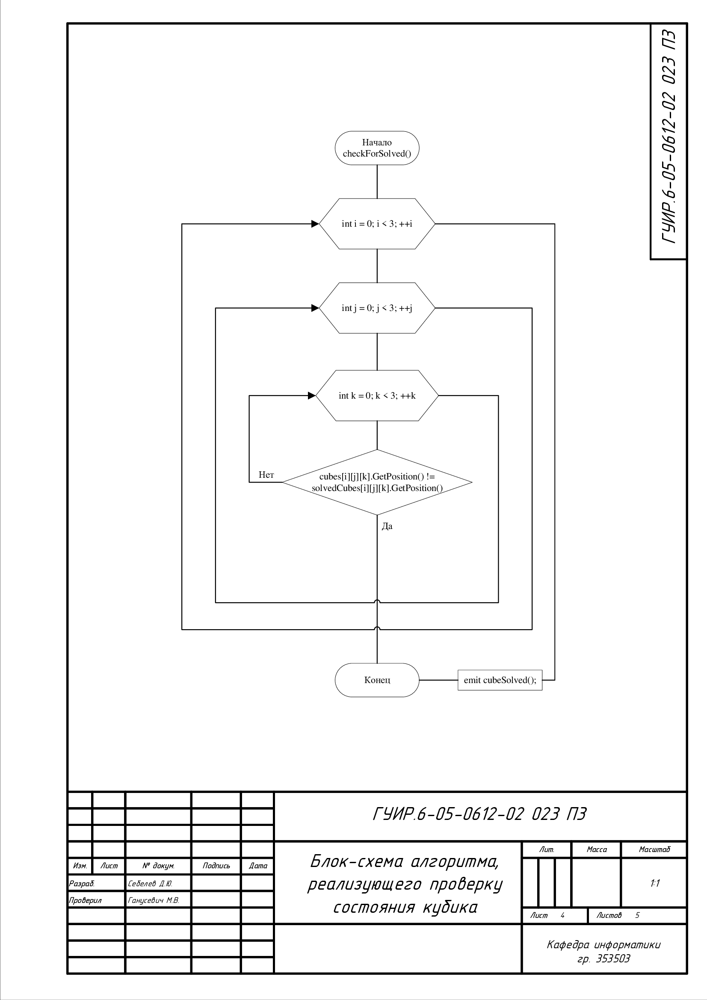
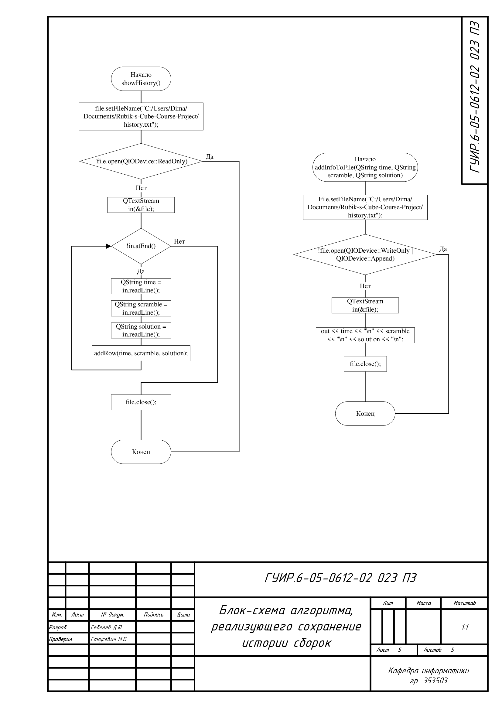

## Приложение-тренажер для сборки кубика Рубика на время

## Блок-схема алгоритма, реализующего вращение кубика
Применяется в: `openglwidget.cpp` в методах `mouseMoveEvent(QMouseEvent *event)`, `mousePressEvent(QMouseEvent *event)`

## Блок-схема алгоритма, реализующего вращение граней кубика
Применяется в: `openglwidget.cpp` в методе `keyPressEvent(QKeyEvent *event)`

## Блок-схема алгоритма, реализующего перемешивание кубика
Применяется в: `rubikscube.cpp` в методе `scramble()`

## Блок-схема алгоритма, реализующего проверку состояния кубика
Применяется в: `rubikscube.cpp` в методе `checkForSolved()`

## Блок-схема алгоритма, реализующего сохранение истории сборок
Применяется в: `history.cpp` в методах `addInfoToFile(QString time, QString scramble, QString solution)`, `showHistory()`
