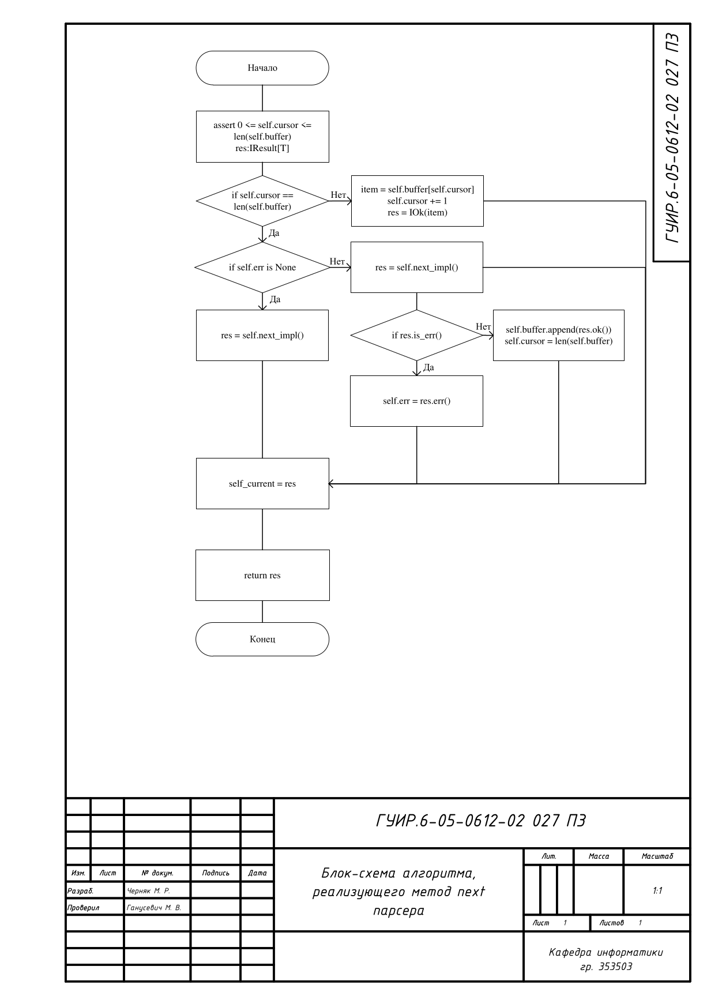
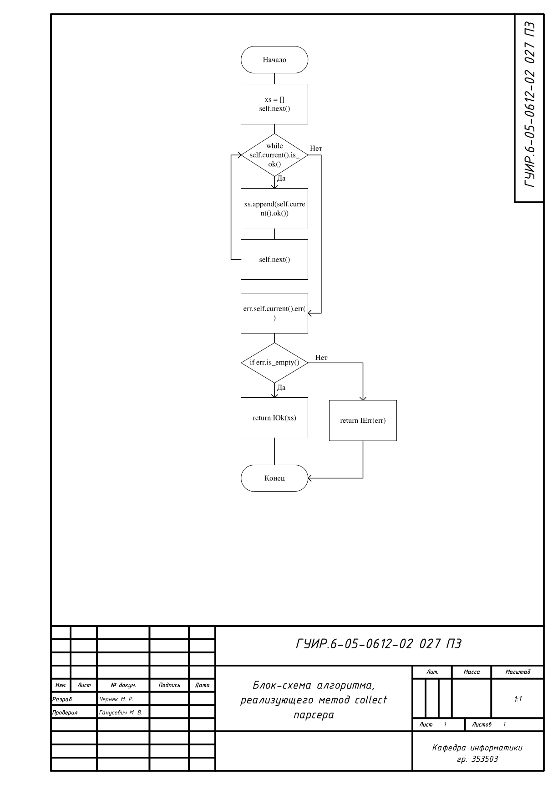
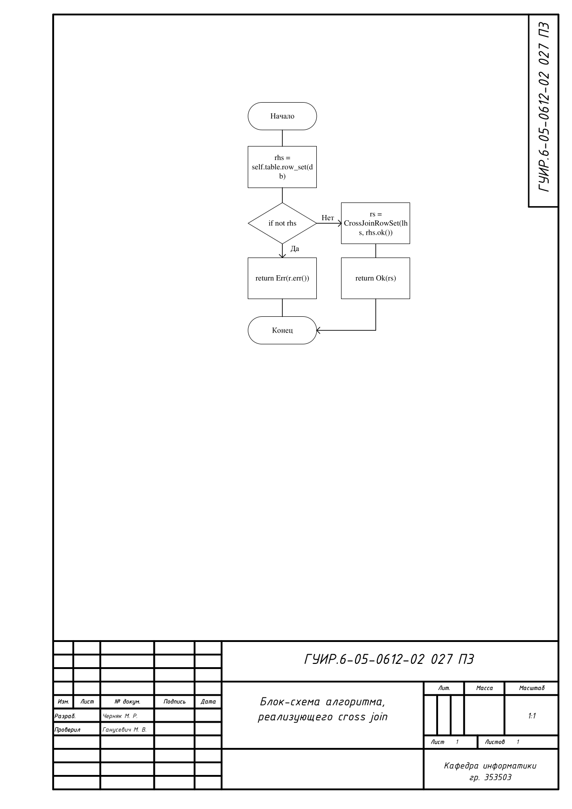
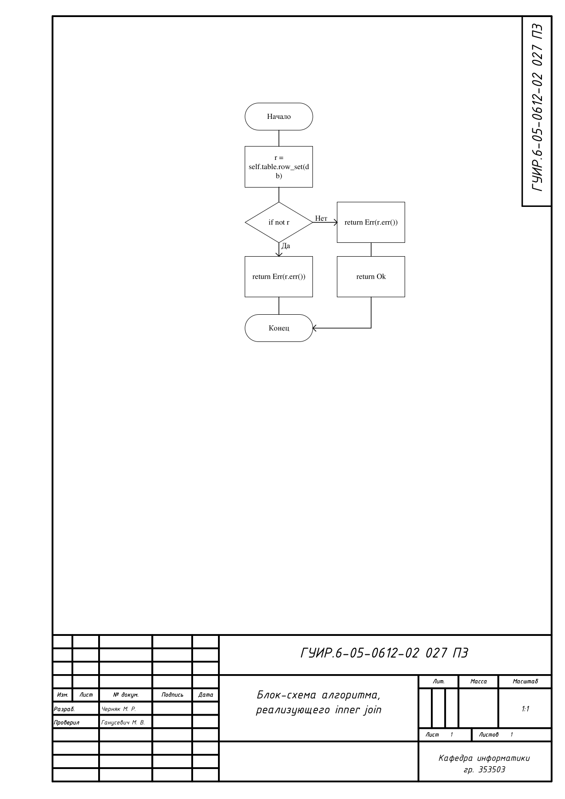
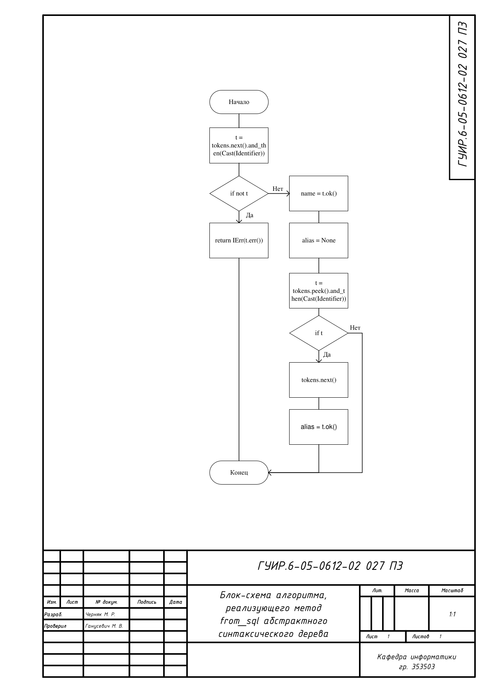

# Разработка простейшей СУБД

Простейшая СУБД ptrSQL предоставляющая собственный CLI

## Блок-схема алгоритма реализующего метод next парсера

Применяется в: `ptrSQL/parser/streams/stream.py`

## Блок-схема алгоритма реализующего метод collect парсера

Применяется в: `ptrSQL/parser/streams/stream.py`

## Блок-схема алгоритма реализующего cross join в AST

Применяется в: `ptrSQL/ast/join.py`

## Блок-схема алгоритма реализующего inner join в AST

Применяется в: `ptrSQL/ast/join.py`

## Блок-схема алгоритма реализующего метод from_sql в AST

Применяется в: `ptrSQL/ast/alias.py`

