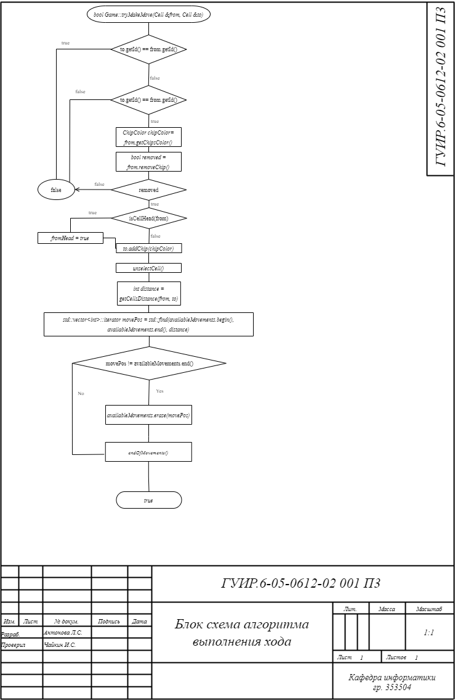
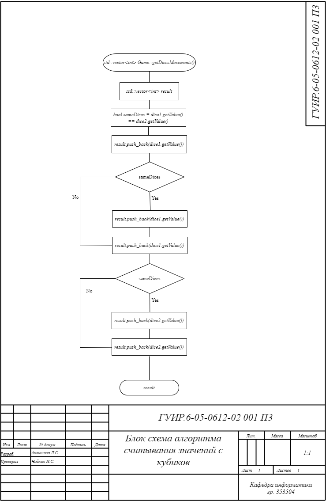
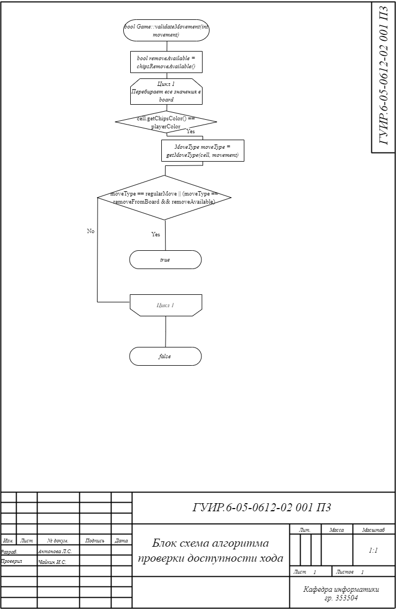
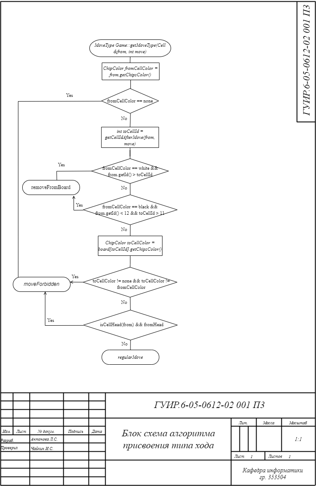
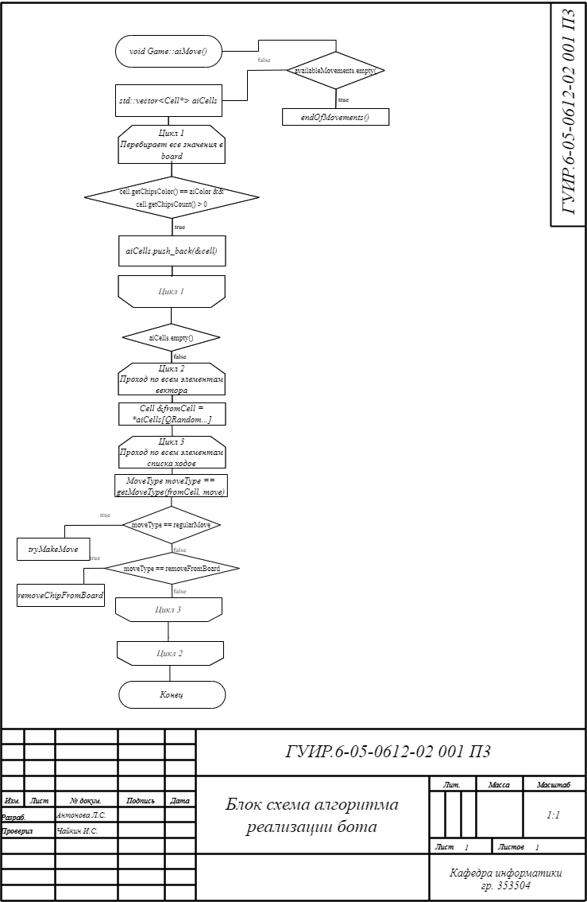

# Разработка приложения для игры в нарды

Реализация игрового проекта: игры в нарды вдвоем на одном устройстве и против ИИ игрока.

## Алгоритм выполнения хода

Применяется в: `Backgammon/game.cpp` в методе tryMakeMove()

## Алгоритм считывания значений с кубиков

Применяется в: `Backgammon/game.cpp` в методе getDicesMovements()

## Алгоритм проверки доступности хода

Применяется в: `Backgammon/game.cpp` в методе validateMovement()

## Алгоритм присвоения типа хода

Применяется в: `Backgammon/game.cpp` в методе getMoveType()

## Алгоритм реализации бота

Применяется в: `Backgammon/game.cpp` в методе aiMove()

