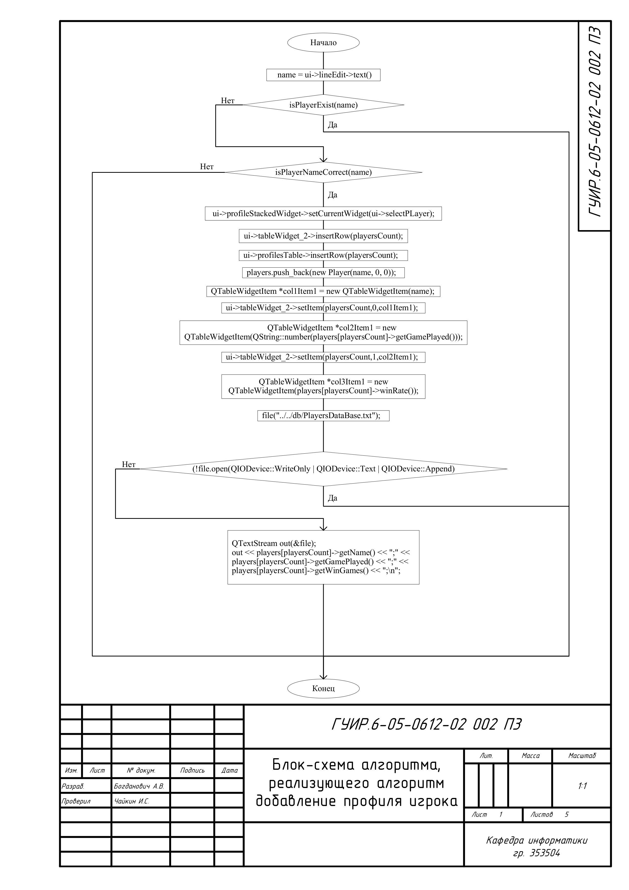
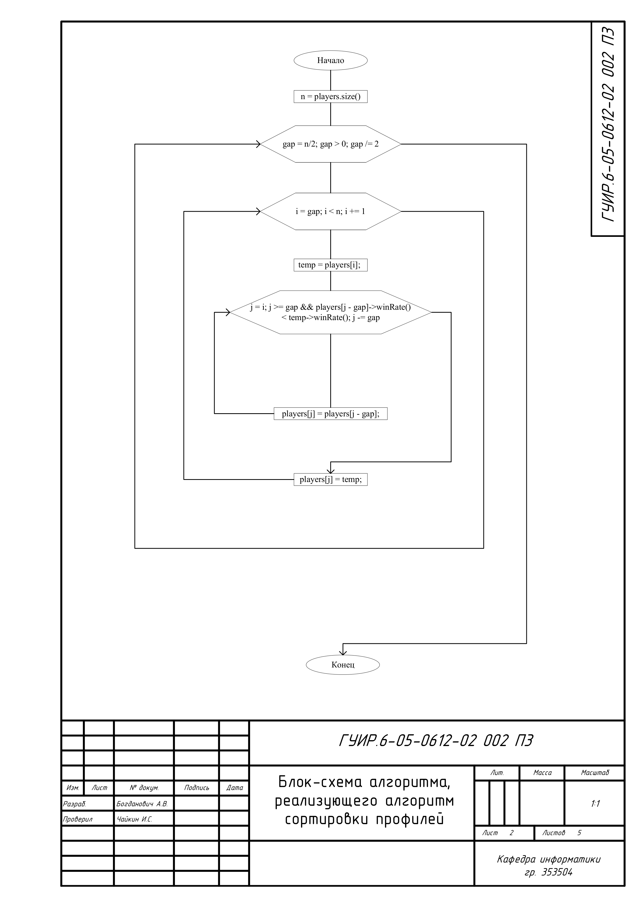
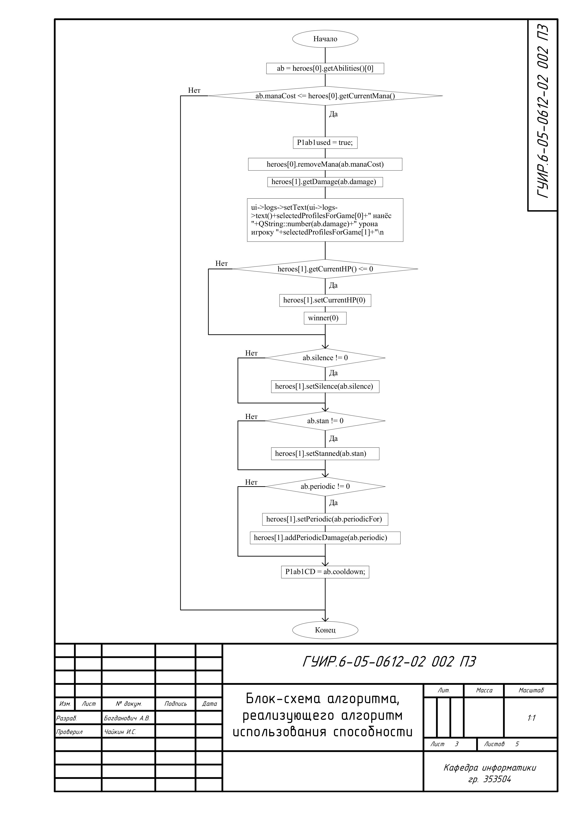
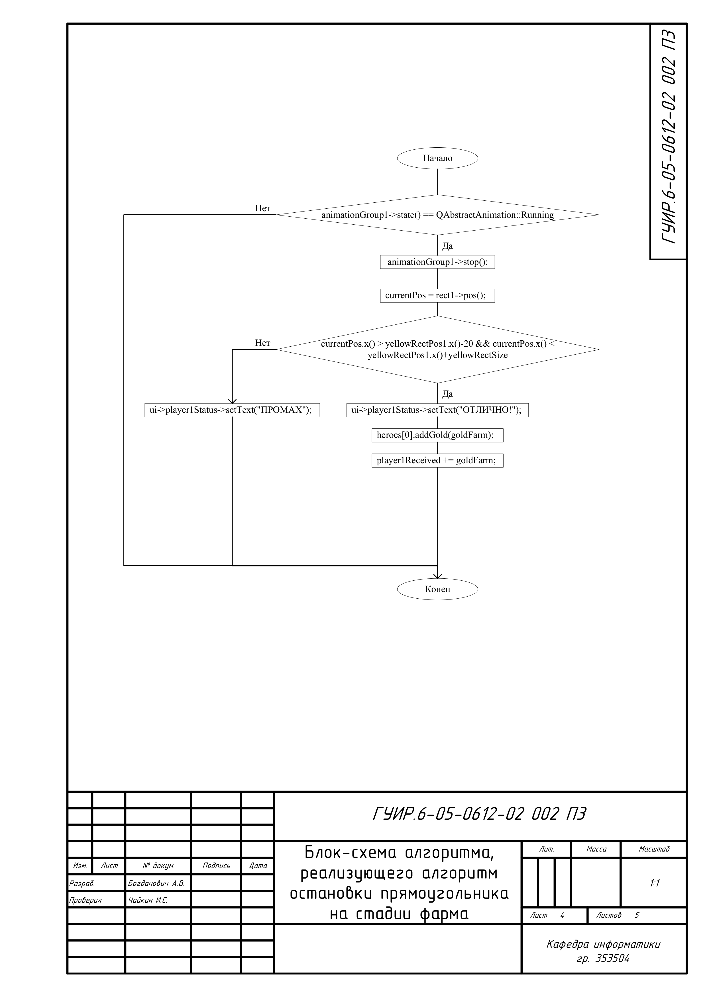

# СОЗДАНИЕ РПГ ИГРЫ

Игра на подобии DOTA на QT. 

## Блок-схема алгоритма, реализующего алгоритм добавление профиля игрока

Применяется в: `mainwindow.cpp` в функции `MainWindow::on_pushButton_2_clicked` результат появляется в таблице tableWidget_2 и profilesTable, а так же записывается в файл PlayersDataBase.txt

## Блок-схема алгоритма, реализующего алгоритм сортировки профилей

Применяется в: `mainwindow.cpp` в функции `MainWindow::shellSortDescending` результат появляется в таблице profilesTable и в файле PlayersDataBase.txt

## Блок-схема алгоритма, реализующего алгоритм использования способности

Применяется в: `mainwindow.cpp` в функции `MainWindow::on_player1_useAb1_clicked` результатом алгоритма является уменьшение маны у героя, который использовал способность, и уменьшение очков здоровья у противника, а так же изменения label`ов 

## Блок-схема алгоритма, реализующего алгоритм остановки прямоугольника на стадии фарма

Применяется в: `mainwindow.cpp` в функции `MainWindow::stop_rect1` результатом алгоритма является получение ли не получение золота, а также окончание раунда фарма

## Блок-схема алгоритма, реализующего алгоритм покупки предмета в магазине

Применяется в: `mainwindow.cpp` в функциях `MainWindow::on_pushButton_3_clicked` и `MainWindow::on_shop_item1buy_clicked` результатом алгоритма является добавление предмета в инвентарь игрока и изменение label`ов

