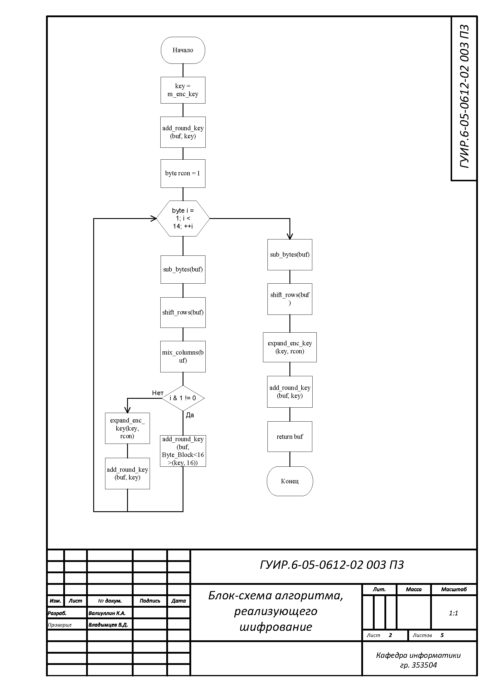
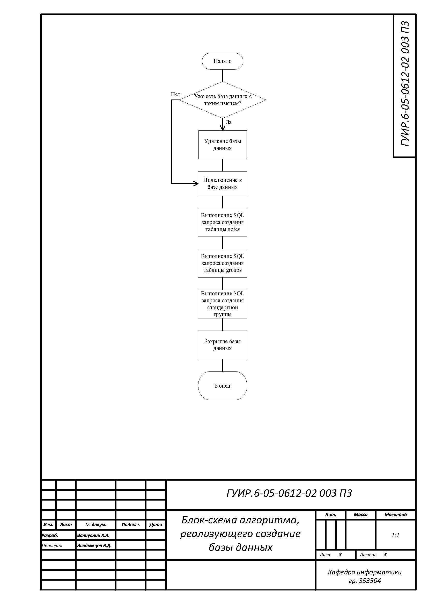
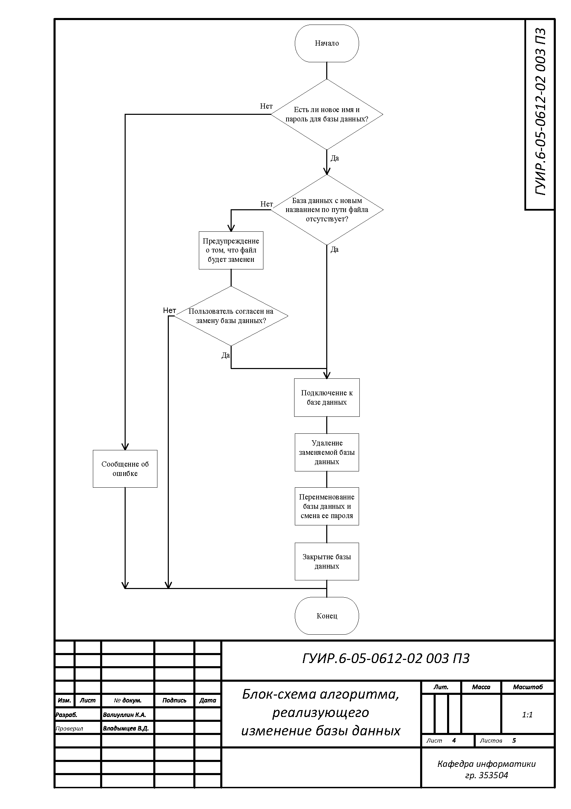
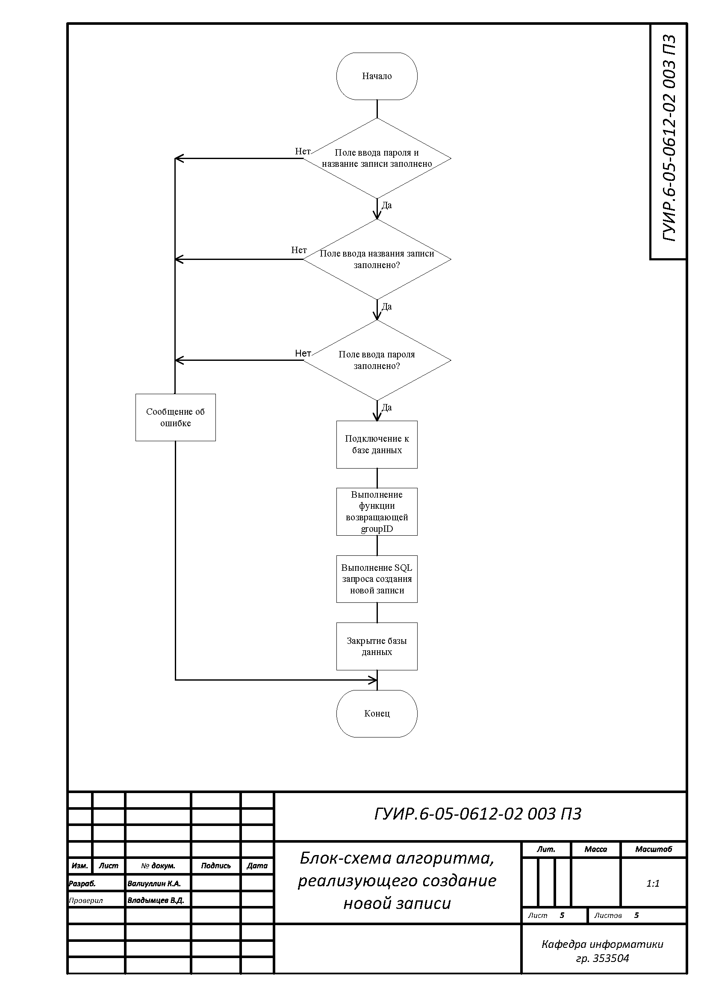

# Создание менеджера пароля

Course Work OAIP 2024, получил 10 с кайфом.
 
## Алгоритм шифрования
 
Применяется в `aes256/AES256_Base.cpp` в функции `Byte_Block<16> & AES256_Base::encrypt`
 

 
## Алгоритм создания базы данных
 
Применяется в `database/createdatabasewidget.cpp` и `dbmanagement\databasecreator.cpp` в функциях
`CreateDatabaseWidget::on_buttonBox_accepted()` и `DatabaseCreator::createDatabase()`
 

 
## Алгоритм изменения базы данных
 
Применяется в `database/editdatabasewidget.cpp` в функции `EditDatabaseWidget::on_buttonBox_accepted()`

 
## Алгоритм создания новой записи 
 
Применяется в `notes/addnewnotewidget.cpp` в функции `AddNewNoteWidget::on_buttonBox_accepted()`

