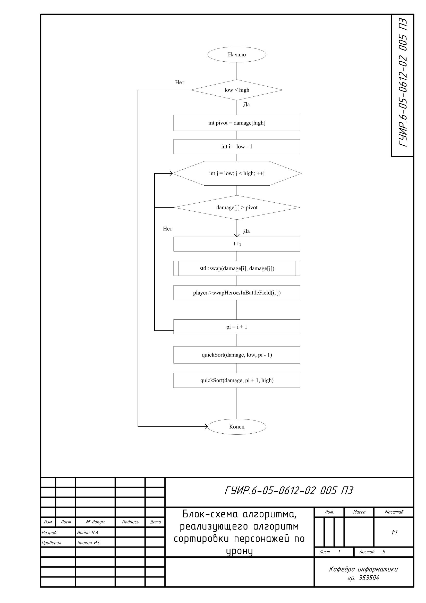
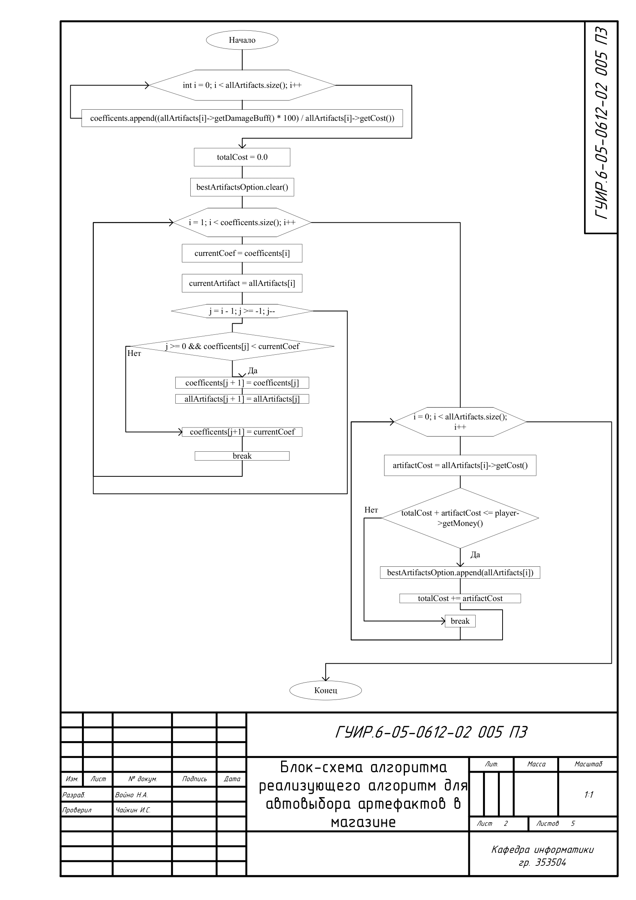
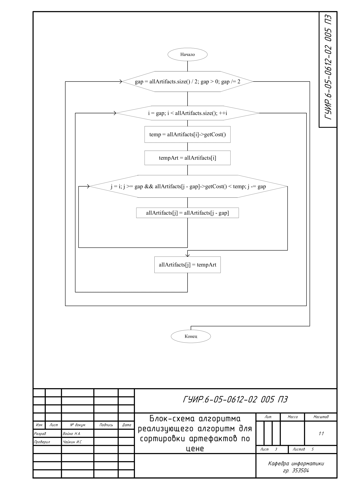
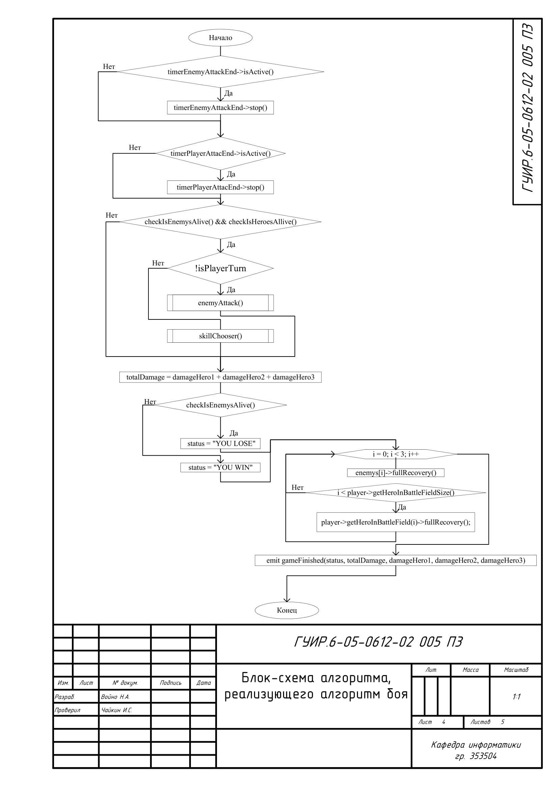
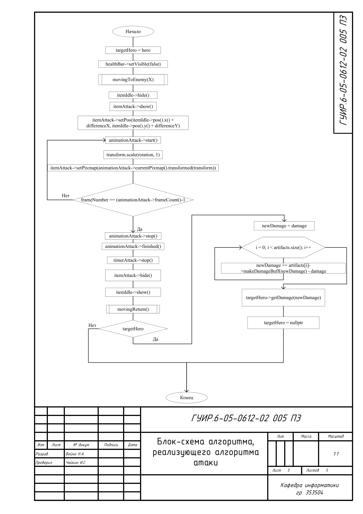

# Авторская пошаговая игра

краткое описание? хз чё тут писать, ну, не сдал можно и не зачилиться. 

## Алгоритм сортировки персонажа по урону

Применяется в: `mainwindow.cpp` в функции `MainWindow::quickSort` результат сортировки выводится в статистику боя

## Алгоритм для автовыбора артефактов в магазине

Применяется в: `mainwindow.cpp` в функции `MainWindow::on_pushButton_AutoChoose_clicked` результат появляется в таблице tableWidget

## Алгоритм для сортировки артефактов по урону

Применяется в: `mainwindow.cpp` в функции `MainWindow::on_pushButton_Sort_clicked` результат появляется в таблице tableWidget

## Алгоритм боя

Применяется в: `mainwindow.cpp` в функции `MainWindow::on_pushButton_2_clicked` результатом вызова алгоритма является начало игры

## Алгоритм атаки

Применяется в: `game.cpp` в функциях `Game::enemyAttack`, `Game::on_attackIcon1_clicked`, `Game::on_attackIcon2_clicked` и `Game::on_attackIcon3_clicked` результатом алгоритма является отображение анимации атаки и нанесение урона

