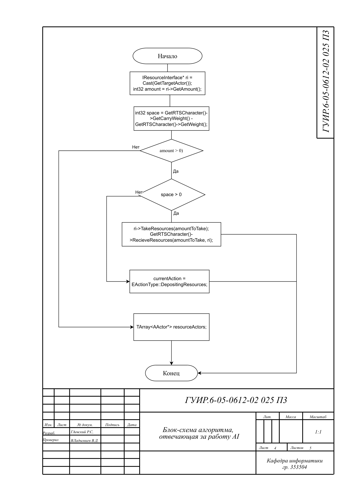
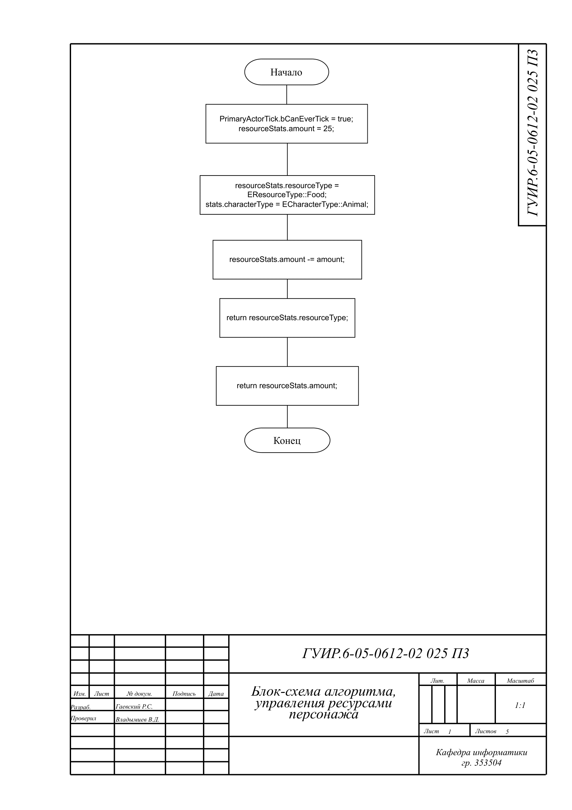
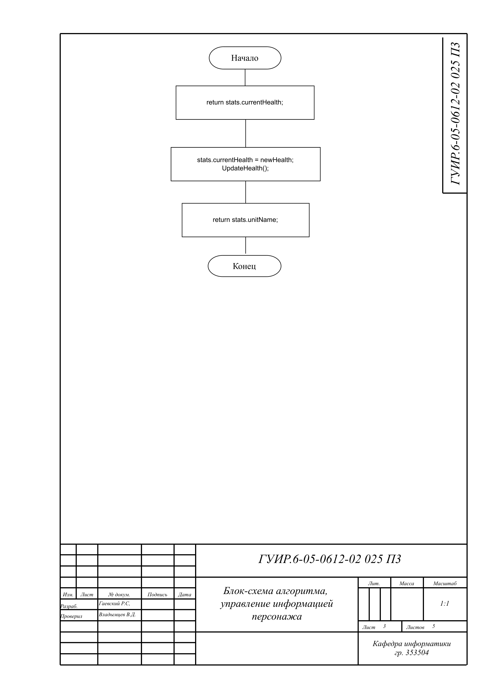
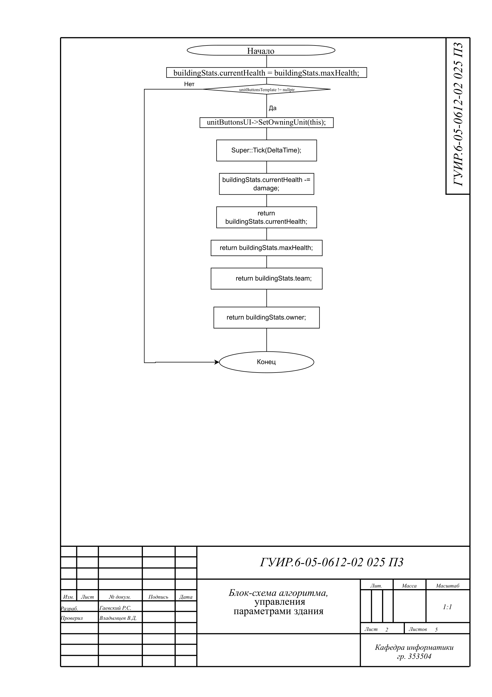
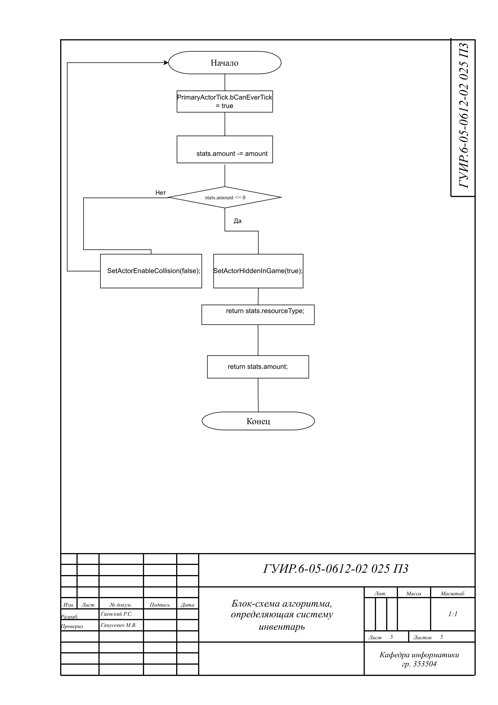
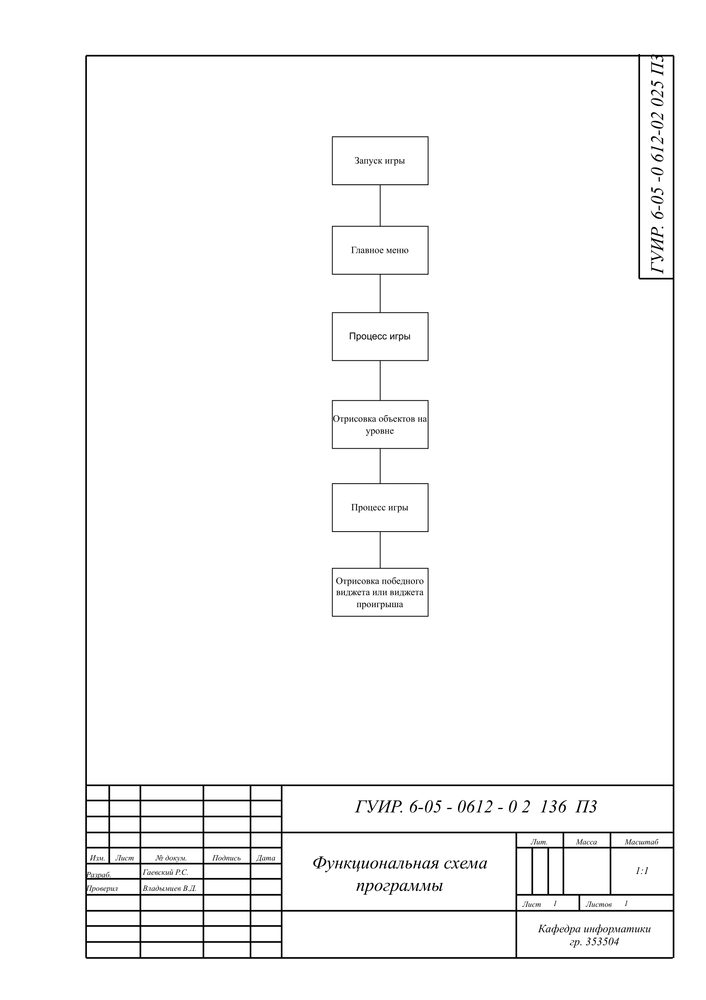

# Название Курсовой Работы

Краткое описание 

## Алгоритм работы AI

Применяется в: `/BaseAIcpp`

## Алгоритм управление ресурсами персонажей

Применяется в: `/Resoursecpp`

## Алгоритм управления информацией персонажа

Применяется в: `/СharacterDetailsUI.cpp`

## Алгоритм управления параметрами зданий

Применяется в: `/Building.cpp`

## Алгоритм cистема инвентарь

Применяется в: `/InventoryUI.cpp`

## Функциональная схема программы

