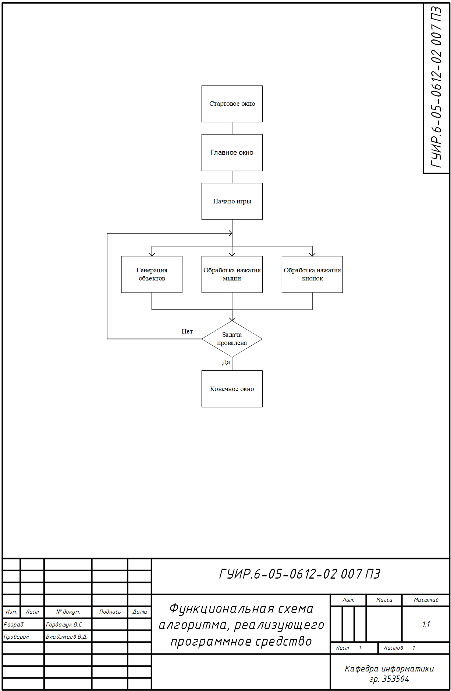
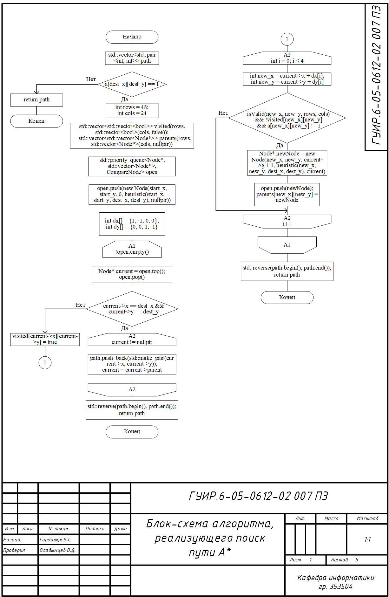
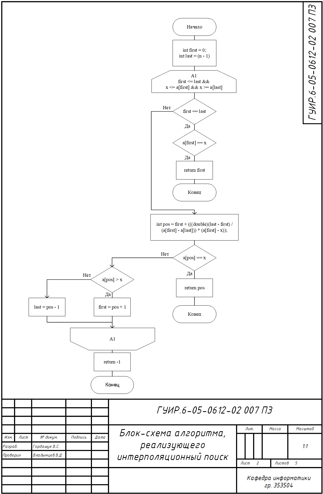
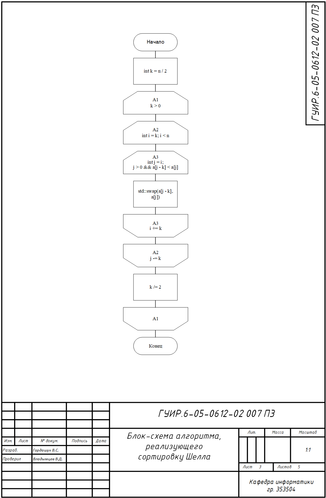
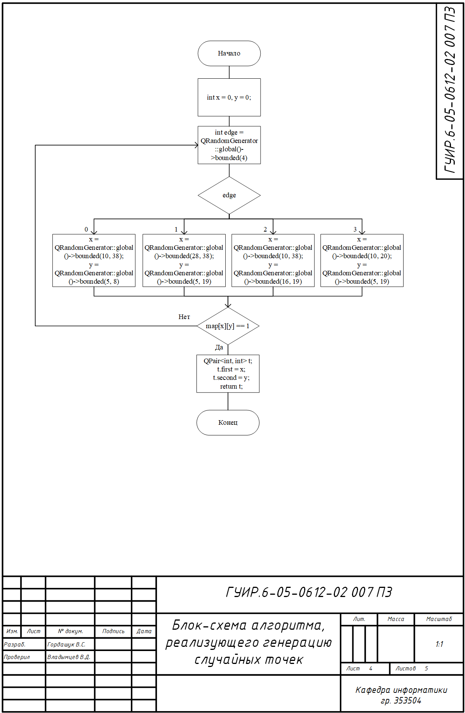
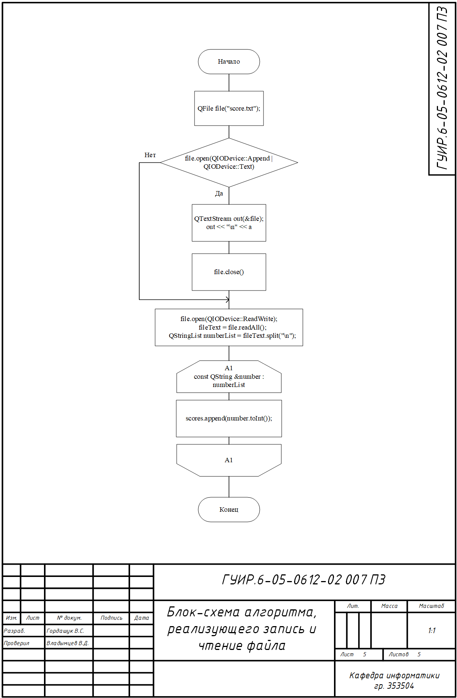

# Игра в стиле RTS

курсовая 

## Функциональная схема

## Алгоритм А*

Применяется в: `find.cpp` в функции `Find::aStar` используется в `widget.cpp`

## Алгоритм интерполяционного поиска

Применяется в: `end.cpp` в функции `End::interpolationSearch` результат появляется на label

## Алгоритм сортировки Шелла

Применяется в: `end.cpp` в функции `End::shellSort` используется для сортировки данных из файла

## Алгоритм генерации случайных точек

Применяется в: `widget.cpp` в функциях `Widget::generatePos` используется для генерации позиций юнитов

## Алгоритм записи и чтения файла

Применяется в: `end.cpp` в функциях `End::openFile` используется для анализа результата игры

