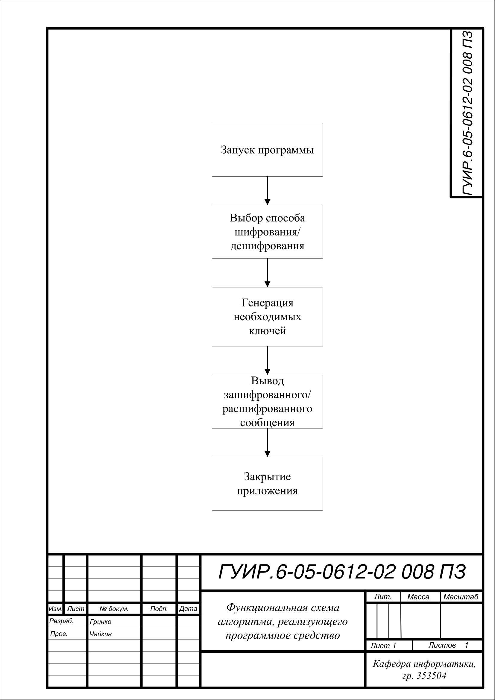
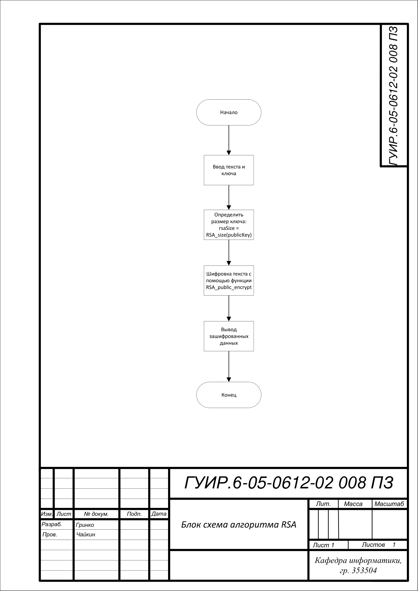
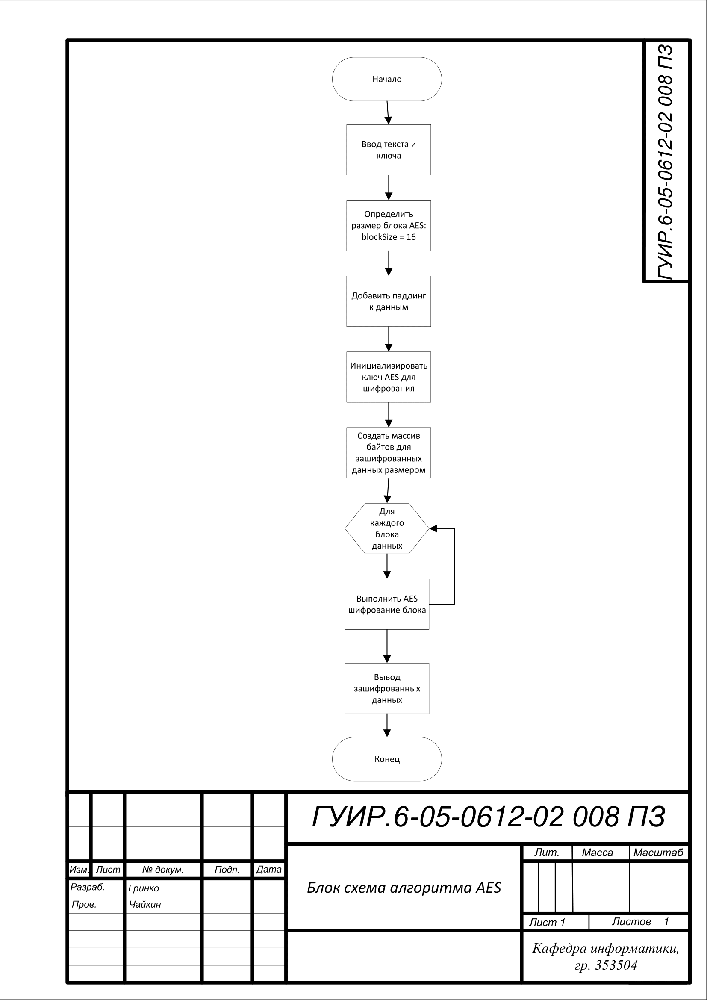
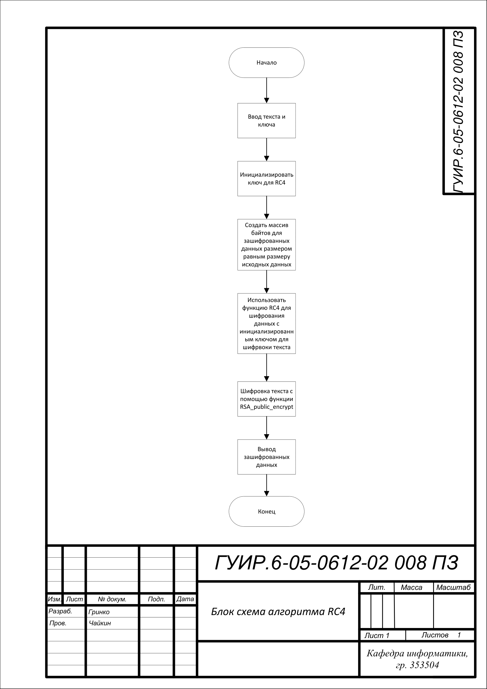
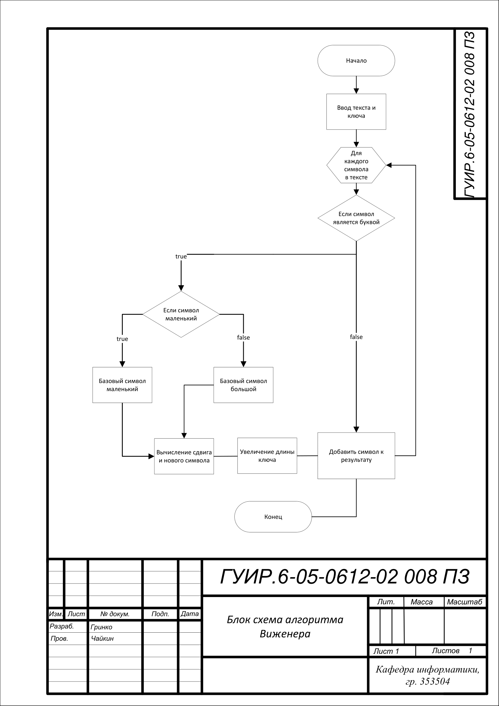
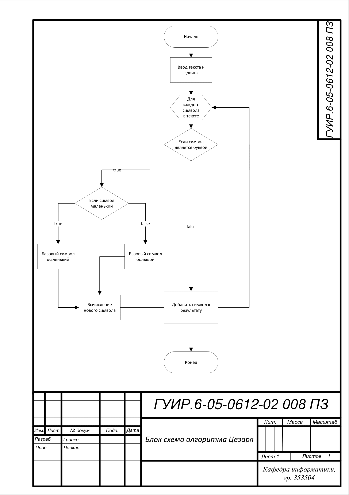

# Приложение для шифровки и дешифровки сообщений

бр гьгнльнььааг

## Функциональная схема

## Алгоритм RSA

Применяется в: mainwindow.cpp в функции MainWindow::rsaEncrypt и MainWindow::rsaDecrypt

## Алгоритм AES

Применяется в: mainwindow.cpp в функции MainWindow::aesEncrypt и MainWindow::aesDecrypt

## Алгоритм RC4

Применяется в: mainwindow.cpp в функции MainWindow::rc4Encrypt и MainWindow::rc4Decrypt

## Алгоритм Виженера

Применяется в: mainwindow.cpp в функциях MainWindow::vigenereEncrypt и MainWindow::vigenereDecrypt

## Алгоритм Цезаря

Применяется в: mainwindow.cpp в функциях MainWindow::caesarEncrypt и MainWindow::caesarDecrypt

