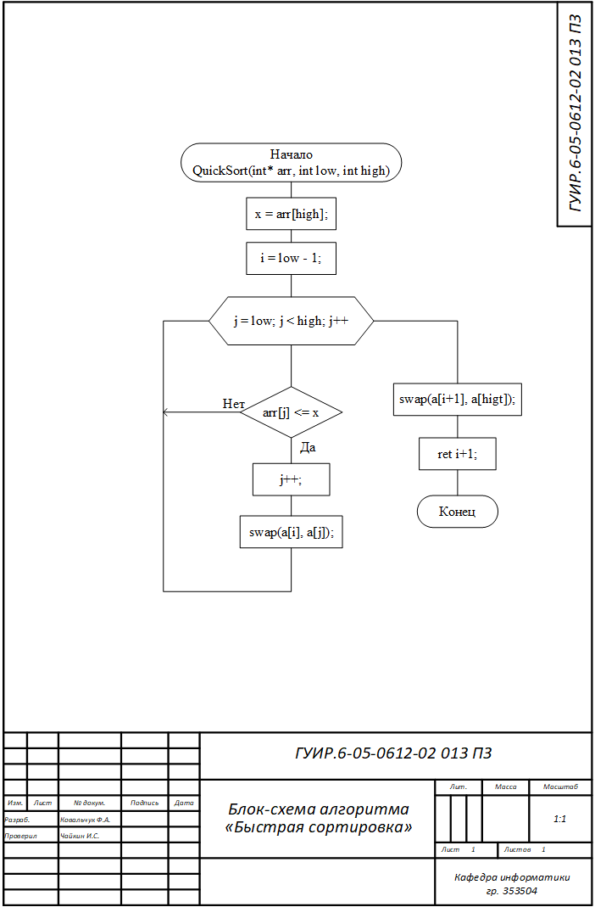
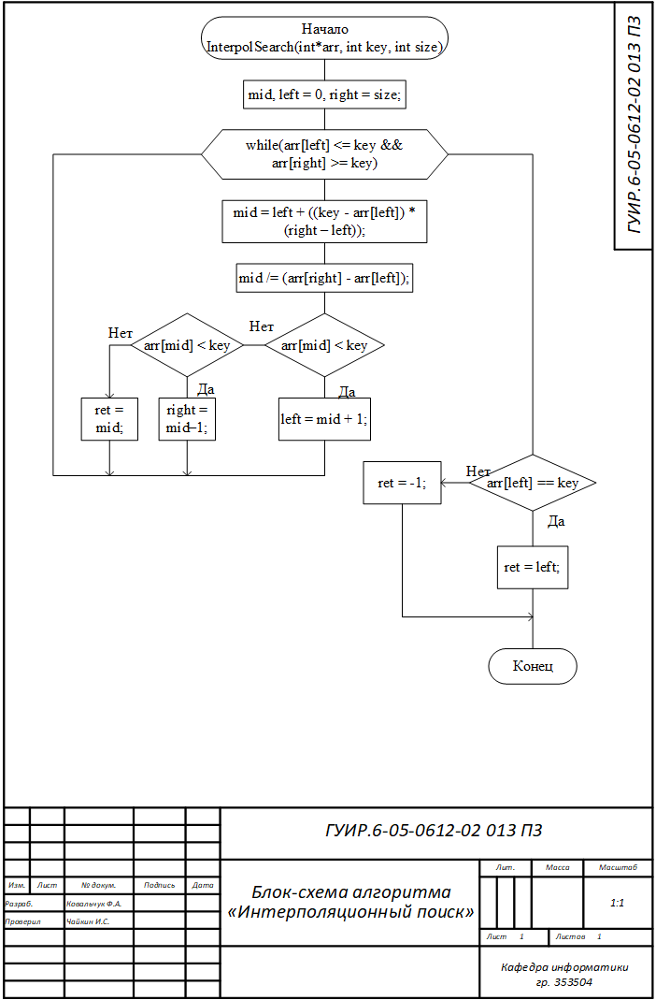
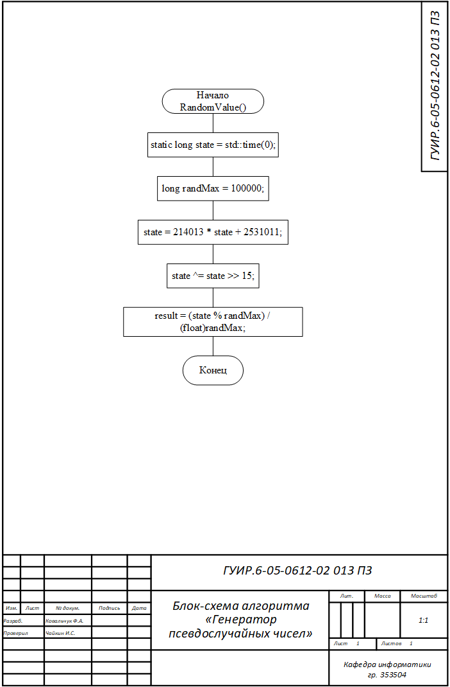
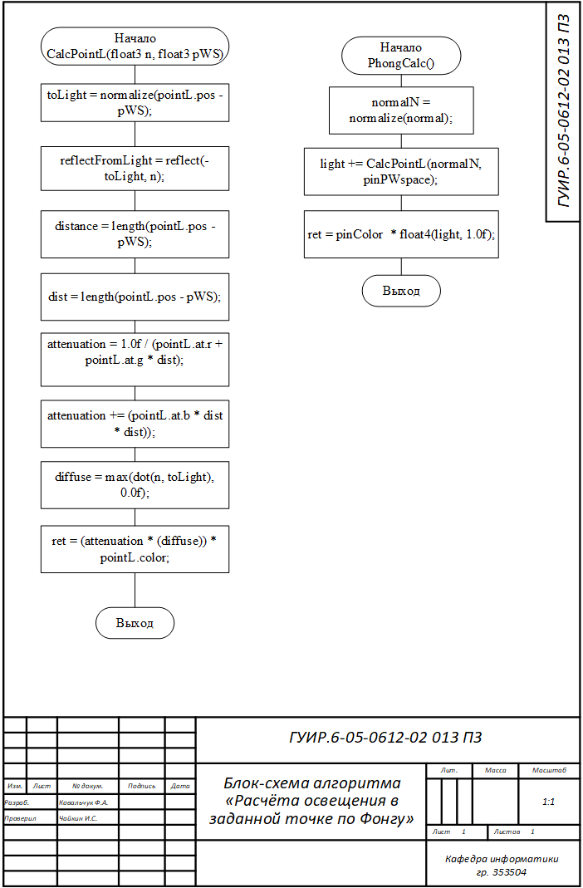
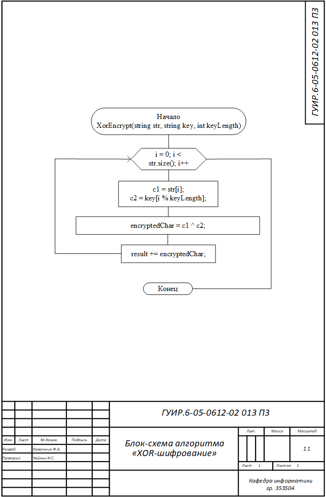
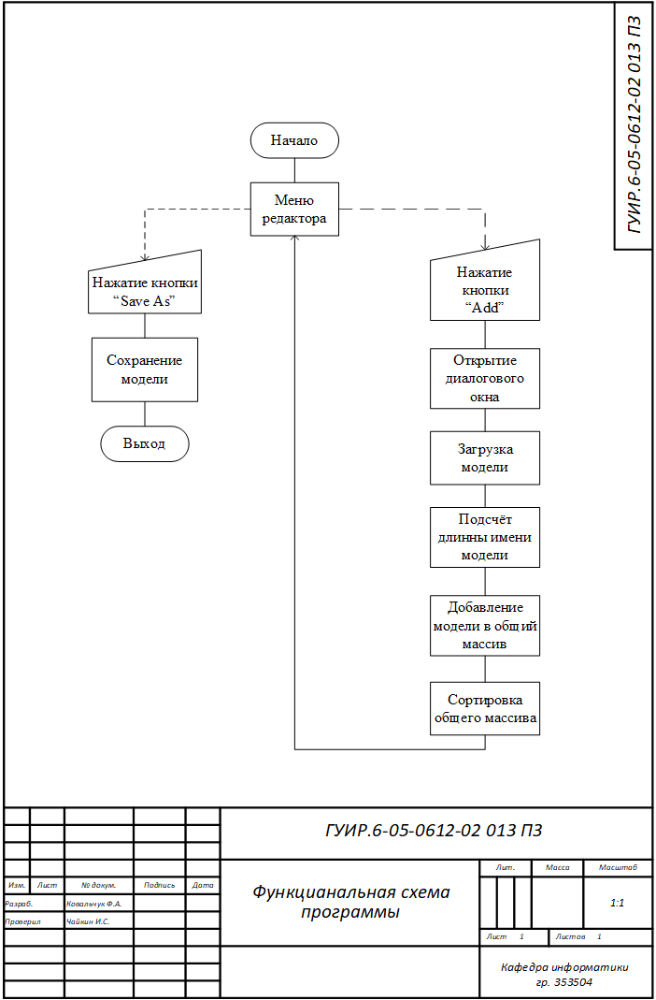
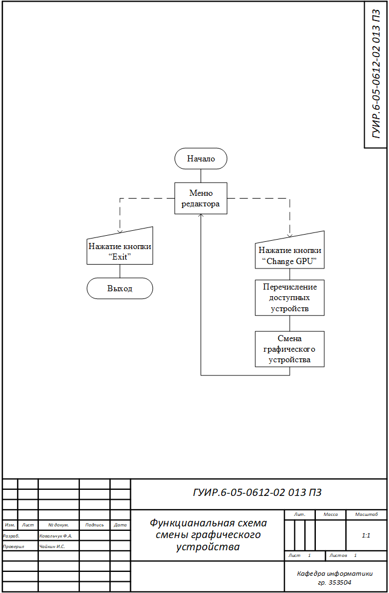
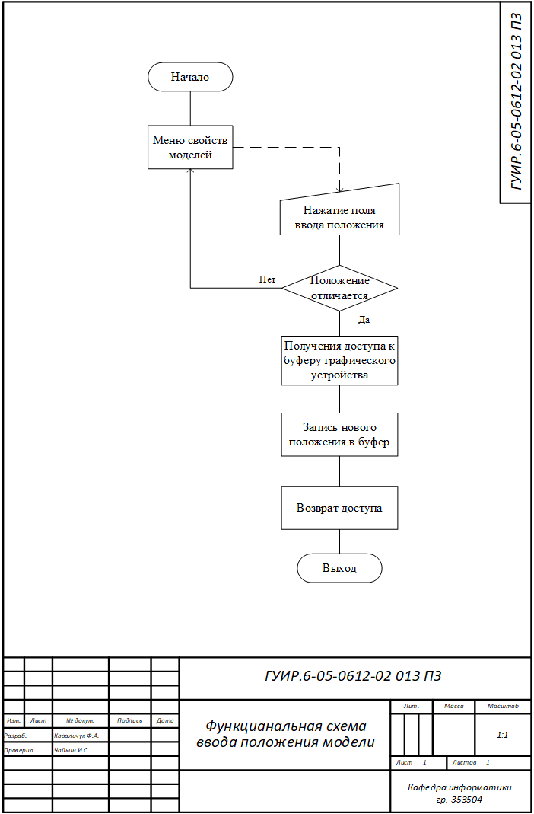
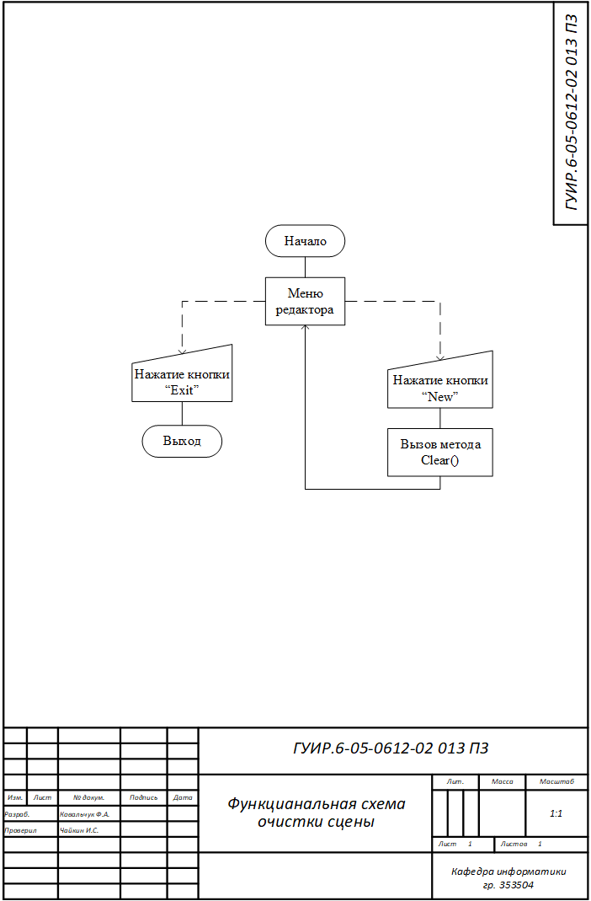

# Простой редактор 3д моделей на DirectX12

С полным кодом проекта можно ознакомиться с помощью [отдельного репозитория sMESHer] (https://github.com/EidanowI/sMESHer.git) 

## Алгоритм быстрой сортировки

Применяется в: `/Scene/Scene.cpp`

## Алгоритм интерполяционного поиска

Применяется в: `/Scene/Scene.cpp`

## Алгоритм генерации псевдослучайных чисел

Применяется в: `/Light/Light.cpp`

## Алгоритм расчёта освещения в заданной точке по Фонгу

Применяется в: `/Shaders/PixelSha.hlsl`

## Алгоритм XOR-шифрование

Применяется в: `/Scene/Scene.cpp`

## Функциональная схема программы

## Функциональная схема смены графического устройства

## Функциональная схема ввода искомого имени

## Функциональная схема ввода положения модели

## Функциональная схема очистки сцены

