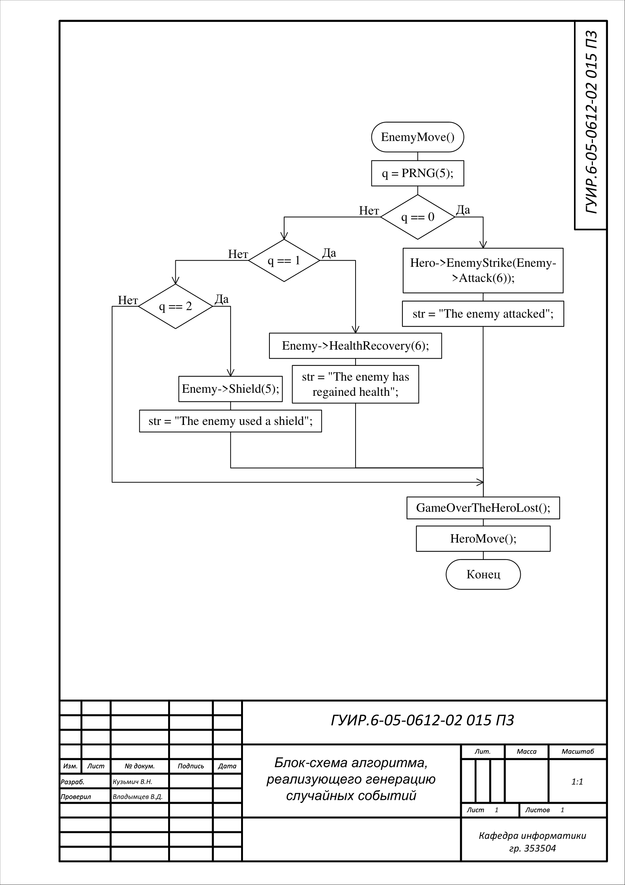
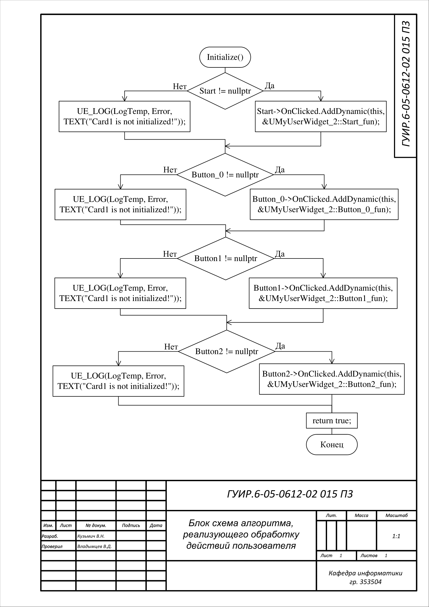
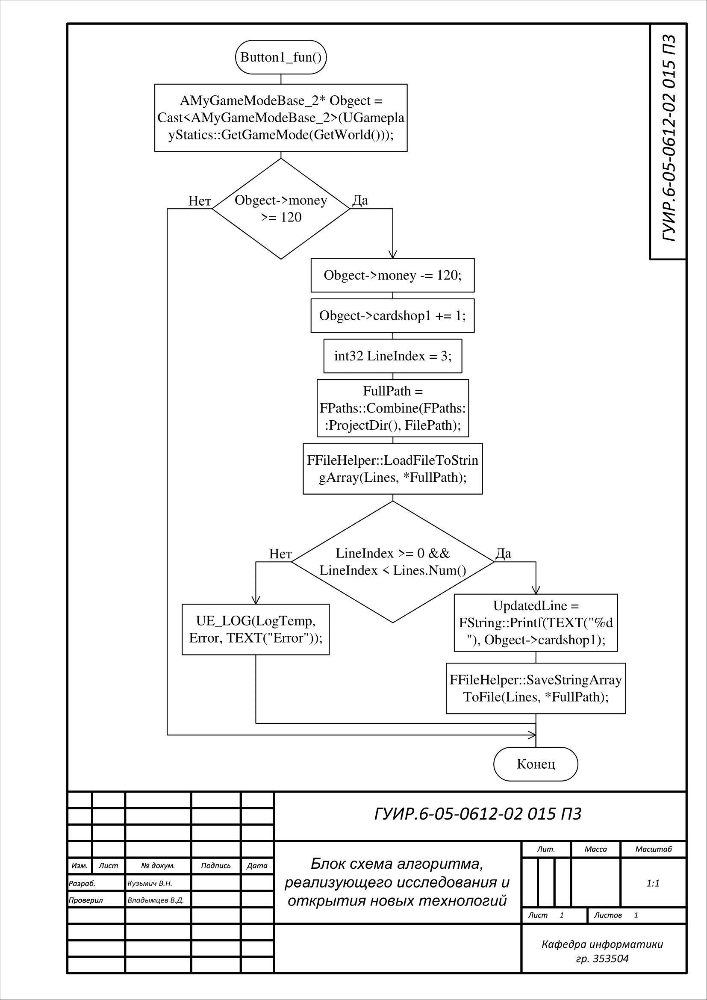
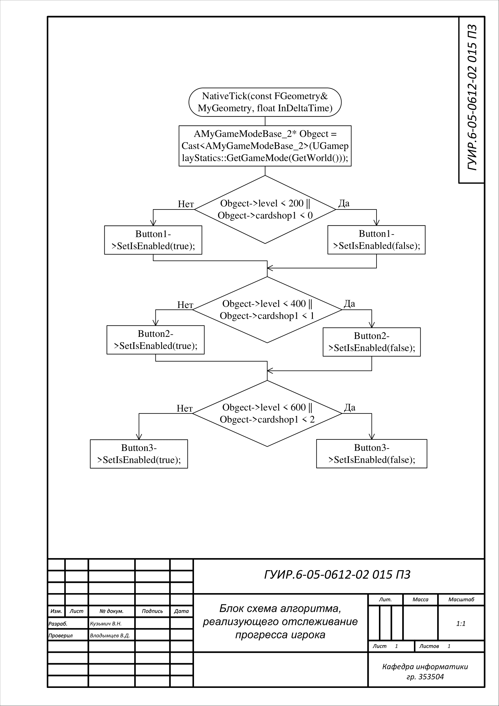
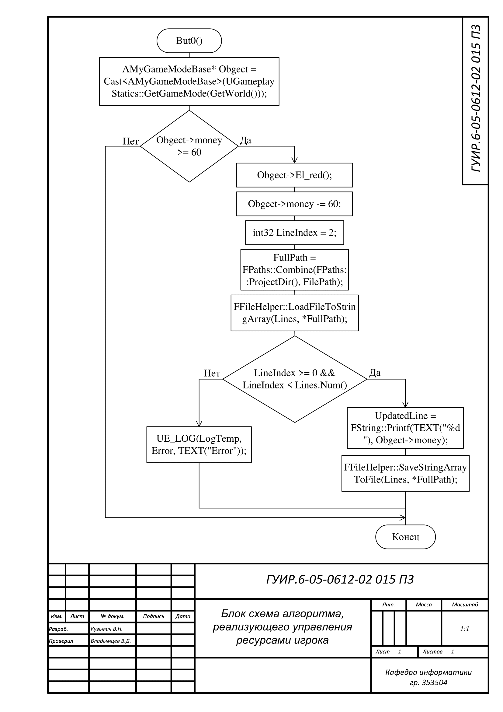
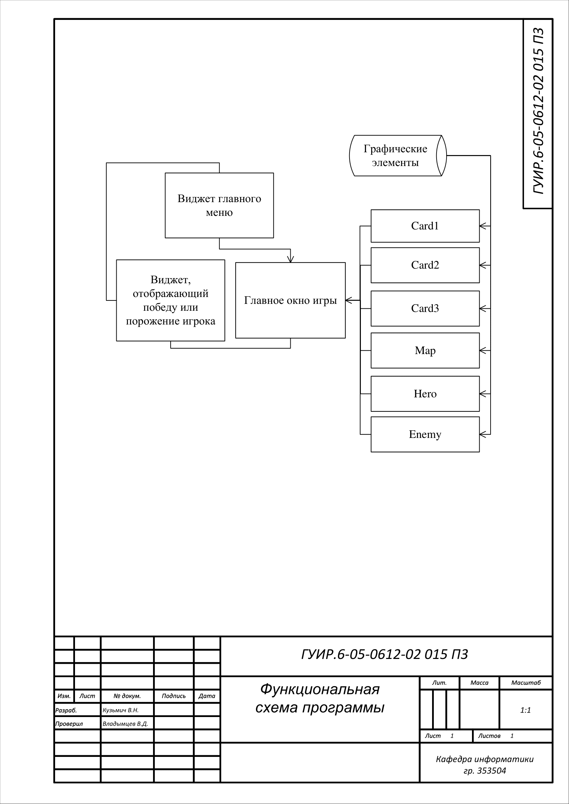

# Игра в стиле STS на С++

## Алгоритм генерации случайных событий (используется в MyGameModeBase.cpp в методе void AMyGameModeBase::EnemyMove(). Применяется там же)

## Алгоритм обработки действий пользователя-1 (используется в MyUserWidget_2.cpp в методе bool UMyUserWidget_2::Initialize(). Применяется там же)

## Алгоритм открытия новых технологий (используется в MyUserWidget_2.cpp в методе void UMyUserWidget_2::Button1_fun(). Применяется там же)

## Алгоритм отслеживания прогресса игрока (используется в MyUserWidget_2.cpp в методе void UMyUserWidget_2::NativeTick(const FGeometry& MyGeometry, float InDeltaTime). Применяется там же)

## Алгоритм управление ресурсами (используется в UMyUserWidget в методе void UMyUserWidget::But0(). Применяется там же)

## Функциональная схема программы

