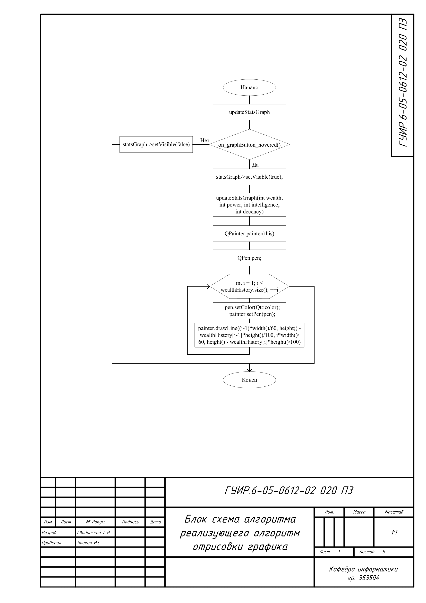
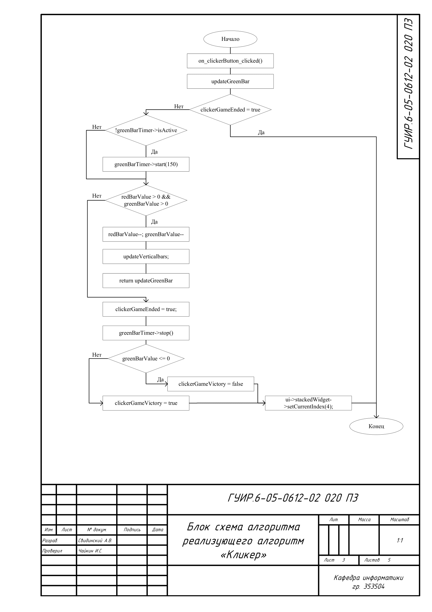
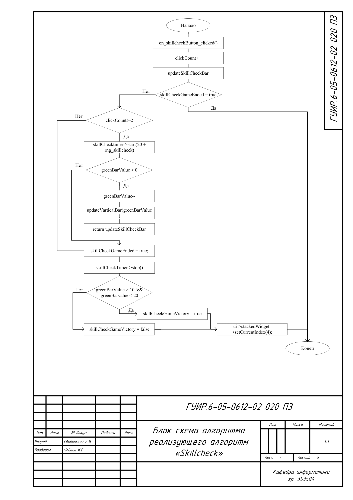
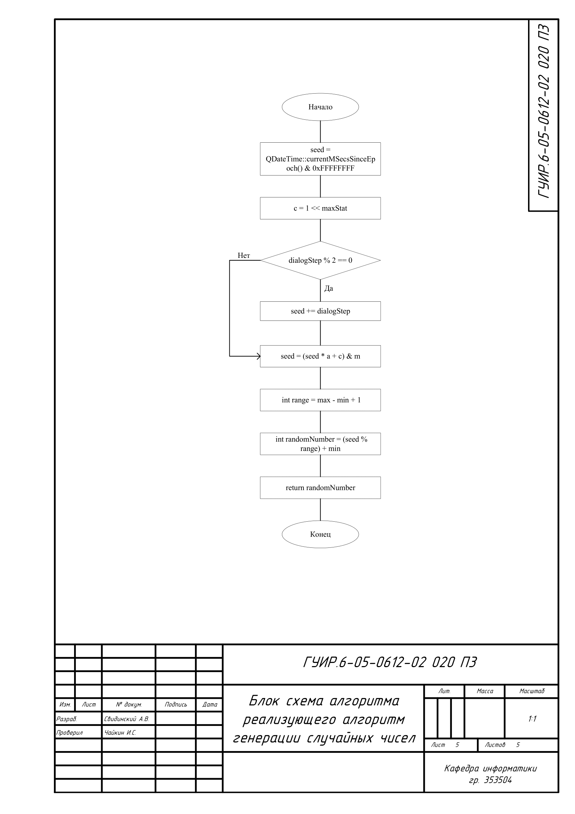

# Разработка стратегической-ролевой игры. Аналог "REIGNS"

Реализация игрового проекта: игры аналога Reigns, в сеттинге игры Dota, с упрощенной графикой и основными, дополнительными механиками.

## Алгоритм отрисовки графика

Применяется в: `mainwindow.cpp` в функции `MainWindow::on_graphButton_hovered()` результатом алгоритма является выведения графика изменений статистики игрока в виджете page_3

## Алгоритм "Swipe"

Применяется в: `mainwindow.cpp` в функциях `MainWindow::on_optionButtons_unhovered()`, `MainWindow::on_acceptButton_unhovered()`, `MainWindow::on_declineButton_unhovered()`, `MainWindow::on_acceptButton_hovered()` и `MainWindow::on_declineButton_hovered()` алгоритм позволяет имитировать управляющий жест, который создает анимацию для выбора действий пользователя

## Алгоритм "Кликер"

Применяется в: `mainwindow.cpp` в функциях `MainWindow::on_clickerButton_clicked()` и `MainWindow::updateGreenBar()` результатом алгоритма является вызов мини-игры "Кликер"

## Алгоритм "Skillcheck"

Применяется в: `mainwindow.cpp` в функциях `MainWindow::on_skillcheckButton_clicked()` и `MainWindow::updateSkillCheckBar()` результатом алгоритма является вызов мини-игры "Skillcheck"

## Алгоритм генерации случайных чисел

Применяется в: `mainwindow.cpp` в функции `MainWindow::on_skillcheckButton_clicked()` алгоритм используется для создания неповторяющихся проверок на реакцию

