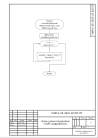
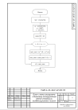
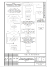
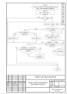
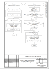
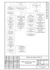

# Музыкальный лаунчпад

 

## Алгоритм шифрования XOR

Применяется в: `/mainwindow.cpp`
Реализация в: `/mainwindow.h`

## Алгоритм генерации псевдослучайных чисел

Применяется в: `/mainwindow.cpp`->on_pushButton_13_clicked()

## Алгоритм быстрого преобразования Фурье

Применяется в: `/mainwindow.cpp`
Реализация в: `/soundanalyzer.cpp`

## Алгоритм бинарного поиска

Применяется в: `/mainwindow.cpp`
Реализация в: `/mainwindow.h`

## Алгоритм cортировки кучей

Применяется в: `/mainwindow.cpp`
Реализация в: `/mainwindow.h`

## Функциональная схема программы

