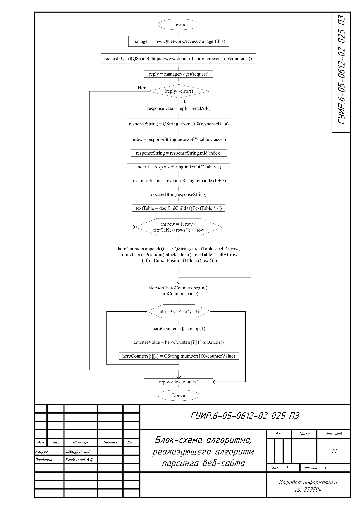
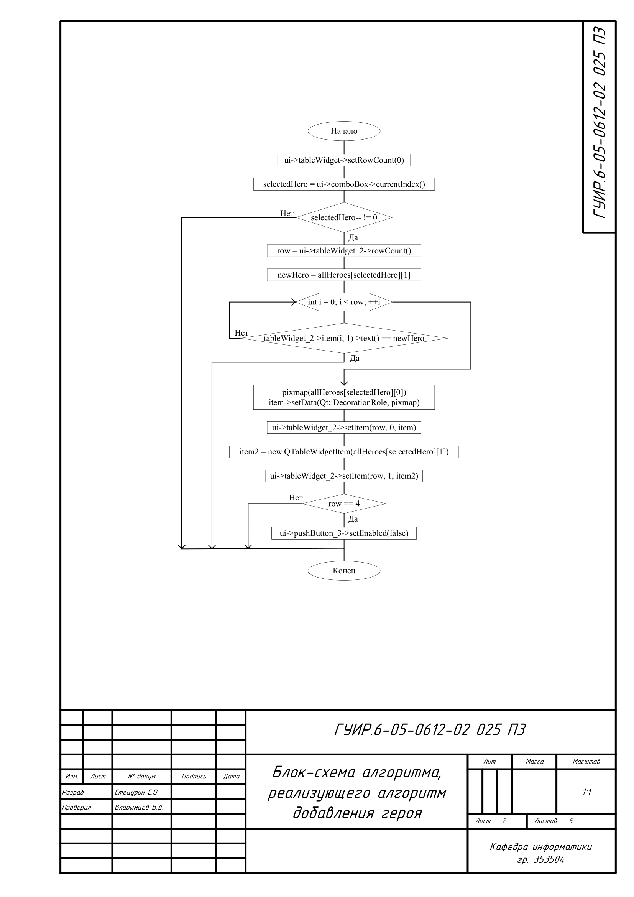
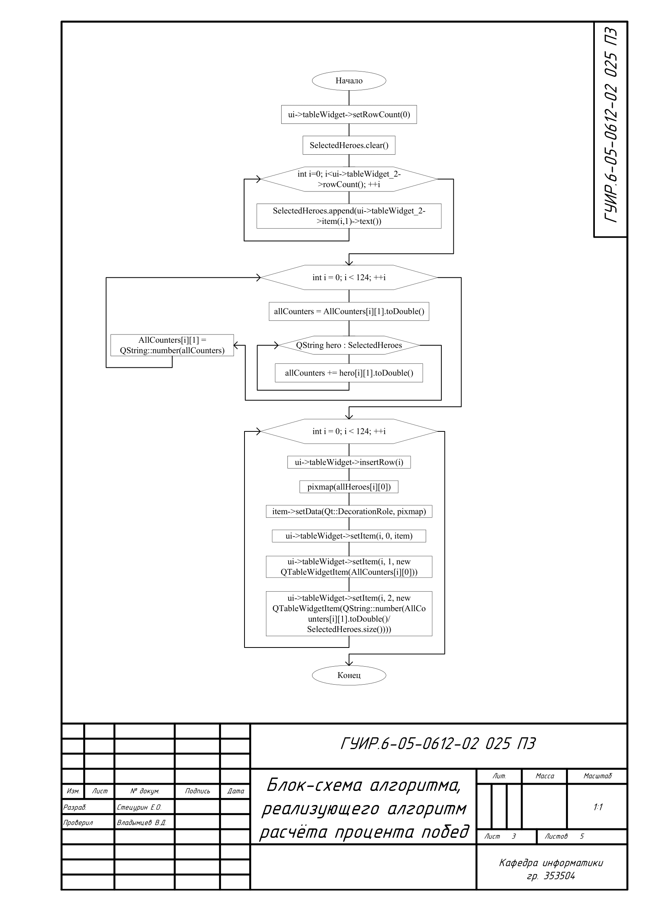
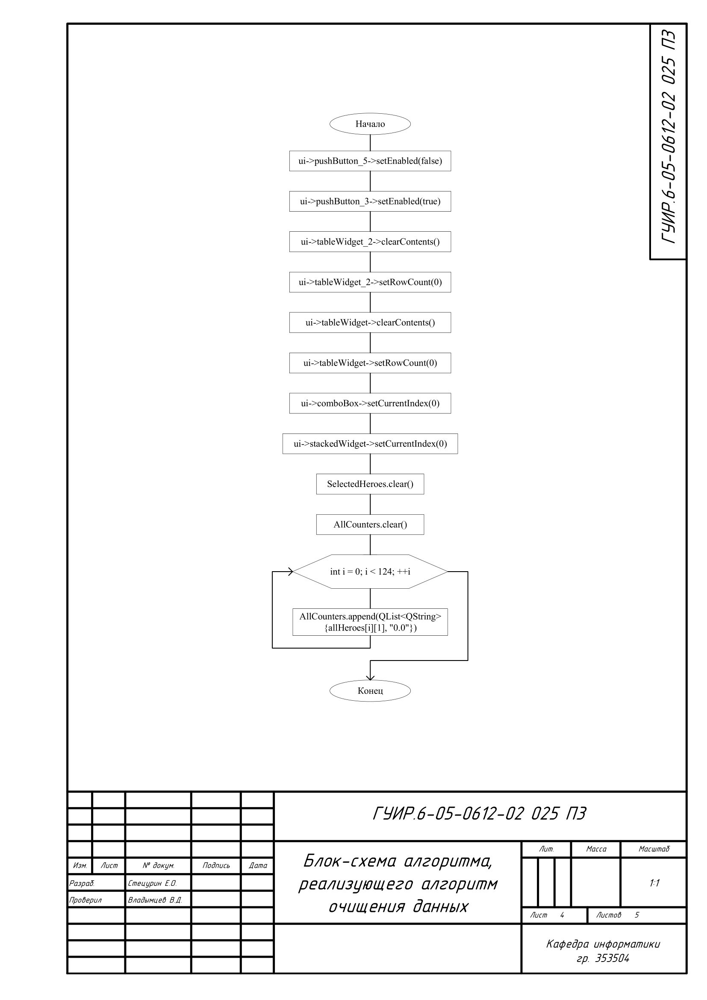
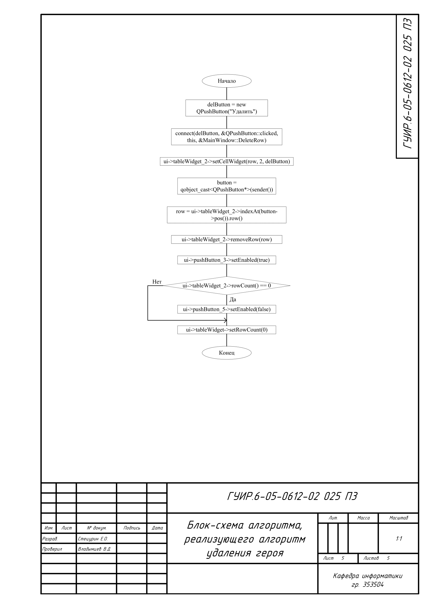

# Создание приложения для обработки введённой информации (анализ вражеского и союзного выбора героев в компьютерной игре DOTA 2)

краткое описание? хз чё тут писать, ну, сдал на 8 можно и зачилиться. 

## Алгоритм парсинга веб-сайта

Применяется в: `parsing.cpp` в функции `MainWindow::GenericHeroParsing` результат парсинга записывается в 124 QList

## Алгоритм добавления героя

Применяется в: `mainwindow.cpp` в функции `MainWindow::on_pushButton_3_clicked` результат появляется в таблице tableWidget_2

## Алгоритм расчёта процента побед

Применяется в: `mainwindow.cpp` в функции `MainWindow::on_pushButton_5_clicked` результат появляется в таблице tableWidget

## Алгоритм очищения данных

Применяется в: `mainwindow.cpp` в функции `MainWindow::on_pushButton_2_clicked` результатом алгоритма является полное очищение информации, кроме данных взятых с парсинга

## Алгоритм удаления героя

Применяется в: `mainwindow.cpp` в функциях `MainWindow::on_pushButton_3_clicked` и `MainWindow::DeleteRow` результатом алгоритма является удаление героя из таблицы tableWidget_2 и очищение таблицы tableWidget

