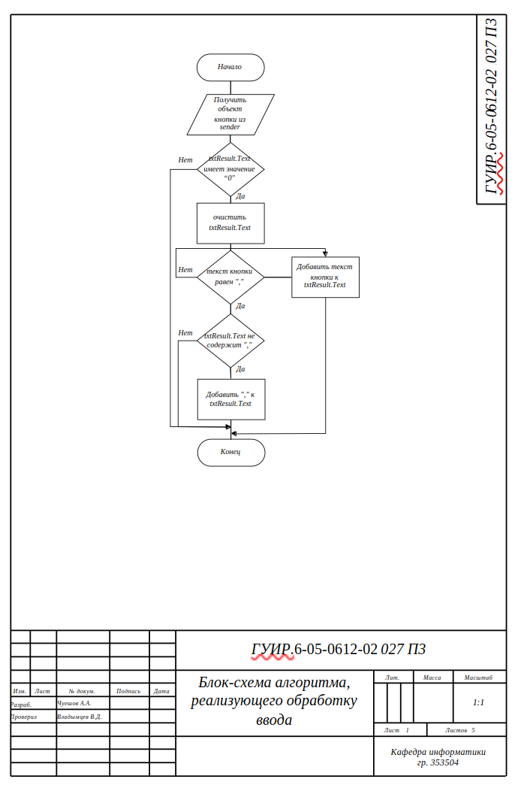
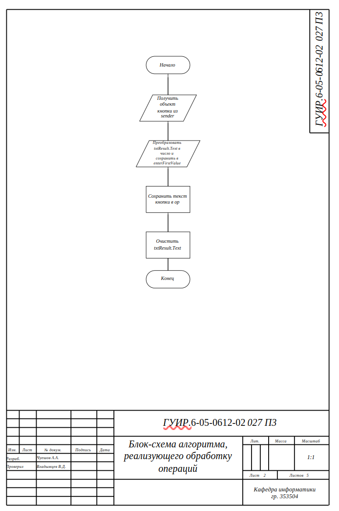
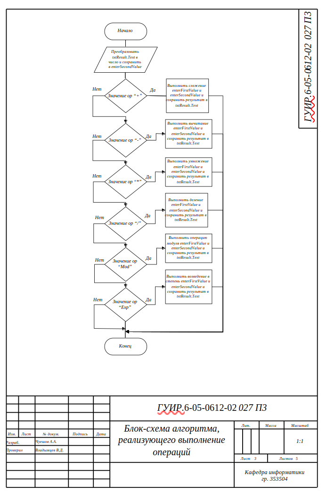
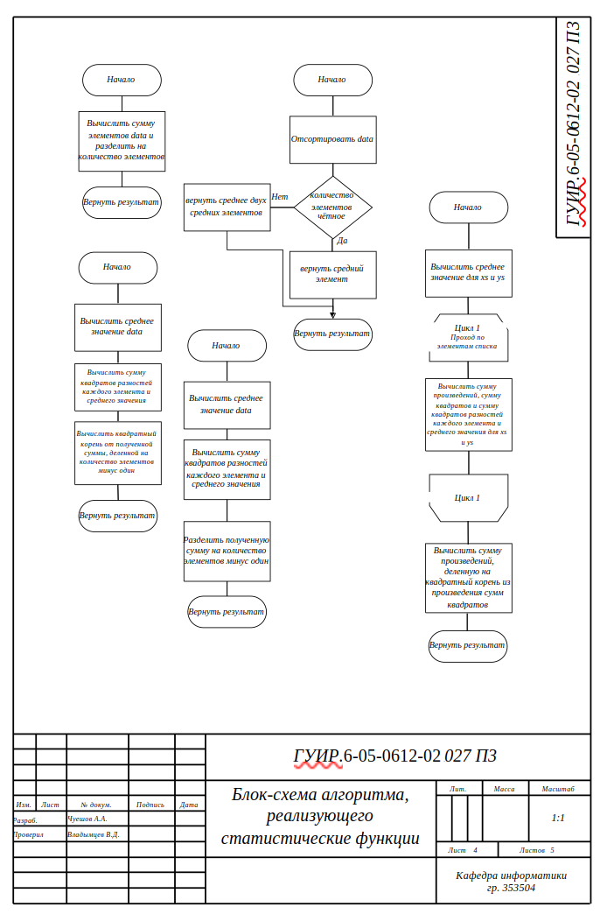
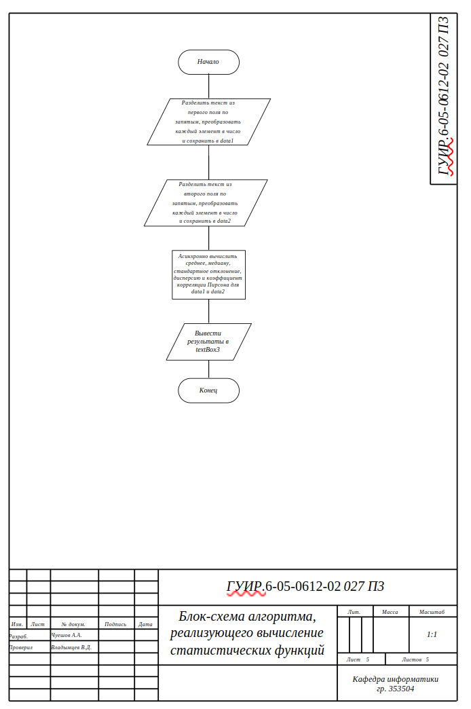

# Инженерный калькулятор

Реализация проекта: Инженерный калькулятор на языке программирования C# (с использованием Windows Forms), реализующий основные математические алгоритмы. 

## Алгоритм обработки ввода пользователя

Применяется в: [Form1.cs](https://github.com/Alexandch/Fundamentals-of-algorithmization-and-programming/blob/main/353504/%D0%A7%D1%83%D0%B5%D1%88%D0%BE%D0%B2%20%D0%90.%20%D0%90./%D0%9A%D1%83%D1%80%D1%81%D0%BE%D0%B2%D0%B0%D1%8F%20%D1%80%D0%B0%D0%B1%D0%BE%D1%82%D0%B0/Scientific%D0%A1alculator/Form1.cs) в методе EnterNumbers(sender,e)

## Алгоритм обработки операций

Применяется в: [Form1.cs](https://github.com/Alexandch/Fundamentals-of-algorithmization-and-programming/blob/main/353504/%D0%A7%D1%83%D0%B5%D1%88%D0%BE%D0%B2%20%D0%90.%20%D0%90./%D0%9A%D1%83%D1%80%D1%81%D0%BE%D0%B2%D0%B0%D1%8F%20%D1%80%D0%B0%D0%B1%D0%BE%D1%82%D0%B0/Scientific%D0%A1alculator/Form1.cs) в методе numberOper(sender, e)

## Алгоритм, реализующий выполнение операций

Применяется в: [Form1.cs](https://github.com/Alexandch/Fundamentals-of-algorithmization-and-programming/blob/main/353504/%D0%A7%D1%83%D0%B5%D1%88%D0%BE%D0%B2%20%D0%90.%20%D0%90./%D0%9A%D1%83%D1%80%D1%81%D0%BE%D0%B2%D0%B0%D1%8F%20%D1%80%D0%B0%D0%B1%D0%BE%D1%82%D0%B0/Scientific%D0%A1alculator/Form1.cs) в методе btnEqual_Click(sender,e)

## Алгоритм, реализующий статистические функции

Применяется в: [Form1.cs](https://github.com/Alexandch/Fundamentals-of-algorithmization-and-programming/blob/main/353504/%D0%A7%D1%83%D0%B5%D1%88%D0%BE%D0%B2%20%D0%90.%20%D0%90./%D0%9A%D1%83%D1%80%D1%81%D0%BE%D0%B2%D0%B0%D1%8F%20%D1%80%D0%B0%D0%B1%D0%BE%D1%82%D0%B0/Scientific%D0%A1alculator/Form1.cs) в методах MeanAsync(data), MedianAsync(data), StandardDeviationAsync(data), VarianceAsync(data), PearsonCorrelationAsync(xs,ys).

## Алгоритм, реализующий вычисление статистических функций

Применяется в: [Form1.cs](https://github.com/Alexandch/Fundamentals-of-algorithmization-and-programming/blob/main/353504/%D0%A7%D1%83%D0%B5%D1%88%D0%BE%D0%B2%20%D0%90.%20%D0%90./%D0%9A%D1%83%D1%80%D1%81%D0%BE%D0%B2%D0%B0%D1%8F%20%D1%80%D0%B0%D0%B1%D0%BE%D1%82%D0%B0/Scientific%D0%A1alculator/Form1.cs) в методе button1_Click(sender,e)

