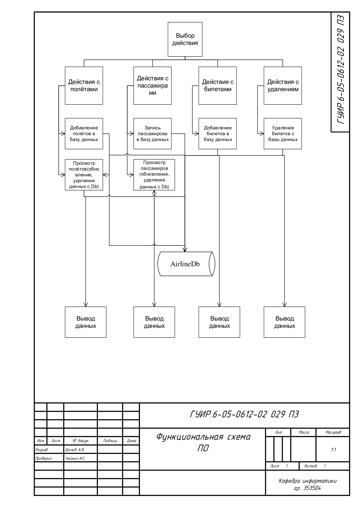
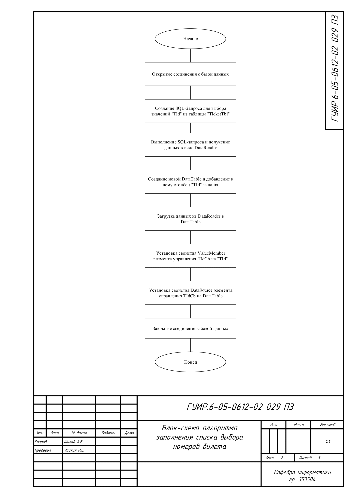
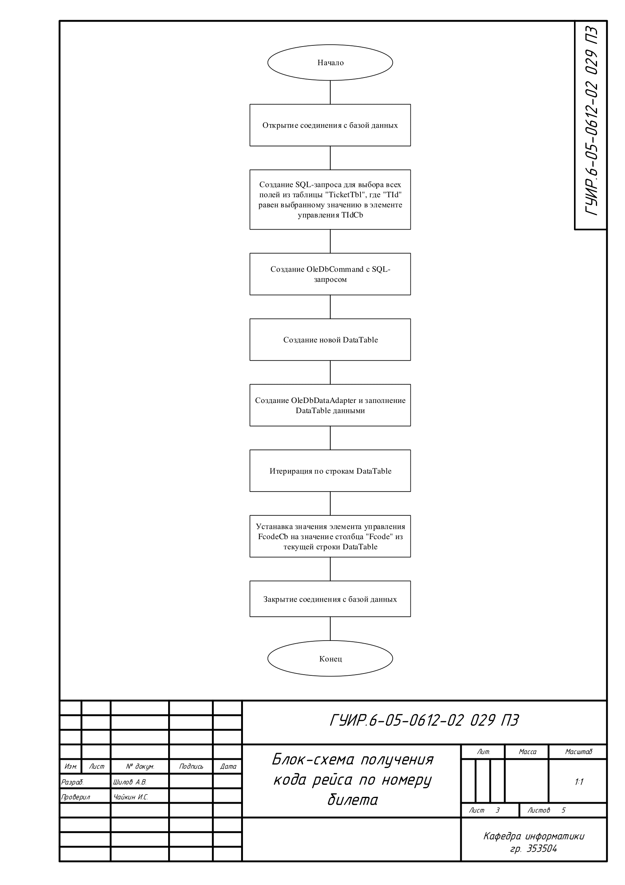
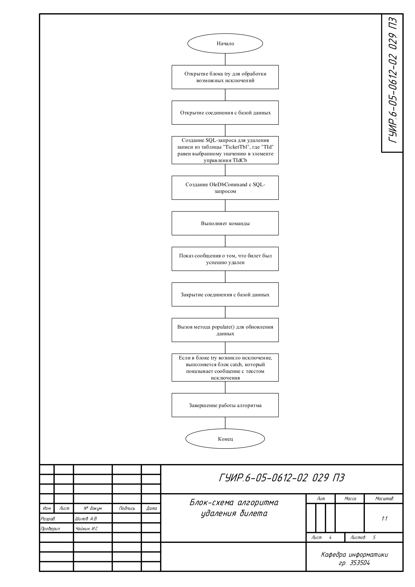
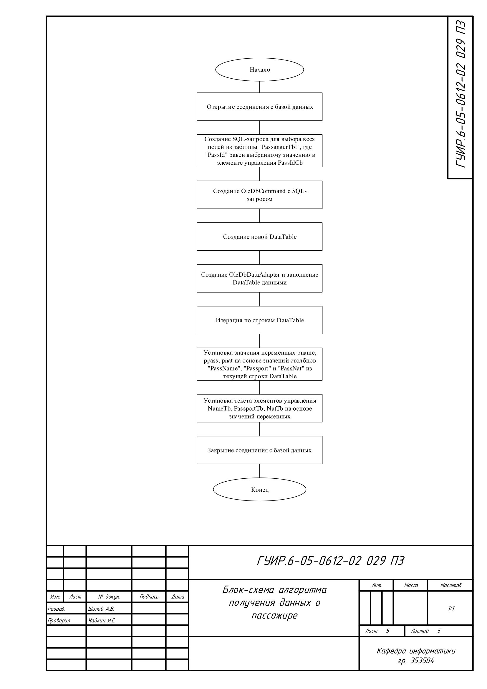

## Функциональная схема программы

Схема общей структуры программы

## Блок-схема алгоритма заполнения списка выбора рейса

## Блок-схема алгоритма заполнения списка выбора номеров билета

Применяется в: `CtiancelaonTbl.cs`

## Блок-схема получения кода рейса по номеру билета

Применяется в: `CtiancelaonTbl.cs`

## Блок-схема алгоритма удаления билета

Применяется в: `CtiancelaonTbl.cs`

## Блок-схема алгоритма получения данных о пассажире

Применяется в: `Ticket.cs`

