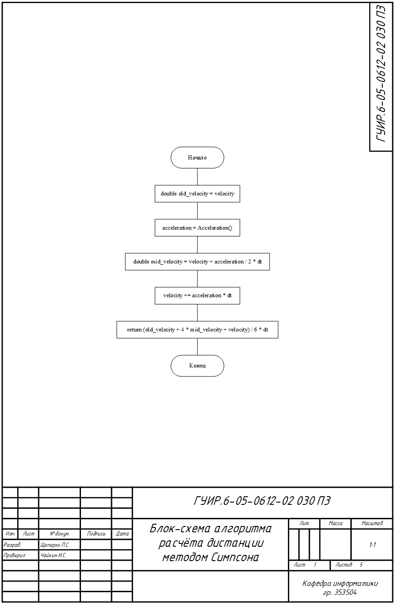
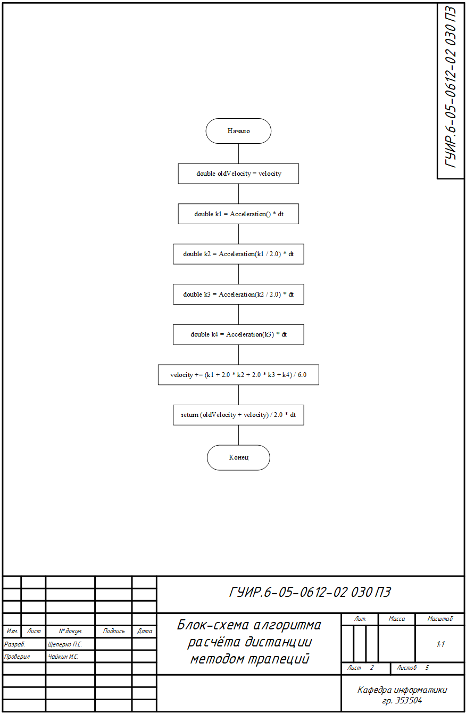
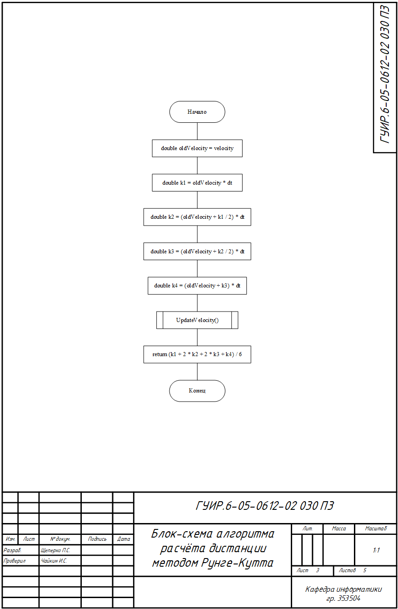
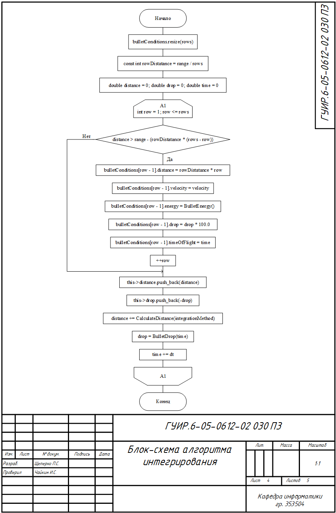
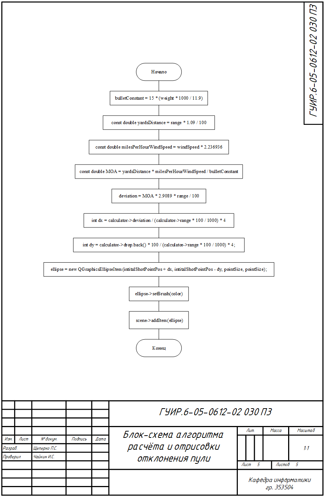

# Приложение баллистический калькулятор

Приложения для расчёта баллистических свойств пули по введённым характеристикам

## Функциональная схема алгоритма

Функциональная схема программы

## Алгоритм расчёта дистанции методом Симпсона

Применяется в: `calculator.cpp` в функции `Calculator::DistanceSimpson` результатом алгоритма является расчёт разбиения под кривой графика скорости от времени методом Симпсона

## Алгоритм расчёта дистанции методом трапеций

Применяется в: `calculator.cpp` в функции `Calculator::DistanceTrapezoid` результатом алгоритма является расчёт разбиения под кривой графика скорости от времени методом трапеций

## Алгоритм расчёта дистанции методом Рунге-Кутта

Применяется в: `calculator.cpp` в функции `Calculator::DistanceRungeKutta` результатом алгоритма является расчёт разбиения под кривой графика скорости от времени методом Рунге-Кутта

## Алгоритм интегрирования

Применяется в: `calculator.cpp` в функции `Calculator::CalculateBulletConditions` результатом алгоритма является расчёт всех баллистических характеристик пули

## Алгоритм расчёта и отрисовки отклонения пули

Применяется в: `mainwindow.cpp` в функциях `Calculator::CalculateDeviation` и `MainWindow::DrawPoint` результатом алгоритма является добавление точки попадания в `reticleView`

