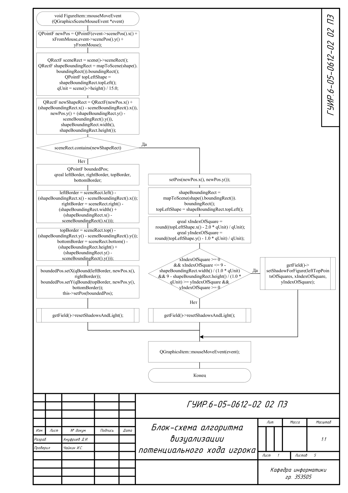
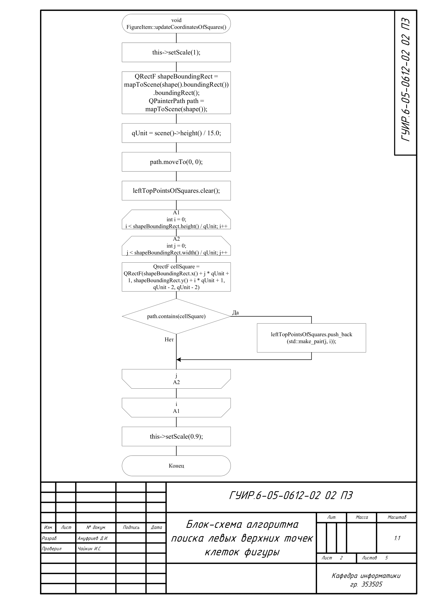
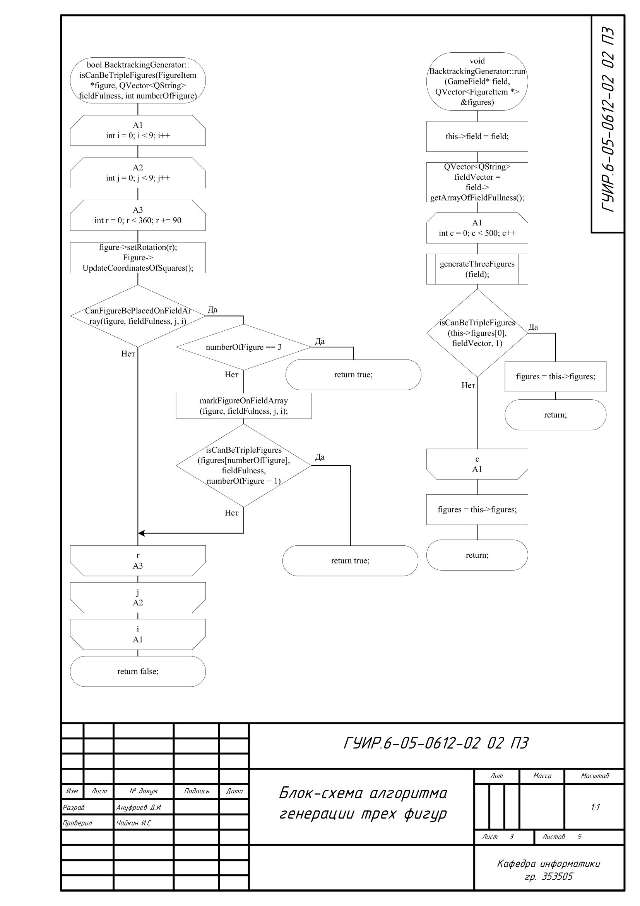
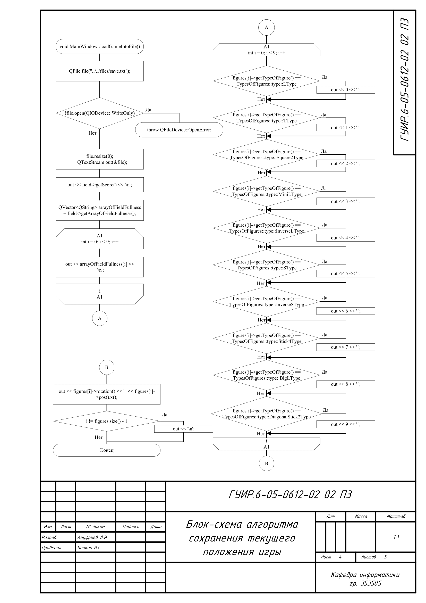
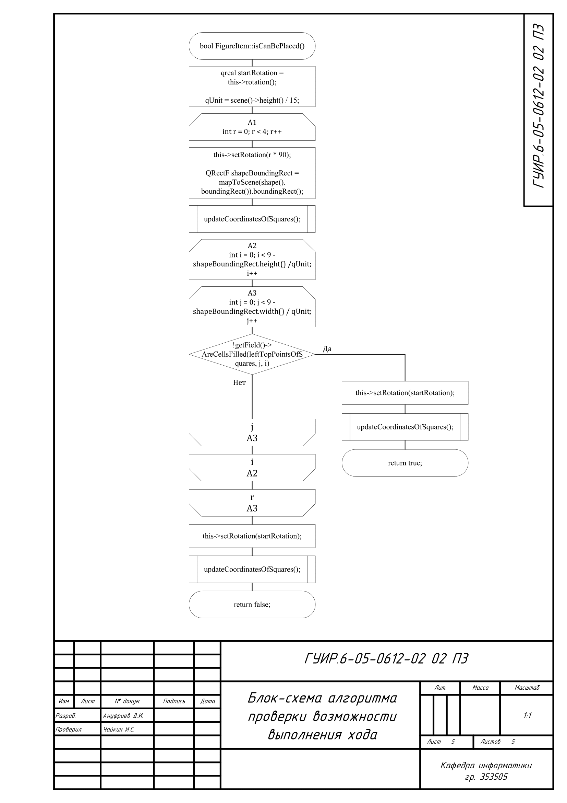

# РАЗРАБОТКА ИГРЫ В СТИЛЕ СУДОКУ-ТЕТРИС (АНАЛОГ BLOCKUDOKU)

Данная папка содержит разработанный курсовой проект с блок-схемами, приложенными к пояснительной записке данного проекта, с ссылками на реализацию данных алгоритмов в программе. 

## Блок-схема алгоритма визуализации потенциального хода игрока

Применяется в: `Cursach/figureitem.cpp`

## Блок-схема алгоритма поиска левых верхних точек клеток фигуры

Применяется в: `Cursach/figureitem.cpp`

## Блок-схема алгоритма генерации трех фигур

Применяется в: `Cursach/backtrackinggenerator.cpp`

## Блок-схема алгоритма сохранения текущего положения игры

Применяется в: `Cursach/mainwindow.cpp`

## Блок-схема алгоритма проверки возможности выполнения хода

Применяется в: `Cursach/figureitem.cpp`

