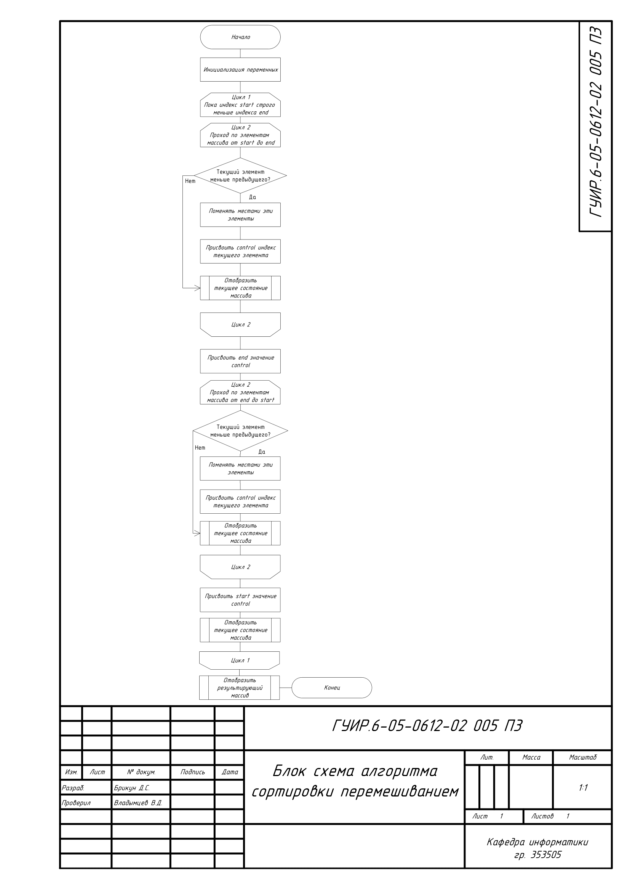
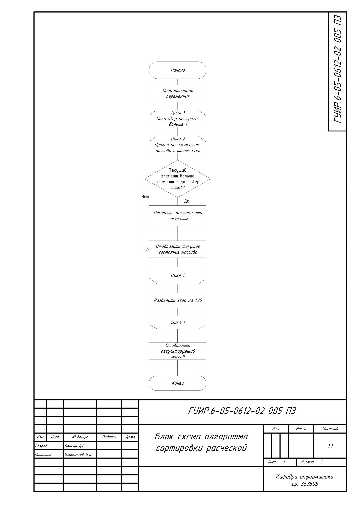
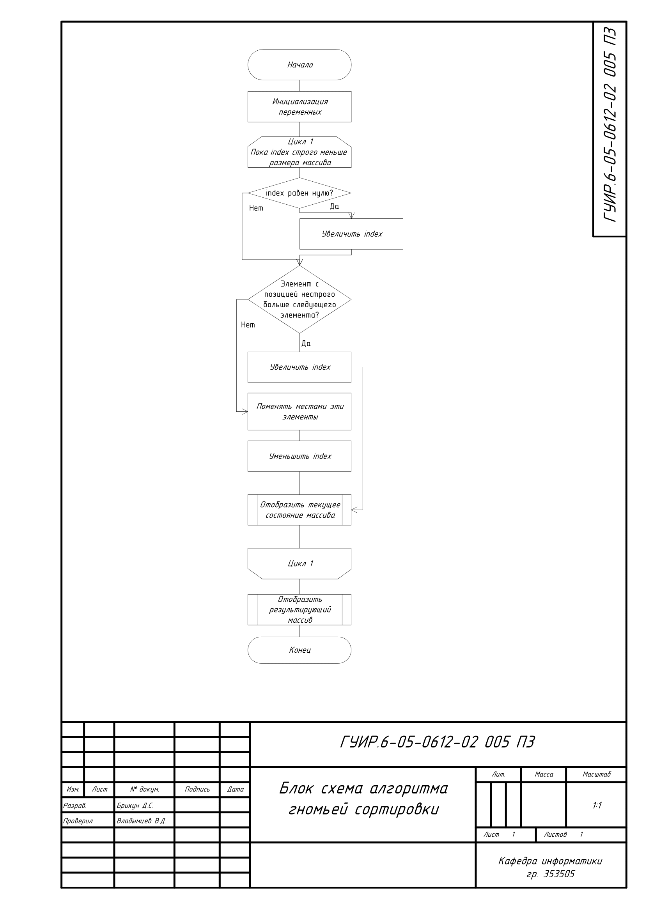
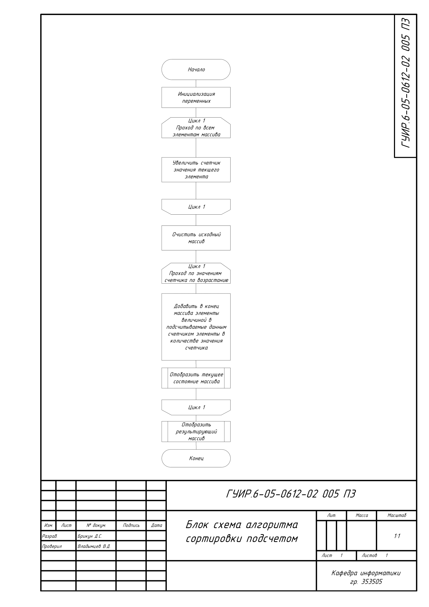

# Создание программы визуализации работы сортировок
 
 Визуализация сортировок с помощью графического интерфейса

## Блок схема алгоритма сортировки перемешиванием

Применяется в: `src/mainwindow.cpp`

## Блок схема алгоритма сортировки расческой

Применяется в: `src/mainwindow.cpp`

## Блок схема алгоритма гномьей сортировки

Применяется в: `src/mainwindow.cpp`

## Блок схема алгоритма сортировки подсчетом

Применяется в: `src/mainwindow.cpp`

## Блок схема алгоритма карманной сортировки

Применяется в: `src/mainwindow.cpp`

