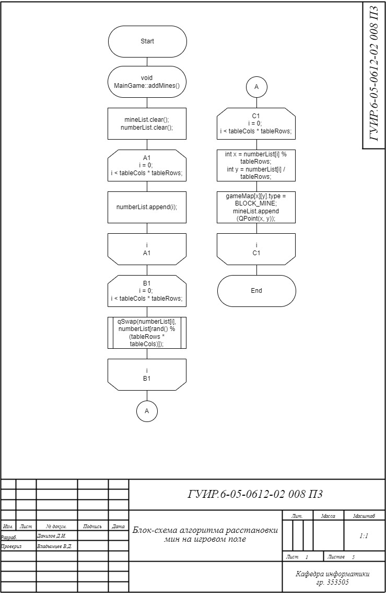
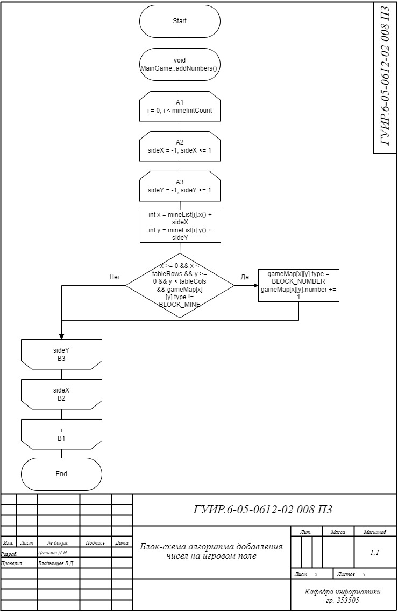
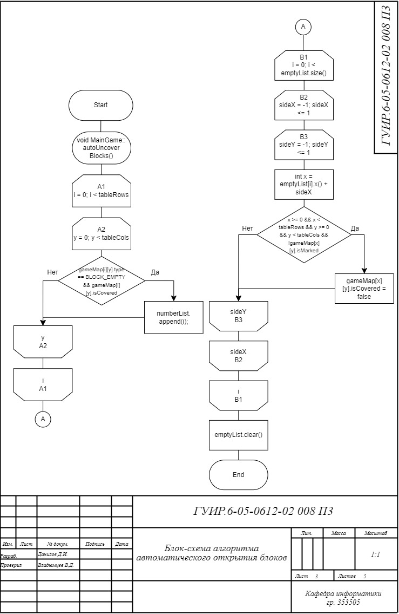
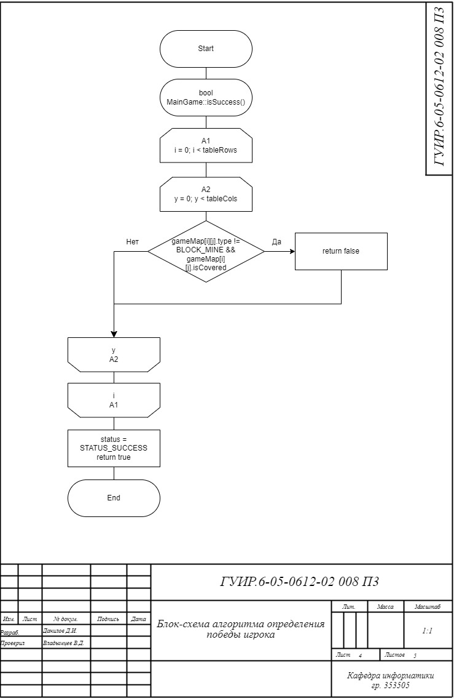
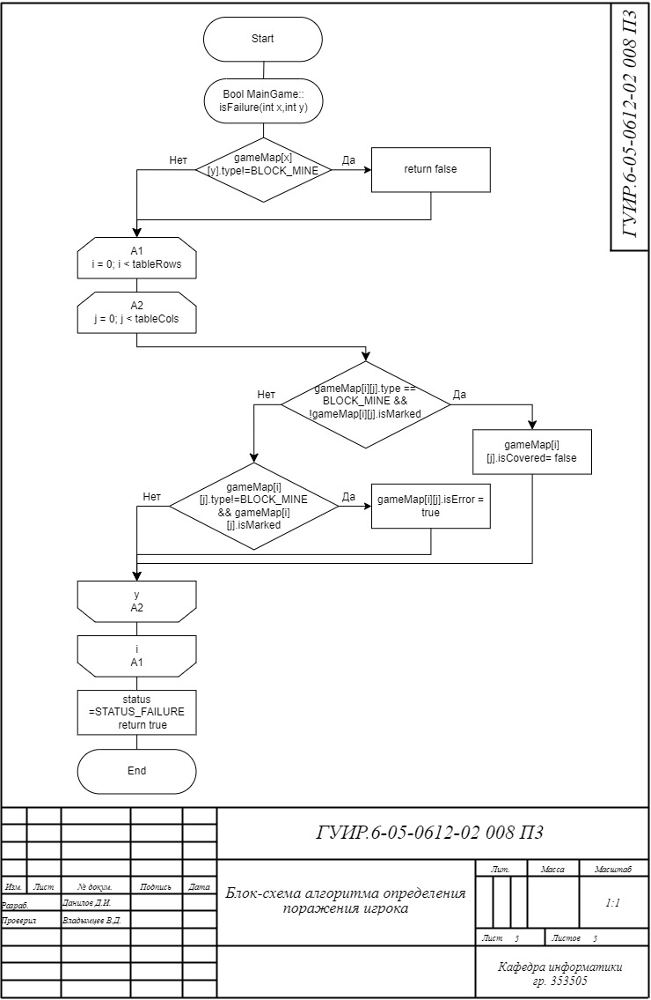

# РАЗРАБОТКА ИГРЫ САПЁР

Данная папка содержит разработанный курсовой проект с блок-схемами, приложенными к пояснительной записке данного проекта, с ссылками на реализацию данных алгоритмов в программе. 

## Блок-схема алгоритма расстановки мин на игровом поле

Применяется в: `Cursach/gamemodel.cpp`

## Блок-схема алгоритма добавления чисел на игровом поле

Применяется в: `Cursach/gamemodel.cpp`

## Блок-схема алгоритма автоматического открытия блоков

Применяется в: `Cursach/gamemodel.cpp`

## Блок-схема алгоритма определения победы игрока

Применяется в: `Cursach/gamemodel.cpp`

## Блок-схема алгоритма определения поражения игрока

Применяется в: `Cursach/gamemodel.cpp`

