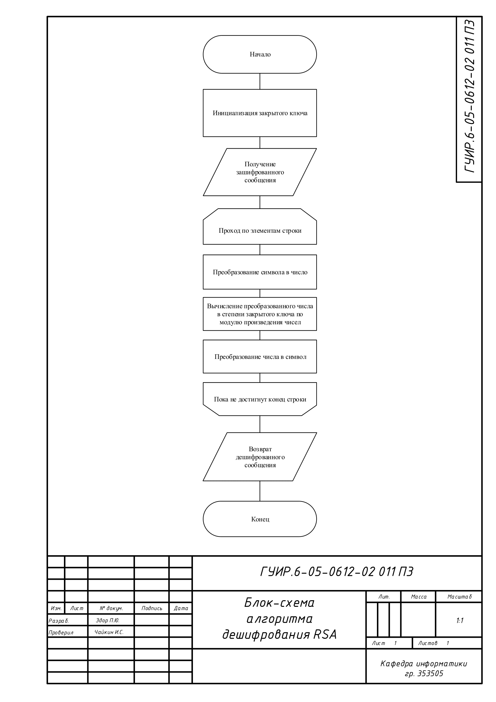
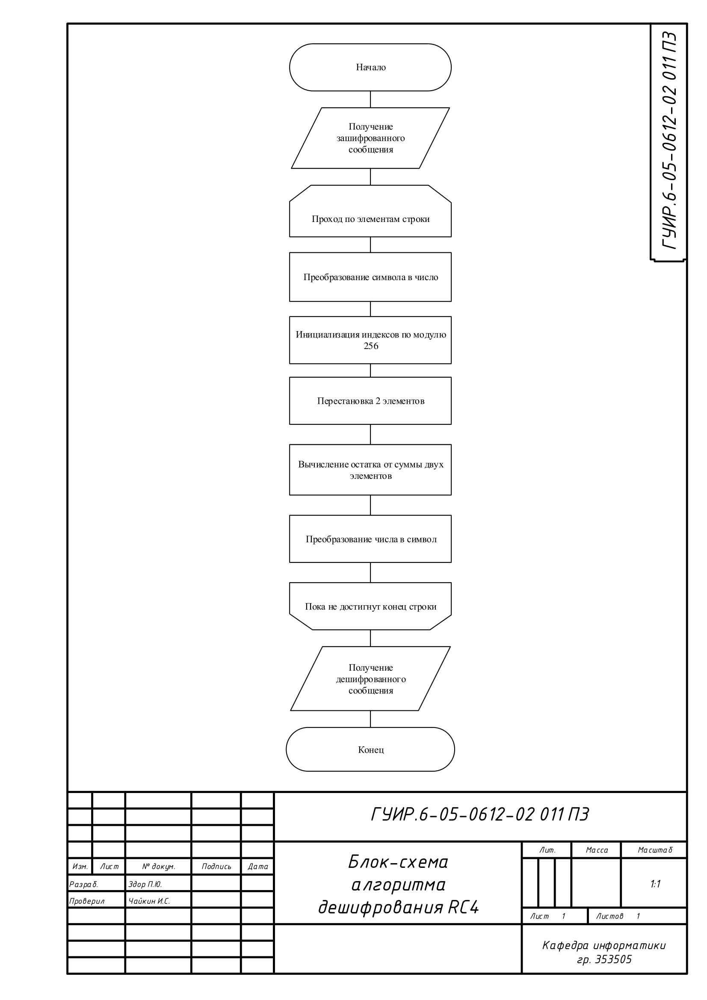
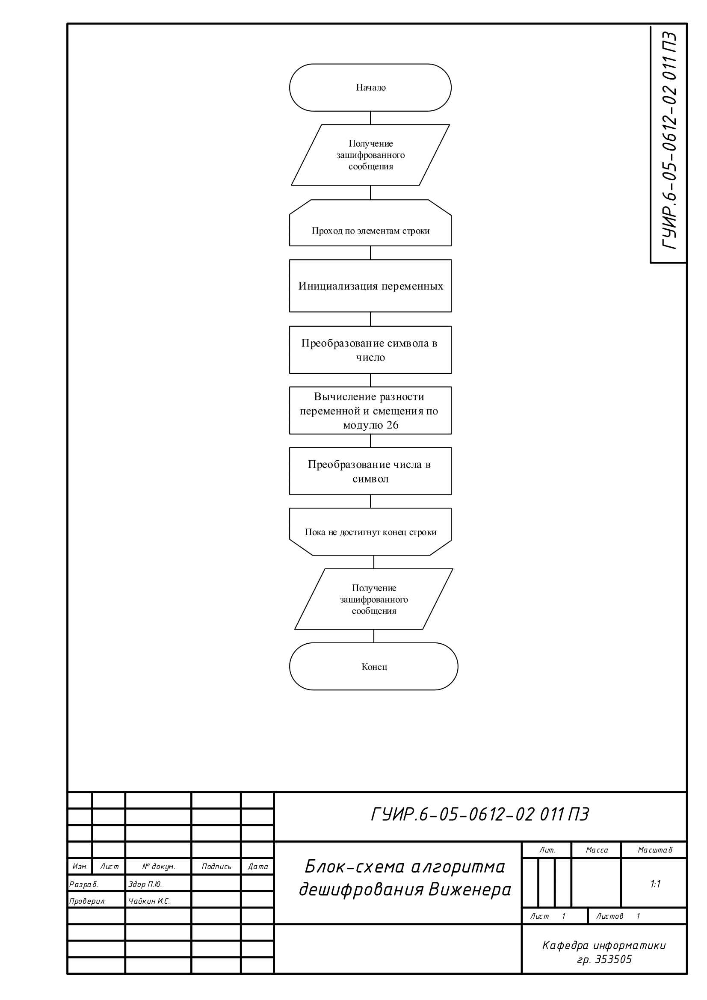
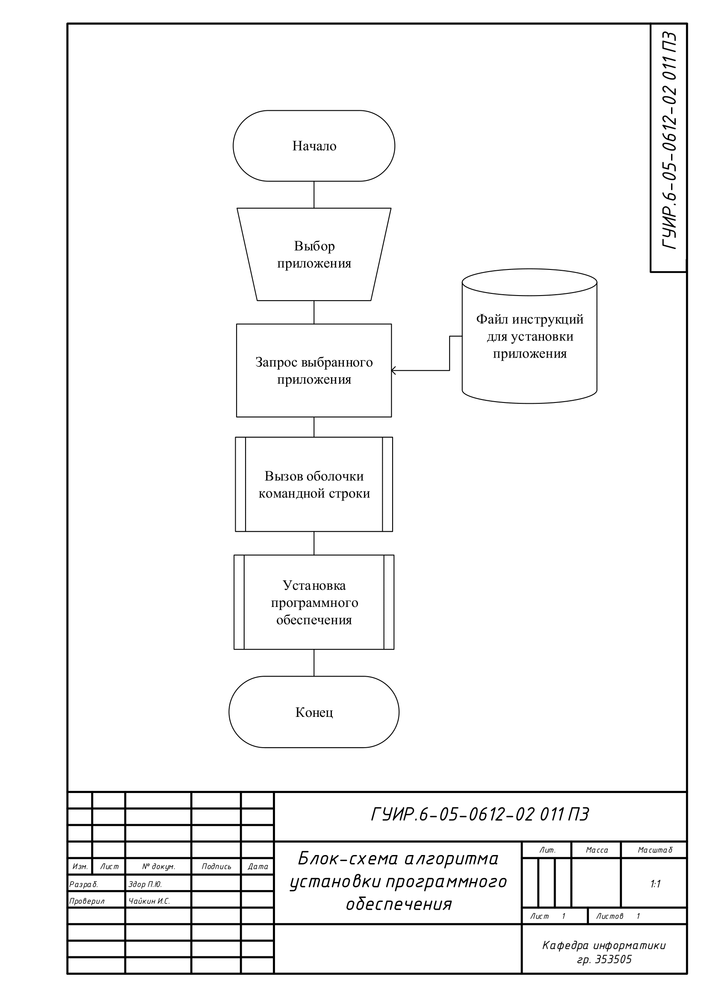
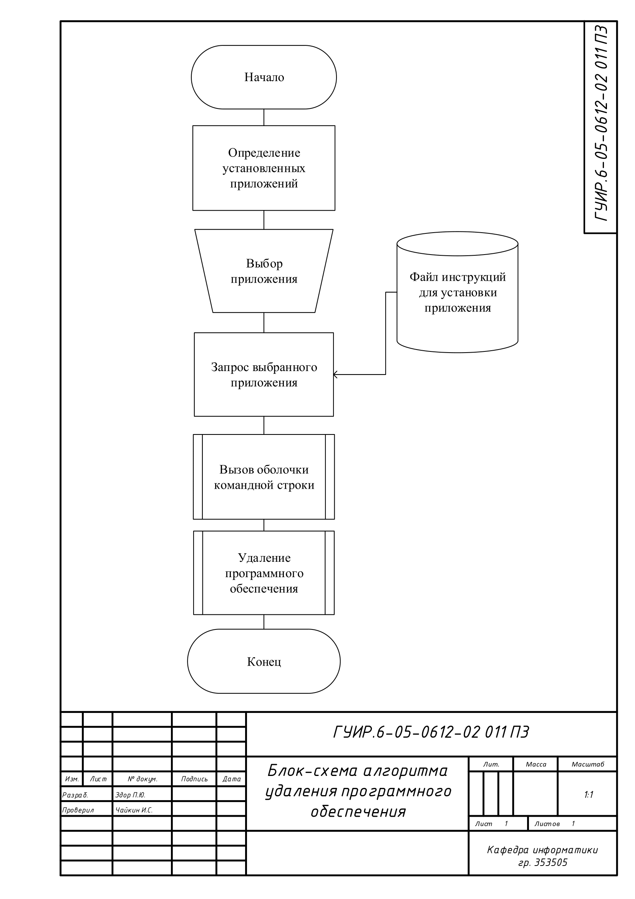

# Программа для установки приложений

Краткое описание 

## Блок-схема алгоритма дешифрования RSA

Применяется в: `download.cpp`

Краткое описание

## Блок-схема алгоритма дешифрования RC4

Применяется в: `download_nv.cpp`

Краткое описание

## Блок-схема алгоритма дешифрования Виженера

Применяется в: `delete.cpp`

Краткое описание

## Блок-схема алгоритма установки приложения

Применяется в: `mainwindow.cpp download.cpp`

Краткое описание

## Блок-схема алгоритма удаления приложения

Применяется в: `mainwindow.cpp delete.cpp`

