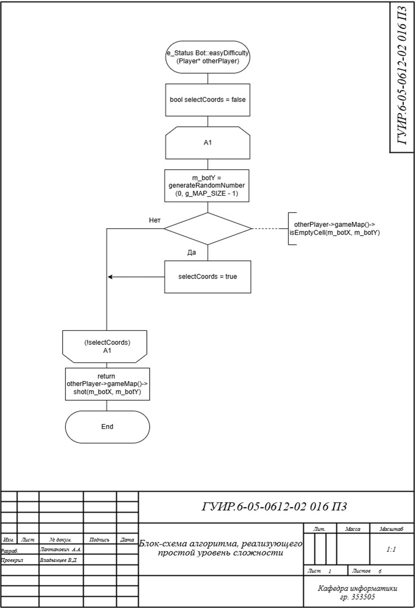
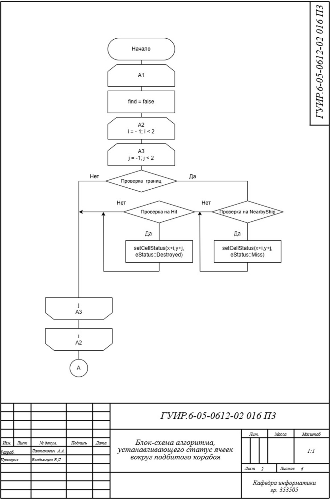
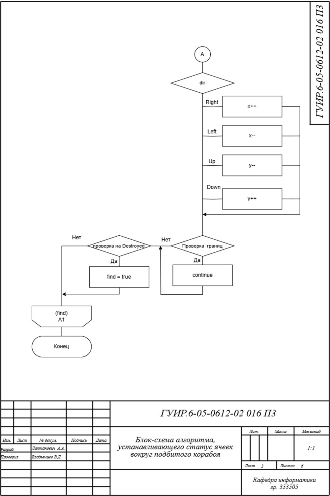
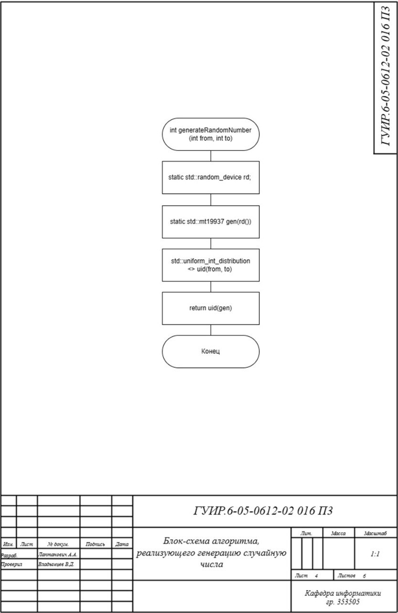
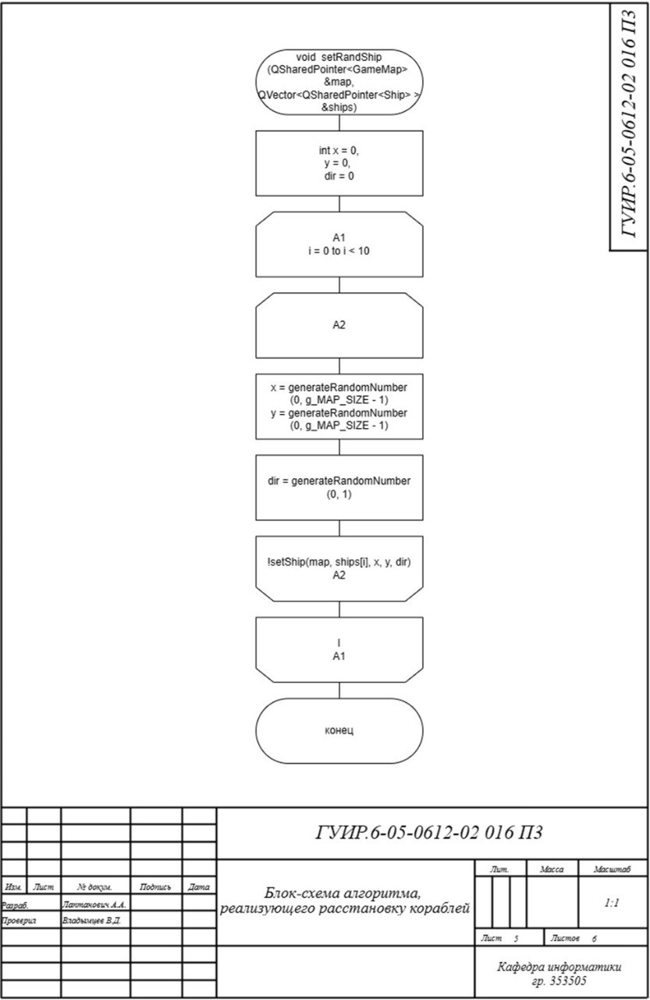
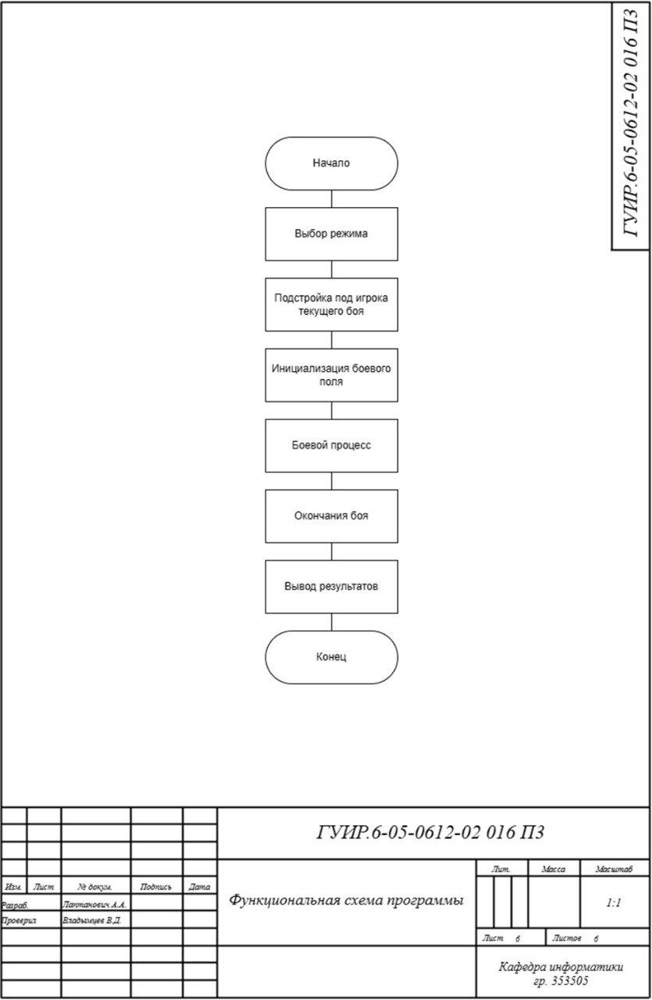

# РАЗРАБОТКА ИГРЫ МОРСКОЙ БОЙ

Данная папка содержит разработанный курсовой проект с блок-схемами, приложенными к пояснительной записке данного проекта, с ссылками на реализацию данных алгоритмов в программе. 

## Блок-схема алгоритма для простого уровня сложности

Применяется в: `Cursach/src/gameMap.cpp`

## Блок-схема алгоритма устанавливающего статус ячеек вокруг подбитого корабля

Применяется в: `Cursach/src/Bot.cpp`

## Блок-схема алгоритма генерации случайного числа

Применяется в: `Cursach/src/utilities.cpp`

## Блок-схема алгоритма расстановкии кораблей

Применяется в: `Cursach/src/BattleShipCore.cpp`

## Функциональная схема программы

