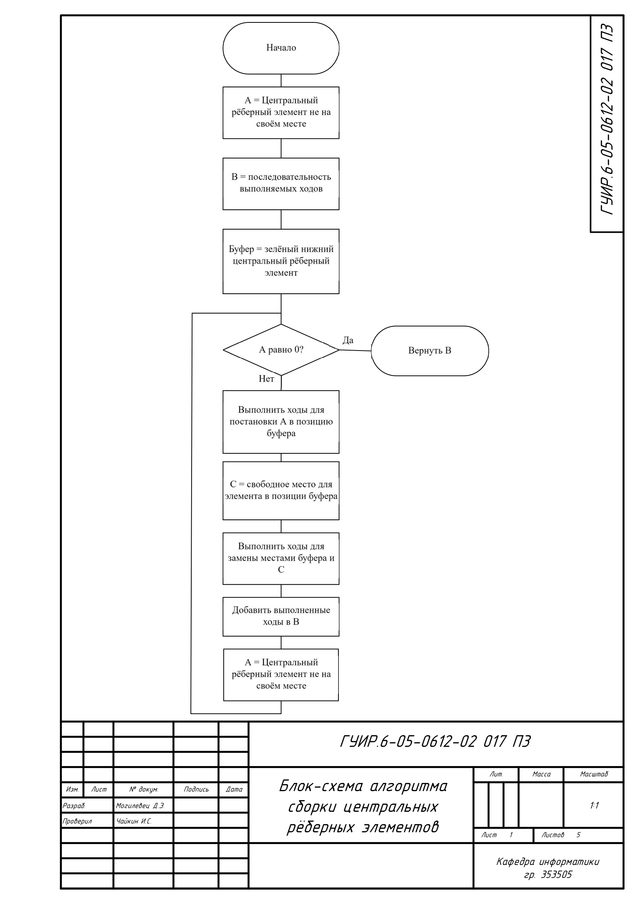
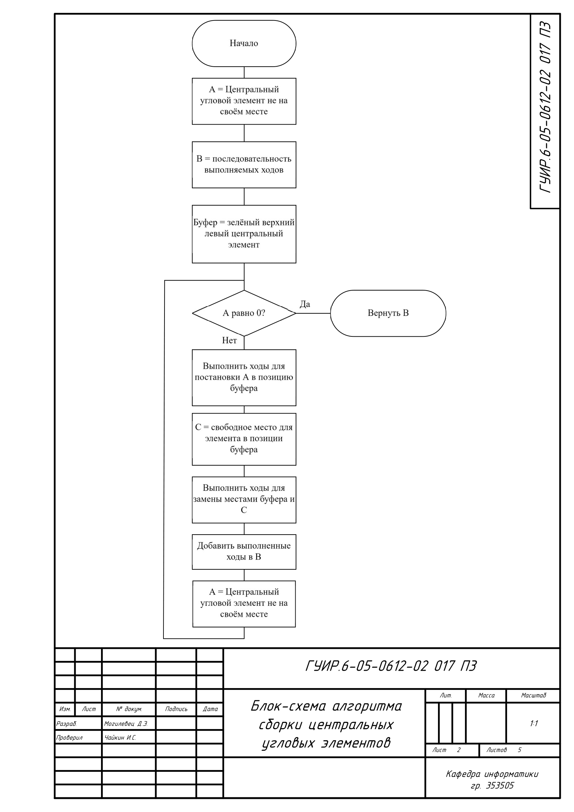
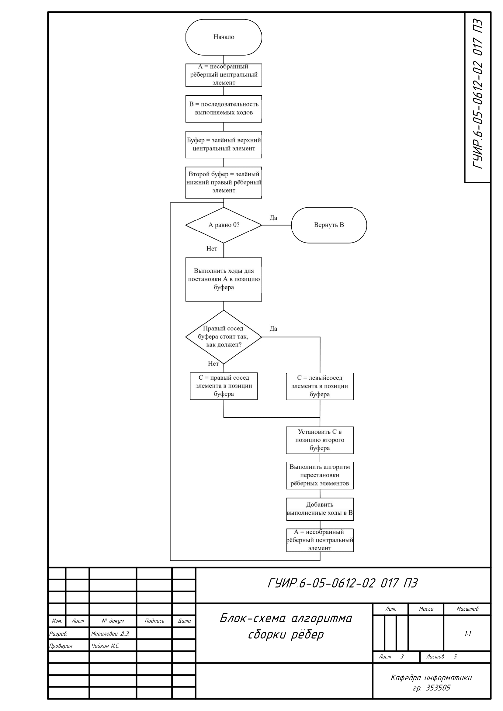
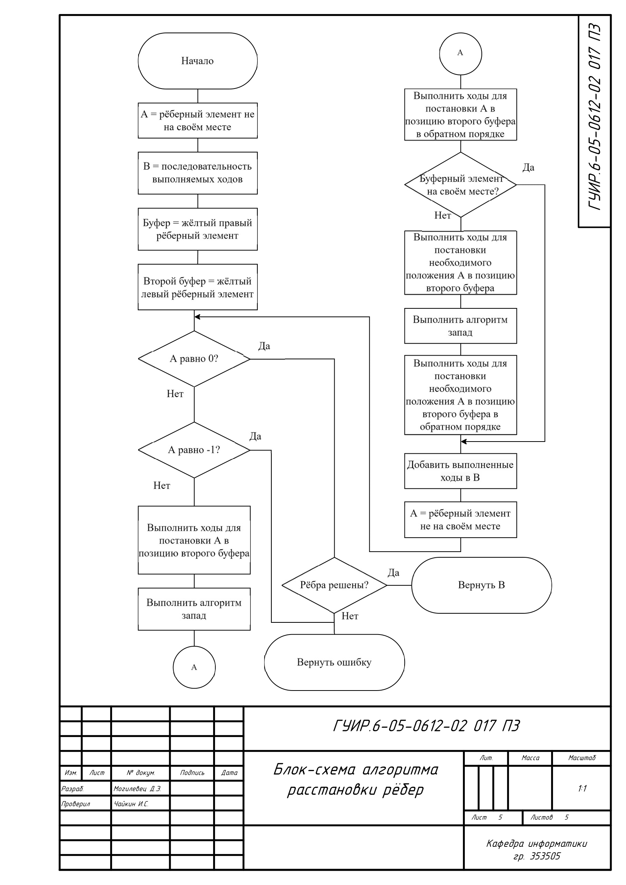

## Блок-схема алгоритма сборки центральных рёберных элементов

Применяется в: `Fundamentals-of-algorithmization-and-programming/353505/Могилевец Д.Э./Курсовая работа/CubeAnimation/CubeAnimation/content/solver.cpp` в методе solveCenterEdges(), результат работы обрабатывается в методе Solution(QMap<QString, QString> state)

## Блок-схема алгоритма сборки центральных угловых элементов

Применяется в: `Fundamentals-of-algorithmization-and-programming/353505/Могилевец Д.Э./Курсовая работа/CubeAnimation/CubeAnimation/content/solver.cpp` в методе solveCenterAngles(), результат работы обрабатывается в методе Solution(QMap<QString, QString> state)

## Блок-схема алгоритма сборки рёбер

Применяется в: `Fundamentals-of-algorithmization-and-programming/353505/Могилевец Д.Э./Курсовая работа/CubeAnimation/CubeAnimation/content/solver.cpp` в методе solveEdges(), результат работы обрабатывается в методе Solution(QMap<QString, QString> state)

## Блок-схема алгоритма расстановки углов

Применяется в: `Fundamentals-of-algorithmization-and-programming/353505/Могилевец Д.Э./Курсовая работа/CubeAnimation/CubeAnimation/content/solver.cpp` в методе solveAngles(), результат работы обрабатывается в методе Solution(QMap<QString, QString> state)

## Блок-схема алгоритма расстановки рёбер

Применяется в: `Fundamentals-of-algorithmization-and-programming/353505/Могилевец Д.Э./Курсовая работа/CubeAnimation/CubeAnimation/content/solver.cpp` в методе solveEdgesFinal(), результат работы обрабатывается в методе Solution(QMap<QString, QString> state)

